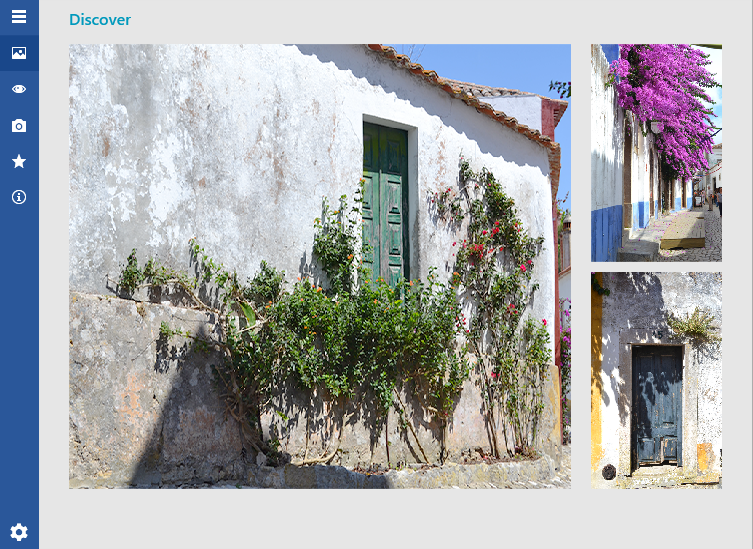

# Overview

Thank you for choosing __RadNavigationView__!				

__RadNavigationView__ is an adaptive component, used to build a consistent navigational experience in {{ site.framework_name }} applications. The control can automatically adjust its display mode based on the amount of screen space available to it, thus improving the overall user experience (UX) of your applications.				

RadNavigationView is part of the powerful UI for WPF navigation controls framework, which includes components as [RadToolBar](), [RadTreeView](), [RadPanelBar](), [RadWindow](), [RadMenu]() and more.

#### __Figure 1: RadNavigationView in the Office 2016 theme__

As every control from UI for {{ site.framework_name }}, RadNavigationView comes with a set of pre-defined themes. Of course, if you choose to do so, you can design your own templates for a completely custom look using Expression Blend.

## Key Features

* __Adaptive Display Mode__:  The control dynamically adjusts its layout depending on the size that is available to it.

* __Powerful Data Binding__: You can bind the control and its components to different sources such as Objects and Collections. Read more about this in the [Data Binding]() section of the documentation.

* __Flexible Header and Footer Content__: Customize your headers and footers any way you want using direct content or data templates. Read more about this in the [Header and Footer]() section of the documentation.

* __UI Automation Support__: Check the [UI Automation Support]() common article.

* __Enhanced Routed Events Framework__: The events system of the control will help your code become even more elegant and concise.

>tip Get started with the control with its [Getting Started]() help article that shows how to use it in a basic scenario.

>Check out the online demos at [demos.telerik.com](https://demos.telerik.com/wpf/).

## See Also
 * [Display Mode]()
 * [Icon and IconTemplate]()
 * [Events]()