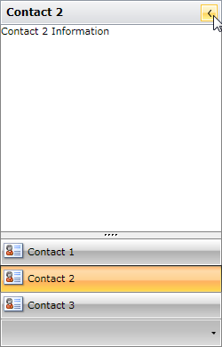
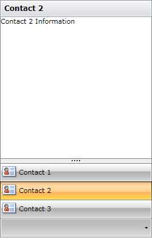

# Minimization

You can use the __Minimization__ feature of the __RadOutlookBar__ to create more user friendly and "MS Outlook look and feel" applications. The following properties are related to this feature:

* __IsMinimizable__ – boolean property that allows you to choose whether the __RadOutlookBar__ can be minimized or not. The default value of the property is True.

* __IsMinimized__ - boolean property that allows you to choose whether the __RadOutlookBar__ should be minimized or not. The default value of the property is False.

* __MinimizedWidth__ – double property that represents the width that will be set to the __RadOutlookBar__, when it is minimized. The default value of the property is 30. 

* __MinimizedWidthThreshold__ – double property that represents at what width the __RadOutlookBar__ will go in minimized state, when it is resized via the vertical resizer 

* __IsVerticalResizerVisible__ – boolean property that allows you to show or hide the vertical resizer 

* __VerticalResizerAlignment__ – property of type __ResizerAlignment__ that has two predefined values – __Left__, __Right__. With this property you can choose where to be placed the vertical resizer 

## Setting the IsMinimizable property

The default value of the __IsMinimizable__ property is __True__:

#### __XAML__

{{region radoutlookbar-features-minimization_0}}
        <telerik:RadOutlookBar x:Name="RadOutlookBar1" 
                               Width="250"
                               Height="390">
            <telerik:RadOutlookBarItem Header="Contact 1" Icon="../Images/OutlookBar/contactsBig.png">
                <TextBlock Text="Contact 1 Information" />
            </telerik:RadOutlookBarItem>
            <telerik:RadOutlookBarItem Header="Contact 2" 
                                       Icon="../Images/OutlookBar/contactsBig.png"
                                       IsSelected="True">
                <TextBlock Text="Contact 2 Information" />
            </telerik:RadOutlookBarItem>
            <telerik:RadOutlookBarItem Header="Contact 3" Icon="../Images/OutlookBar/contactsBig.png">
                <TextBlock Text="Contact 3 Information" />
            </telerik:RadOutlookBarItem>
        </telerik:RadOutlookBar>
{{endregion}}

Setting the __IsMinimizable__ property to __False__ will disable the __Minimization__ feature of the __RadOutlookBar__:

#### __XAML__

{{region radoutlookbar-features-minimization_1}}
        <telerik:RadOutlookBar x:Name="RadOutlookBar1" 
                               Width="250"
                               Height="390"
                               IsMinimizable="False">
            <telerik:RadOutlookBarItem Header="Contact 1" Icon="../Images/OutlookBar/contactsBig.png">
                <TextBlock Text="Contact 1 Information" />
            </telerik:RadOutlookBarItem>
            <telerik:RadOutlookBarItem Header="Contact 2" 
                                       Icon="../Images/OutlookBar/contactsBig.png"
                                       IsSelected="True">
                <TextBlock Text="Contact 2 Information" />
            </telerik:RadOutlookBarItem>
            <telerik:RadOutlookBarItem Header="Contact 3" Icon="../Images/OutlookBar/contactsBig.png">
                <TextBlock Text="Contact 3 Information" />
            </telerik:RadOutlookBarItem>
        </telerik:RadOutlookBar>
{{endregion}}

## Setting the IsMinimized property

The __IsMinimized__ property allows you to manually control the state of the __RadOutlookBar__. When set to the __RadOutlookBar__ 
        is minimized:

#### __XAML__

{{region radoutlookbar-features-minimization_2}}
	        <telerik:RadOutlookBar x:Name="RadOutlookBar1" 
	                               Width="250"
	                               Height="390"
	                               IsMinimized="True">
	            <telerik:RadOutlookBarItem Header="Contact 1" Icon="../Images/OutlookBar/contactsBig.png">
	                <TextBlock Text="Contact 1 Information" />
	            </telerik:RadOutlookBarItem>
	            <telerik:RadOutlookBarItem Header="Contact 2" 
	                                       Icon="../Images/OutlookBar/contactsBig.png"
	                                       IsSelected="True">
	                <TextBlock Text="Contact 2 Information" />
	            </telerik:RadOutlookBarItem>
	            <telerik:RadOutlookBarItem Header="Contact 3" Icon="../Images/OutlookBar/contactsBig.png">
	                <TextBlock Text="Contact 3 Information" />
	            </telerik:RadOutlookBarItem>
	        </telerik:RadOutlookBar>
	{{endregion}}

##  Setting the MinimizedWidth property

The default value of the __MinimizedWidth__property is 30. However, you can change that size to better fit your scenario:

#### __XAML__

{{region radoutlookbar-features-minimization_3}}
        <telerik:RadOutlookBar x:Name="RadOutlookBar1" 
                               Width="250"
                               Height="390"
                               IsMinimized="True"
                               MinimizedWidth="60">
            <telerik:RadOutlookBarItem Header="Contact 1" Icon="../Images/OutlookBar/contactsBig.png">
                <TextBlock Text="Contact 1 Information" />
            </telerik:RadOutlookBarItem>
            <telerik:RadOutlookBarItem Header="Contact 2" 
                                       Icon="../Images/OutlookBar/contactsBig.png"
                                       IsSelected="True">
                <TextBlock Text="Contact 2 Information" />
            </telerik:RadOutlookBarItem>
            <telerik:RadOutlookBarItem Header="Contact 3" Icon="../Images/OutlookBar/contactsBig.png">
                <TextBlock Text="Contact 3 Information" />
            </telerik:RadOutlookBarItem>
        </telerik:RadOutlookBar>
{{endregion}}

## Resizing RadOutlookBar via the vertical resizer

You can also take advantage of the vertical resizer to change the state of the __RadOutlookBar__. By default when the size of the __RadOutlookBar__ exceeds 34, it's restored. Otherwise the control is minimized.

Furthermore, you can set the __MinimizedWidthThreshold__ to control when to change the __RadOutlookBar__ state, when it is resized via the vertical resizer. 
