# How to Use RadOutlookBar as a Container in Prism Application

This help article will show you how to use __RadOutlookBar__ as a container for hosting views.

Start off by creating an __empty Visual Studio solution__. Call this solution __OutlookBarAndPrism__.

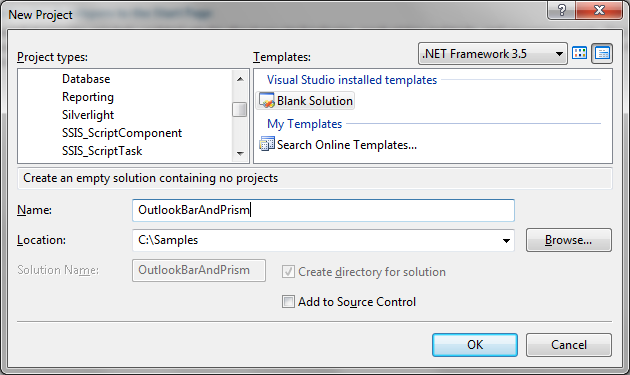

Then, __add a Silverlight project__ and call it __Shell__.

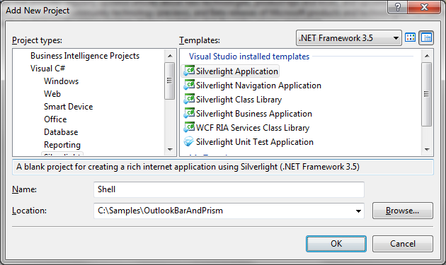

Add references to:

* __Microsoft.Practices.Composite.dll__
* __Microsoft.Practices.Composite.Presentation.dll__
* __Microsoft.Practices.Composite.UnityExtensions.dll__
* __Microsoft.Practice.Unity.dll__

>noteYou can download the latest binaries from [here](http://www.microsoft.com/downloads/details.aspx?FamilyID=387c7a59-b217-4318-ad1b-cbc2ea453f40&displaylang=en). Further information on how to download and build prism can be found [here](http://www.sparklingclient.com/downloading-and-building-prism/).
				
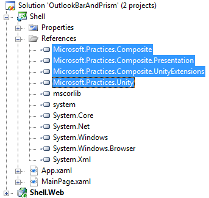

Then, add references to:

* __Telerik.Windows.Controls.dll__
* __Telerik.Windows.Controls.Navigation.dll__

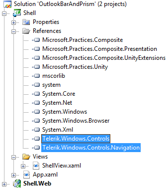

__Delete MainPage.xaml__(*along with MainPage.xaml.cs*), add a __new folder__ called __Views__ and add a __UserControl__ called __ShellView__ to the	__Views__ folder.
				
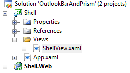

Open __ShellView.xaml__ and __add__ a __RadOutlookBar__ control. __Register__ the __RadOutlookBar__ control with __Prism’s RegionManager__ by giving it a __RegionName__. In this case, registration can happen in XAML by annotating a UIElement with a RegionName attached property.

#### __XAML__

{{region How_to_Use_RadOutlookBar_as_a_Container_in_Prism_Application_0}}
	<UserControl x:Class="Shell.Views.ShellView" 
	             xmlns="http://schemas.microsoft.com/winfx/2006/xaml/presentation"
	             xmlns:x="http://schemas.microsoft.com/winfx/2006/xaml"
	             xmlns:prism="clr-namespace:Microsoft.Practices.Composite.Presentation.Regions;assembly=Microsoft.Practices.Composite.Presentation"
	             xmlns:telerik="http://schemas.telerik.com/2008/xaml/presentation">
	    <Grid x:Name="LayoutRoot">
	        <Grid.ColumnDefinitions>
	            <ColumnDefinition Width="300" />
	            <ColumnDefinition Width="*" />
	        </Grid.ColumnDefinitions>
	        <telerik:RadOutlookBar prism:RegionManager.RegionName="OutlookBarRegion" />
	    </Grid>
	</UserControl>
{{endregion}}

Once a region has been defined via XAML, it will automatically be registered at run time with __RegionManager__, one of the composition services registered by the __bootstrapper__. __RegionManager__ is essentially a Dictionary where the key is the name of the region and the value is an instance of the IRegion interface.

Next, we need to add a bootstrapper class to the Shell project.

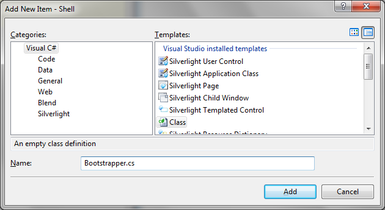

The __Bootstrapper__ inherits __UnityBootstrapper__ and is the __starting point__ of every Prism application. Two common tasks need to be done every time a Bootstrapper is used:

1. __Create Shell__

1. __Create Module Catalog__

For the moment we will do just step 1.

#### __C#__

{{region How_to_Use_RadOutlookBar_as_a_Container_in_Prism_Application_1}}
	public class Bootstrapper : UnityBootstrapper
	{
		protected override DependencyObject CreateShell()
		{
			// Use the container to create an instance of the shell.
			Shell.Views.ShellView shellView = Container.Resolve<Shell.Views.ShellView>();
			// Display the Shell as the root visual for the  application.
			Application.Current.RootVisual = shellView;
			return shellView;
		}
	}
{{endregion}}

#### __VB.NET__

{{region How_to_Use_RadOutlookBar_as_a_Container_in_Prism_Application_1}}
	Public Class Bootstrapper
		Inherits UnityBootstrapper
		Protected Overrides Function CreateShell() As DependencyObject
			' Use the container to create an instance of the shell.
			Dim shellView As Shell.Views.ShellView = Container.Resolve(Of Shell.Views.ShellView)()
			' Display the Shell as the root visual for the  application.
			Application.Current.RootVisual = shellView
			Return shellView
		End Function
	End Class
{{endregion}}

Now we have to actually run the bootstrapper. Go to __App.xaml.cs__ and modify the __Application_Startup__ event handler.
				

#### __C#__

{{region How_to_Use_RadOutlookBar_as_a_Container_in_Prism_Application_2}}
	private void Application_Startup(object sender, StartupEventArgs e)
	{
		Bootstrapper bootstrapper = new Bootstrapper();
		bootstrapper.Run();
	}
{{endregion}}

#### __VB.NET__

{{region How_to_Use_RadOutlookBar_as_a_Container_in_Prism_Application_2}}
	Private Sub Application_Startup(ByVal sender As Object, ByVal e As StartupEventArgs)
		Dim bootstrapper As New Bootstrapper()
		bootstrapper.Run()
	End Sub
{{endregion}}

Now if you run the application in this state, you will get the following error.

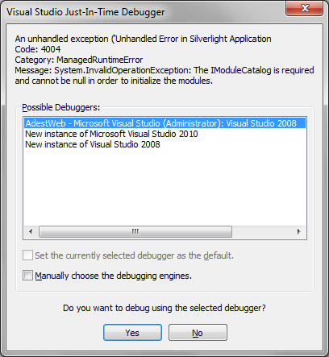

This error is caused by the fact that currently there are no modules to display, so let’s add one.

Add a new Silverlight Class Library to the OutlookBarAndPrism solution and called it ModuleA.

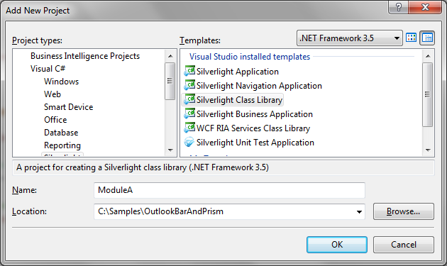

__Remove__ the __Class1.cs__ file that is added by default.Add reference to __Microsoft.Practices.Composite.dll__ and __Microsoft.Practices.Unity.dll.__ Add a __new class__ to the __ModuleA__ class library and call it __ModuleA__.

>noteIt is not required that the class library and the newly added class have the same name.
				

Make __ModuleA__ class implement the __IModule__ interface. The __IModule__ interface contains a method, void Initialize, which we will have to implement.

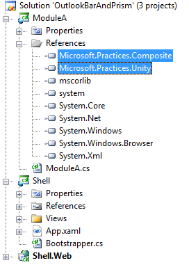

#### __C#__

{{region How_to_Use_RadOutlookBar_as_a_Container_in_Prism_Application_3}}
	public class ModuleA : IModule
	{
		IUnityContainer container;
		IRegionManager regionManager;

		public ModuleA(IRegionManager regionManager, IUnityContainer container)
		{
			this.regionManager = regionManager;
			this.container = container;
		}

		public void Initialize()
		{
			// Register views here.
		}
	}
{{endregion}}

#### __VB.NET__

{{region How_to_Use_RadOutlookBar_as_a_Container_in_Prism_Application_3}}
	Public Class ModuleA
		Implements IModule
		Private container As IUnityContainer
		Private regionManager As IRegionManager
	
		Public Sub New(ByVal regionManager As IRegionManager, ByVal container As IUnityContainer)
			Me.regionManager = regionManager
			Me.container = container
		End Sub
	
		Public Sub Initialize()
			' Register views here.
		End Sub
	End Class
{{endregion}}

We will be back shortly with the implementation of the Initialize method.

Now, __add a new folder__ to the __ModuleA__ class library and __call it Views__. __Add a new UserControl__ to the __Views__ folder and __call it ModuleAView__. __ModuleAView__ will contain a __RadTreeView__. Therefore, we need to add references to __Telerik.Windows.Controls.dll__ and __Telerik.Windows.Controls.Navigation.dll__ to __ModuleA__ class library. This is how __ModuleAView__ might look like:
				

#### __XAML__

{{region How_to_Use_RadOutlookBar_as_a_Container_in_Prism_Application_1}}
	<UserControl x:Class="ModuleA.Views.ModuleAView" 
	             xmlns="http://schemas.microsoft.com/winfx/2006/xaml/presentation"
	             xmlns:x="http://schemas.microsoft.com/winfx/2006/xaml"
	             xmlns:telerik="http://schemas.telerik.com/2008/xaml/presentation">
	    <Grid x:Name="LayoutRoot" Background="White">
	        <telerik:RadTreeView>
	            <telerik:RadTreeViewItem Header="ModuleA Item 0">
	                <telerik:RadTreeViewItem Header="ModuleA Item 0.1" />
	            </telerik:RadTreeViewItem>
	            <telerik:RadTreeViewItem Header="ModuleA Item 1">
	                <telerik:RadTreeViewItem Header="ModuleA Item 1.1" />
	            </telerik:RadTreeViewItem>
	        </telerik:RadTreeView>
	    </Grid>
	</UserControl>
{{endregion}}

Now that we have our first view defined, we need to register it in the Initialize method.
				

#### __C#__

{{region How_to_Use_RadOutlookBar_as_a_Container_in_Prism_Application_5}}
	public void Initialize()
	{
		// Register views here.
		this.regionManager.RegisterViewWithRegion("OutlookBarRegion", ()  =>
		{
			return new ModuleAView();
		});
	}
{{endregion}}

#### __VB.NET__

{{region How_to_Use_RadOutlookBar_as_a_Container_in_Prism_Application_5}}
	Public Sub Initialize()
		' Register views here.'
		Me.regionManager.RegisterViewWithRegion("OutlookBarRegion", Function()
																	Return New ModuleAView()
																	End Function)
	End Sub
{{endregion}}

If you remember, in the __ShellView__ we registered the __RadOutlookBar__ using __prism:RegionManager.RegionName="OutlookBarRegion"__. That is why the first parameter in the __RegisterViewWithRegion__ is called __OutlookBarRegion__.
				

Now let’s leave __ModuleA__ for a bit and go back to the __Bootstrapper__ class in __Shell__. So far, we have done only one of two necessary tasks:

1. Create Shell (__done__)
1. Create Module Catalog
					

Since we have added a module, let’s create a module catalog. First of all, add a reference to the ModuleA class library.
				

Then __open__ the __Bootstrapper__ class and __override__ the __GetModuleCatalog()__ method.
				

#### __C#__

{{region How_to_Use_RadOutlookBar_as_a_Container_in_Prism_Application_6}}
	protected override IModuleCatalog GetModuleCatalog()
	{
		ModuleCatalog catalog = new ModuleCatalog();
		catalog.AddModule(typeof(ModuleA.ModuleA));
		return catalog;
	}
{{endregion}}

#### __VB.NET__

{{region How_to_Use_RadOutlookBar_as_a_Container_in_Prism_Application_6}}
	Protected Overrides Function GetModuleCatalog() As IModuleCatalog
		Dim catalog As New ModuleCatalog()
		catalog.AddModule(GetType(ModuleA.ModuleA))
		Return catalog
	End Function
{{endregion}}

So far, if you run the project you should get result similar to the one bellow:

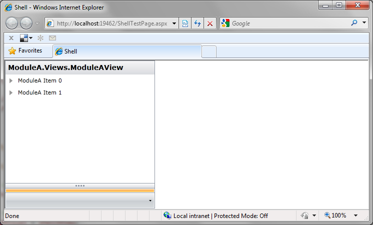

Strangely, the __RadOutlookBarItem__ has no header and the title is a .ToString() representation of the __ModuleAView__ class. To fix that we can add an __ItemHeader__ property to the __ModuleAView__ user control.
				

#### __C#__

{{region How_to_Use_RadOutlookBar_as_a_Container_in_Prism_Application_7}}
	public partial class ModuleAView : UserControl
	{
		public ModuleAView()
		{
			InitializeComponent();
			this.ItemHeader = "ModuleA";
		}
		public string ItemHeader { get; set; }
	}
{{endregion}}

#### __VB.NET__

{{region How_to_Use_RadOutlookBar_as_a_Container_in_Prism_Application_7}}
	Partial Public Class ModuleAView
		Inherits UserControl
		Public Sub New()
			InitializeComponent()
			Me.ItemHeader = "ModuleA"
		End Sub
	
		Public Property ItemHeader() As String
			Get
				Return m_ItemHeader
			End Get
			Set(ByVal value As String)
				m_ItemHeader = Value
			End Set
		End Property
		Private m_ItemHeader As String
	End Class
{{endregion}}

Then, go to the __RadOutlookBar__’s definition in __ShellView.xaml__ and add a __DisplayMemberPath__ property pointing to __Header__.
				

#### __XAML__

{{region How_to_Use_RadOutlookBar_as_a_Container_in_Prism_Application_2}}
    <telerik:RadOutlookBar prism:RegionManager.RegionName="OutlookBarRegion" DisplayMemberPath="ItemHeader" />
{{endregion}}

Now, if you run the project, you will see that the __RadOutlookBarItem__ has a header.

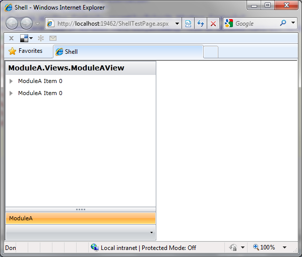

The last thing that needs to be done is to make the __Title__ area display __ModuleA__ as well. The fastest way to do this is to use the __TextSearch__ class that is located in the __Telerik.Windows.Controls__ namespace in __Telerik.Windows.Controls.dll__.

#### __C#__

{{region How_to_Use_RadOutlookBar_as_a_Container_in_Prism_Application_9}}
	public ModuleAView()
	{
		InitializeComponent();
		this.ItemHeader = "ModuleA";
		Telerik.Windows.Controls.TextSearch.SetText(this, "ModuleA");
	}
{{endregion}}

#### __VB.NET__

{{region How_to_Use_RadOutlookBar_as_a_Container_in_Prism_Application_9}}
	Public Sub New()
		InitializeComponent()
		Me.ItemHeader = "ModuleA"
		Telerik.Windows.Controls.TextSearch.SetText(Me, "ModuleA")
	End Sub
{{endregion}}

Now if you run the project, the output should be similar to the onebellow.

Another approach to this scenario is to insert an actual __RadOutlookBarItem__. What I mean by that is instead of having in __ModuleAView.xaml__:
				

#### __XAML__

{{region How_to_Use_RadOutlookBar_as_a_Container_in_Prism_Application_3}}
    <Grid x:Name="LayoutRoot" Background="White">
        <telerik:RadTreeView>
            <telerik:RadTreeViewItem Header="ModuleA Item 0">
                <telerik:RadTreeViewItem Header="ModuleA Item 0.1" />
            </telerik:RadTreeViewItem>
            <telerik:RadTreeViewItem Header="ModuleA Item 0">
                <telerik:RadTreeViewItem Header="ModuleA Item 0.1" />
            </telerik:RadTreeViewItem>
        </telerik:RadTreeView>
    </Grid>
{{endregion}}

You can add the __RadTreeView__ as a content to a __RadOutlookBarItem__:
				

#### __XAML__

{{region How_to_Use_RadOutlookBar_as_a_Container_in_Prism_Application_4}}
    <Grid x:Name="LayoutRoot" Background="White">
        <telerik:RadOutlookBarItem x:Name="outlookBarItem1" 
                                   Title="Some Title"
                                   Header="Some Item">
            <telerik:RadTreeView>
                <telerik:RadTreeViewItem Header="ModuleA Item 0">
                    <telerik:RadTreeViewItem Header="ModuleA Item 0.1" />
                </telerik:RadTreeViewItem>
                <telerik:RadTreeViewItem Header="ModuleA Item 0">
                    <telerik:RadTreeViewItem Header="ModuleA Item 0.1" />
                </telerik:RadTreeViewItem>
            </telerik:RadTreeView>
        </telerik:RadOutlookBarItem>
    </Grid>
{{endregion}}

Now, instead of having an __ItemHeader__ property, you can create a property of type __RadOutlookBarItem__ and return a reference to __outlookBarItem1__:

#### __C#__

{{region How_to_Use_RadOutlookBar_as_a_Container_in_Prism_Application_12}}
	public partial class ModuleAView : UserControl
	{
		public ModuleAView()
		{
			InitializeComponent();
		}
		public RadOutlookBarItem OutlookBarItem
		{
			get
			{
				return this.outlookBarItem1;
			}
		}
	}
{{endregion}}

#### __VB.NET__

{{region How_to_Use_RadOutlookBar_as_a_Container_in_Prism_Application_12}}
	Partial Public Class ModuleAView
		Inherits UserControl
		Public Sub New()
			InitializeComponent()
		End Sub
		Public ReadOnly Property OutlookBarItem() As RadOutlookBarItem
			Get
				Return Me.outlookBarItem1
			End Get
		End Property
	End Class
{{endregion}}

In the __Initialize()__ method of __ModuleA__.cs we will use the previously created __OutlookBarItem__ property:

#### __C#__

{{region How_to_Use_RadOutlookBar_as_a_Container_in_Prism_Application_13}}
	public void Initialize()
    {
	     // Register views here.
	     this.regionManager.RegisterViewWithRegion("OutlookBarRegion", () =>
	     {
	      	return new ModuleAView().OutlookBarItem;
	     });
    }
{{endregion}}

#### __VB.NET__

{{region How_to_Use_RadOutlookBar_as_a_Container_in_Prism_Application_13}}
	Public Sub Initialize()
		' Register views here.'
		Me.regionManager.RegisterViewWithRegion("OutlookBarRegion", Function()
																	Return New ModuleAView().OutlookBarItem
																	End Function)
	End Sub
{{endregion}}

Remove __DisplayMemeberPath__ from __RadOutlookBar’s__ definition in __ShellView.xaml__ and run the project. If you get the following error, then we are on the right track.

The reason for it is that whatever is defined in __LayoutRoot__ of __ModuleAView.xaml__ is a child of __ModuleAView__, but we are adding it to __RadOutlookBar__ as well. Thus the problem, one and the same visual element cannot appear on more than one place in the visual tree of the application. To overcome this issue, in the constructor of __ModuleAView__ we need to remove whatever is in __LayoutRoot__.
				

#### __C#__

{{region How_to_Use_RadOutlookBar_as_a_Container_in_Prism_Application_14}}
	public partial class ModuleAView : UserControl
	{
		public ModuleAView()
		{
			InitializeComponent();
			this.LayoutRoot.Children.Clear();
		}

		public RadOutlookBarItem OutlookBarItem
		{
			get
			{
				return this.outlookBarItem1;
			}
		}
	}
{{endregion}}

#### __VB.NET__

{{region How_to_Use_RadOutlookBar_as_a_Container_in_Prism_Application_14}}
	Partial Public Class ModuleAView
		Inherits UserControl
		Public Sub New()
			InitializeComponent()
			Me.LayoutRoot.Children.Clear()
		End Sub
	
		Public ReadOnly Property OutlookBarItem() As RadOutlookBarItem
			Get
				Return Me.outlookBarItem1
			End Get
		End Property
	End Class
{{endregion}}

Now if you run the project, everything should be fine.

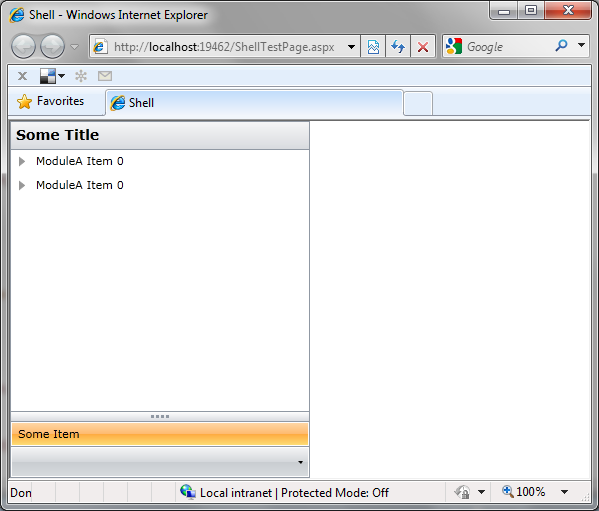