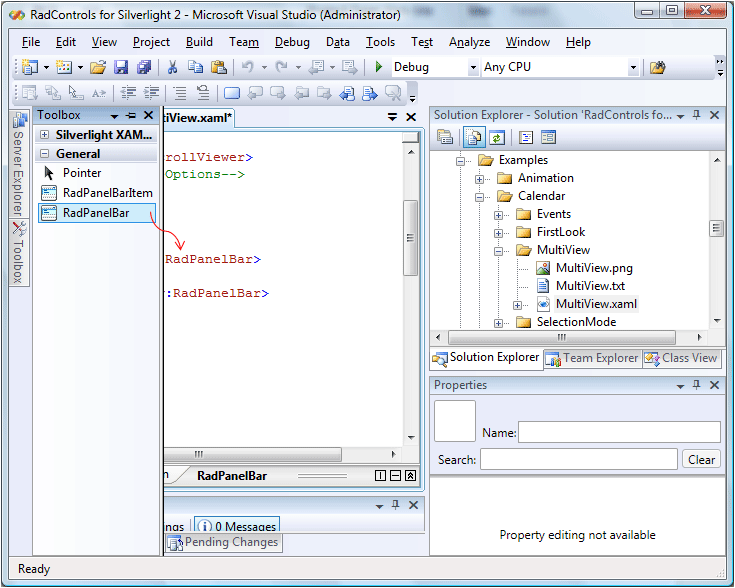
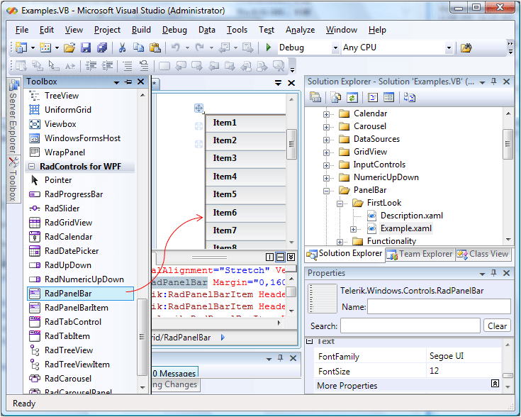

# Getting Started

This article will show you how to create a simple PanelBar.

## Getting Started with RadPanelBar


>In order to use __RadPanelBar__ control in your projects you have to add references to the following assemblies:
>	- __Telerik.Windows.Controls__
>	- __Telerik.Windows.Controls.Navigation__
>	- __Telerik.Windows.Data__  

>You can find more info [here](http://www.telerik.com/help/wpf/installation-installing-controls-dependencies-wpf.html).



>In order to use __RadPanelBar__ control in your projects you have to add references to the following assemblies:
>	- __Telerik.Windows.Controls__
>	- __Telerik.Windows.Controls.Navigation__  

>You can find more info [here](http://www.telerik.com/help/silverlight/installation-installing-controls-dependencies.html).


1. Drag and Drop the __PanelBar__ control from the toolbox.
	
	
	
	
	
	

1. After you have dropped the control onto the XAML you can manage the control by setting various properties to operate the control's behavior:			

	#### __XAML__
	{{region xaml-radpanelbar-populating_0}}
		<telerik:RadPanelBar VerticalAlignment="Center" ExpandMode="Single" />
	{{endregion}}

## Populating the RadPanelBar with Items

### Declaratively populating the RadPanelBar control Items collection	  

You can add __RadPanelBarItems__ directly to the __RadPanelBar.Items__ collection in XAML:			

#### __XAML__
{{region xaml-radpanelbar-populating_1}}
	<telerik:RadPanelBar>
	    <telerik:RadPanelBarItem Header="Item 1" />
	    <telerik:RadPanelBarItem Header="Item 2" />
	    <telerik:RadPanelBarItem Header="Item 3" />
	</telerik:RadPanelBar>
{{endregion}}

Or you can populate the items collection from code-behind:			

#### __C#__
{{region cs-radpanelbar-populating_2}}
	RadPanelBar myPanelBar = new RadPanelBar();
	RadPanelBarItem item1 = new RadPanelBarItem() { Header = "Item 1" };
	RadPanelBarItem item2 = new RadPanelBarItem() { Header = "Item 2" };
	RadPanelBarItem item3 = new RadPanelBarItem() { Header = "Item 3" };
	myPanelBar.Items.Add(item1);
	myPanelBar.Items.Add(item2);
	myPanelBar.Items.Add(item3);
{{endregion}}

#### __VB.NET__
{{region vb-radpanelbar-populating_3}}
	Dim myPanelBar As New RadPanelBar()
	Dim item1 As New RadPanelBarItem() With {
	.Header = "Item 1"
			}
	Dim item2 As New RadPanelBarItem() With {
	.Header = "Item 2"
			}
	Dim item3 As New RadPanelBarItem() With {
	.Header = "Item 3"
			}
	myPanelBar.Items.Add(item1)
	myPanelBar.Items.Add(item2)
	myPanelBar.Items.Add(item3)
{{endregion}}

### Databinding the RadPanelBar control		  

The alternative to populating a __RadPanelBar__ by explicitly declaring its items, is data binding the control to a collection of objects. Here is an example of binding a __RadPanelBar__ to a list of strings:			

#### __C#__
{{region cs-radpanelbar-populating_4}}
	List<string> myListDataSource = new List<string>();
	myListDataSource.Add("Item 1");
	myListDataSource.Add("Item 2");
	myListDataSource.Add("Item 3");
	RadPanelBar myPanel = new RadPanelBar();
	myPanel.ItemsSource = myListDataSource;
{{endregion}}

#### __VB.NET__
{{region vb-radpanelbar-populating_5}}
	Dim myListDataSource As New List(Of String)()
	myListDataSource.Add("Item 1")
	myListDataSource.Add("Item 2")
	myListDataSource.Add("Item 3")
	Dim myPanel As New RadPanelBar()
	myPanel.ItemsSource = myListDataSource
{{endregion}}