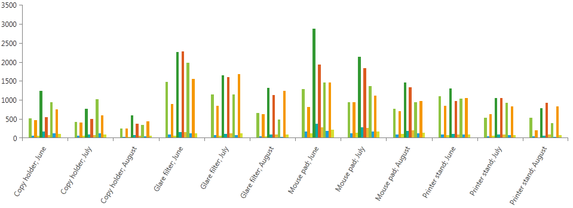

# ChartView Integration

In this article we will show you how to integrate __RadPivotGrid__ with __RadChartView__.
    

## PivotChartViewModel

In order to create __RadChartView__ you need data source. In our case we need the aggregated data from RadPivotGrid's DataProvider. 
          That's why we have created __PivotChartViewModel__ - this class exposes several properties that will help to integrate the two contorls:
        

* __DataProvider__ - this property holds the DataProvider for which you will create __RadChartView__. It is mandatory to set it, otherwise you
              will not populate __RadChartView__ with data.
            

* __SeriesSource__ - this property holds a collection that is automatically filled after the *DataProvider* property is set and when 
              there is a change in the used DataProvider (for example when you add new *RowGroupDescription*, __SeriesSource__ will be populated
              with the new data.
            

* __RowGrandTotalsPosition__ - controls the position of Row Grand Totals  in the chart. You can choose between None, Left and Right. The default value is set to None.
            

* __RowsSubTotalsPosition__ - controls the position of Row SubTotals in the chart. You can choose between None, Left and Right. The default value is set to None.
            

* __ColumnGrandTotalsPosition__ - controls the position of Column Grand Totals in the chart. You can choose between None, Left and Right. The default value is set to None.
            

* __ColumnsSubTotalsPosition__ - controls the position of Column SubTotals in the chart. You can choose between None, Left and Right. The default value is set to None.
            

* __IsReady__ - boolean value, indicating the state of the DataProvider that is used by __PivotChartViewModel__. Its value is true, when the DataProvider
              is still aggregating data.
            

* __SelectedAxis__ - Gets or sets the PivotAxis which will be used as the Y axis (the value axis) when generating the __SeriesSource__. Default value is *Columns*.
            

>If you use both __RadPivotGrid__ and __PivotChartViewModel__, changing the GrandTotals/SubTotals position in one of them, will not affect the other one as they are not connected.
          

## Creating RadChartView

>In order to use __RadChartView__ in your application, you will have to add references to __Telerik.Windows.Controls Telerik.Windows.Controls.Chart and Telerik.Windows.Controls.Data__ assmeblies.
          

Our first task is to create an instance of __PivotChartViewModel__ and set its *DataProvider*. We will use this instance as a DataContext of our application:
        

#### __XAML__

{{region radpivotgrid-features-chartview_1}}
	<UserControl.DataContext>
	    <pivot:PivotChartViewModel DataProvider="{StaticResource DataProvider}"/>
	</UserControl.DataContext>
	{{endregion}}

#### __C#__

{{region radpivotgrid-features-chartview_1}}
	public PivotChartUserControl()
	{
	    InitializeComponent();
	    var chartViewModel = new PivotChartViewModel();
	    chartViewModel.DataProvider = this.DataProvider;
	    this.DataContext = chartViewModel;
	}
	{{endregion}}

#### __VB.NET__

{{region radpivotgrid-features-chartview_1}}
	Public Sub New()
		InitializeComponent()
		Dim chartViewModel = New PivotChartViewModel()
		chartViewModel.DataProvider = Me.DataProvider
		Me.DataContext = chartViewModel
	End Sub
	{{endregion}}

Now we will create a new __RadCartesianChart__ and set its *HorizontalAxis*, *VerticalAxis* and *SeriesProvider* properties. 
          We will use *ChartSeriesProvider* and bind its Source to the *SeriesSource* of __PivotChartViewModel__.
        

#### __XAML__

{{region radpivotgrid-features-chartview_2}}
	<telerik:RadCartesianChart x:Name="chart"  Grid.Row="1" Palette="Windows8">
	    <telerik:RadCartesianChart.HorizontalAxis>
	        <telerik:CategoricalAxis LabelFitMode="Rotate" />
	    </telerik:RadCartesianChart.HorizontalAxis>
	    <telerik:RadCartesianChart.VerticalAxis>
	        <telerik:LinearAxis HorizontalAlignment="Right" />
	    </telerik:RadCartesianChart.VerticalAxis>
	
	    <telerik:RadCartesianChart.SeriesProvider>
	        <telerik:ChartSeriesProvider Source="{Binding SeriesSource}" >
	            <telerik:ChartSeriesProvider.SeriesDescriptors >
	                <telerik:CategoricalSeriesDescriptor  x:Name="seriesDescriptor"  ItemsSourcePath="Items" ValuePath="Value" CategoryPath="NameX"/>
	            </telerik:ChartSeriesProvider.SeriesDescriptors>
	        </telerik:ChartSeriesProvider>
	    </telerik:RadCartesianChart.SeriesProvider>
	</telerik:RadCartesianChart>
	{{endregion}}

Note the binginds for *ItemsSourcePath*, *ValuePath* and *CategoryPath* properties. *Items* is a property of
        __Telerik.Pivot.Core.PivotChartItemsCollection__. *Values* and *NameX* are properties of __Telerik.Pivot.Core.PivotChartItem__.
      

And here is the result of the application:

## Set Chart type and Show Legend

You can change the chart type by setting a Style on your __CategoricalSeriesDescriptor__. In order to create __RadLegend__ you will have to use a converter
          in order to convert the Name to a SeriesLegendSettings.
        

First lets create the Style. We'll use BarSeries and we'll set its *CombineMode* and *LegendSettings* properties:
         

#### __XAML__

{{region radpivotgrid-features-chartview_3}}
	<telerik:CategoricalSeriesDescriptor  x:Name="seriesDescriptor"  ItemsSourcePath="Items" ValuePath="Value" CategoryPath="NameX">
	    <telerik:CategoricalSeriesDescriptor.Style>
	        
	    </telerik:CategoricalSeriesDescriptor.Style>
	</telerik:CategoricalSeriesDescriptor>
	{{endregion}}

The *SeriesSourceNameToSeriesLegendSettigsConverter* is a class in our application:
        

#### __C#__

{{region radpivotgrid-features-chartview_4}}
	public class SeriesSourceNameToSeriesLegendSettigsConverter : IValueConverter
	{
	    public object Convert(object value, Type targetType, object parameter, System.Globalization.CultureInfo culture)
	    {
	        return new SeriesLegendSettings() 
	        { 
	            Title = value.ToString() 
	        };
	    }
	
	    public object ConvertBack(object value, Type targetType, object parameter, System.Globalization.CultureInfo culture)
	    {
	        throw new NotImplementedException();
	    }
	}
	{{endregion}}

#### __VB.NET__

{{region radpivotgrid-features-chartview_4}}
	Public Class SeriesSourceNameToSeriesLegendSettigsConverter
		Implements IValueConverter
	
		Public Function Convert(ByVal value As Object, ByVal targetType As Type, ByVal parameter As Object, ByVal culture As System.Globalization.CultureInfo) As Object
			Return New SeriesLegendSettings() With {.Title = value.ToString()}
		End Function
	
		Public Function ConvertBack(ByVal value As Object, ByVal targetType As Type, ByVal parameter As Object, ByVal culture As System.Globalization.CultureInfo) As Object
			Throw New NotImplementedException()
		End Function
	End Class
	{{endregion}}

Now we just have to add __RadLegend__ to our application:
        

#### __XAML__

{{region radpivotgrid-features-chartview_5}}
	<telerik:RadLegend x:Name="legend" Grid.Row="1" Grid.Column="1" Margin="10 10 0 0" Items="{Binding ElementName=chart, Path=LegendItems, Mode=OneWay}"/>
	{{endregion}}

And here is the result:
        

# See Also

 * [RadPivotGrid Getting Started]()

 * [RadPivotFieldList]()

 * [Features]()

 * [RadChartView]()
