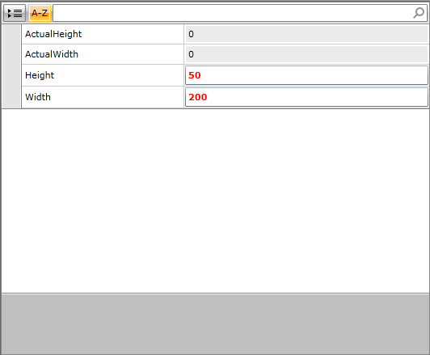

# AutoBind Attached Behavior

DataTemplate reusing techniques – AutoBind attached behavior

## The AutoBind attached behavior

The need of reusable DataTemplates is a common scenario with quite few universal viable solutions. The AutoBind attached behavior enables RadPropertyGrid to use a single DataTemplate resource as an EditorTemplate value for multiple PropertyDefinitions without any additional effort on the users’ side.

[Here](
                http://www.telerik.com/help/silverlight/t_telerik_windows_controls_data_propertygrid_autobindbehavior.html
              )[Here](
                http://www.telerik.com/help/wpf/t_telerik_windows_controls_data_propertygrid_autobindbehavior.html
              )
          is the API reference for the AutoBindBehaviour.
        

Here is a small example with RadPropertyGrid that has its Item property bound to a Button:
        

#### __XAML__

{{region radpropertygrid-autobind_0}}
	<Grid x:Name="LayoutRoot" Background="White">
	        <Grid.Resources>
	            <DataTemplate x:Key="editorTemplate">
	                <TextBox Foreground="Red" FontWeight="Bold" propertyGrid:AutoBindBehavior.UpdateBindingOnElementLoaded="Text" />
	            </DataTemplate>
	        </Grid.Resources>
	        <telerik:RadPropertyGrid x:Name="rpg" AutoGeneratePropertyDefinitions="False">
	            <telerik:RadPropertyGrid.PropertyDefinitions>
	                <telerik:PropertyDefinition Binding="{Binding Height}" 
	                                            EditorTemplate="{StaticResource editorTemplate}" 
	                                            DisplayName="Height" />
	                <telerik:PropertyDefinition Binding="{Binding Width}" 
	                                            EditorTemplate="{StaticResource editorTemplate}" 
	                                            DisplayName="Width" />
	                <telerik:PropertyDefinition Binding="{Binding ActualHeight}" 
	                                            IsReadOnly="True"                                            
	                                            DisplayName="ActualHeight"/>
	                <telerik:PropertyDefinition Binding="{Binding ActualWidth}" 
	                                            IsReadOnly="True"                                            
	                                            DisplayName="ActualWidth"/>
	            </telerik:RadPropertyGrid.PropertyDefinitions>
	        </telerik:RadPropertyGrid>
	    </Grid>
	{{endregion}}

The AutoBind attached behavior is also available in scenarios with auto-generated fields. In order to achieve this one can either set a PropertyDefinition’s EditorTemplate on the AutogeneratingDataField, or utilize a [DataTemplateSelector]().
        

TwoWay binding with the AutoBindBehavior is supported for the following types:
        

* Primitive types
            

* Enum
            

* String
            

* Decimal
            

* Guid
            

* DateTime
            

* Color
            

## How does it work?

AutoBind behavior would work with any type of FrameworkElements that are parts of a certain DataTemplate. In order to enable it one should set its UpdateBindingOnElementLoaded property with a string value that indicates which is the element’s property that should be bound. Apparently, in our example it is TextBox’s Text DependencyProperty.

>The AutoBind behavior is designed to function exclusively in the context of RadPropertyGrid.
          

# See Also

 * [DataTemplateSelector]()
