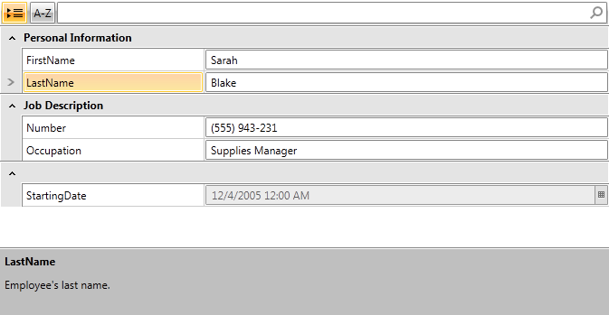

# Data Annotations

In this article we will show you how to use Data Annotations with RadPropertyGrid.
      

RadPropertyGrid supports Data Annotations attributes like:

* Display

* ReadOnly

* Browsable

Using Data Annotations you can categories different properties into separate groups, set some of them as read-only and define description for each of them.
      

## Creating PropertyGrid Application

First, for the purpose of this tutorial, we will create a new class Employee with a couple of properties:

#### __C#__

{{region radpropertygrid-data-annotations_1}}
	     public class Employee
	    {       
	        public string FirstName { get; set; }
	        public string LastName { get; set; }
	        public string PhoneNum { get; set; } 
	        public int Salary { get; set; }
	        public string Occupation { get; set; }                          
	        public DateTime StartingDate { get; set; }              
	    }
	{{endregion}}

#### __VB__

{{region radpropertygrid-data-annotations_2}}
	    Public Class Employee
	        Public Property FirstName() As String
	            Get
	                Return m_FirstName
	            End Get
	            Set(value As String)
	                m_FirstName = Value
	            End Set
	        End Property
	        Private m_FirstName As String
	        Public Property LastName() As String
	            Get
	                Return m_LastName
	            End Get
	            Set(value As String)
	                m_LastName = Value
	            End Set
	        End Property
	        Private m_LastName As String
	        Public Property PhoneNum() As String
	            Get
	                Return m_PhoneNum
	            End Get
	            Set(value As String)
	                m_PhoneNum = Value
	            End Set
	        End Property
	        Private m_PhoneNum As String
	        Public Property Salary() As Integer
	            Get
	                Return m_Salary
	            End Get
	            Set(value As Integer)
	                m_Salary = Value
	            End Set
	        End Property
	        Private m_Salary As Integer
	        Public Property Occupation() As String
	            Get
	                Return m_Occupation
	            End Get
	            Set(value As String)
	                m_Occupation = Value
	            End Set
	        End Property
	        Private m_Occupation As String
	        Public Property StartingDate() As DateTime
	            Get
	                Return m_StartingDate
	            End Get
	            Set(value As DateTime)
	                m_StartingDate = Value
	            End Set
	        End Property
	        Private m_StartingDate As DateTime
	    End Class
	
	{{endregion}}

Once the class Employee is defined, you may use it for creating an object of this type and bind it to RadPropertyGrid:
        

#### __C#__

{{region radpropertygrid-data-annotations_3}}
	this.propertyGrid1.Item = new Employee()
	            {
	                FirstName = "Sarah",
	                LastName = "Blake",
	                PhoneNum = "(555) 943-231",
	                Occupation = "Supplies Manager",              
	                Salary = 3500,
	                StartingDate = new DateTime(2005, 12, 4)
	            };
	{{endregion}}

#### __VB__

{{region radpropertygrid-data-annotations_4}}
	    Me.PropertyGrid1.Item = New Employee() With { _
	  .FirstName = "Sarah", _
	  .LastName = "Blake", _
	  .Occupation = "Supplied Manager", _
	  .StartingDate = New DateTime(2005, 4, 12), _
	  .Salary = 3500 _
	}
	{{endregion}}

The declaration of RadPropertyGrid control inside the Grid:
        

#### __XAML__

{{region radpropertygrid-data-annotations_0}}
	<telerik:RadPropertyGrid x:Name="propertyGrid1" />
	{{endregion}}

After you run the application you should see the following:
        

## Data Annotations with RadPropertyGrid

>important
          If you want to use Data Annotations in your application, you have to add a reference to System.ComponentModel.DataAnnotations assembly.
        

With Data Annotations you can apply attributes to the members of the class that specify how the data is displayed. RadPropertyGrid supports different Data Annotations:

* 
            Display - this is recommended attribute type to use. You can use its properties:
            

* 
                Name - The value of Name will be used in RadPropertyGrid instead of the PropertyName.
              

* 
                Description - will be used in when you want to define a description of the Property.
              

* 
                GroupName -  will be used when you want to categorise different properties into separate groups.
              

* 
                Order - will be used when you want to set Property's display order.
              Here is a sample how to set DataAnnotation with Display attribute:

#### __C#__

{{region radpropertygrid-data-annotations_5}}
	         //Rename the StartingDate property to Year in the UI
	         [Display(Name = "Year")]
	         public DateTime StartingDate { get; set; }
	
	         //Set a description to the FirstName property and categorize it to be from the group "Personal Information"
	         [Display(Description = "Employee's first name.", GroupName = "Personal Information")]
	         public string FirstName { get; set; }
	
	         //Set a description to the LastName property and categorize it to be from the group "Personal Information"
	         [Display(Description = "Employee's last name.", GroupName = "Personal Information")]
	         public string LastName { get; set; }
	{{endregion}}

* 
            Browsable - with this attribute you can define whether an item should be visible or not.
            

#### __C#__

{{region radpropertygrid-data-annotations_7}}
	         //Hide StartingDate from the UI
	        [Browsable(false)]
	        public DateTime StartingDate { get; set; }
	{{endregion}}

* 
            ReadOnly- set a property as read-only.
            

#### __C#__

{{region radpropertygrid-data-annotations_9}}
	         //Set StartingDate as Read-Only
	        [ReadOnly(true)]
	        public DateTime StartingDate { get; set; }
	{{endregion}}

So let's modify our simple Employee class and see the result in RadPropertGrid.
        

#### __C#__

{{region radpropertygrid-data-annotations_11}}
	        [Display(Description = "Employee's first name.", GroupName="Personal Information")]
	        public string FirstName { get; set; }        
	        [Display(Description = "Employee's last name.", GroupName="Personal Information")]
	        public string LastName { get; set; }
	        [Display(Name = "Occupation", GroupName = "Job Description")]
	        public string Occupation { get; set; }               
	        [Browsable(false)]
	        public int Salary { get; set; }
	        [Display(Name = "Number", GroupName = "Job Description")]
	        public string PhoneNum { get; set; }        
	        [ReadOnly(true)]
	        public DateTime StartingDate { get; set; } 
	{{endregion}}

And here is the new result:
        

