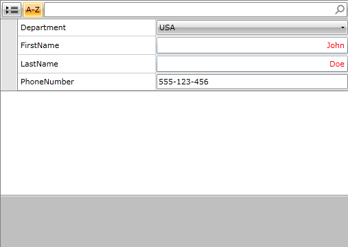

# DataTemplateSelector Support

## Overview

The __DataTemplateSelector__ approach enables conditional selection of __DataTemplates__, based on information provided by the respective bound data item. 
         

[Here](http://www.telerik.com/help/silverlight/gridview-template-selectors-overview.html)[Here](http://www.telerik.com/help/wpf/gridview-template-selectors-overview.html) is an article that provides some additional, more extensive information on __DataTemplateSelectors__.
        

## DataTemplateSelectors in RadPropertyGrid

RadPropertyGrid enables its users to implement conditional editor __DataTemplate__ selection for its __PropertyGridFields__ trough a __DataTemplateSelector__:

#### [C#]Example 1: Creating custom DataTemplateSelector

	{{region radpropertygrid-datatemplateselector_1}}	    
	    public class Customer
	    {
	        public string FirstName { get; set; }
	        public string LastName { get; set; }
	        public string PhoneNumber { get; set; }
	        public Department Department { get; set; }
	    }
	 
	    public class FieldTemplateSelector : DataTemplateSelector
	    {
	        public override DataTemplate SelectTemplate(object item, DependencyObject container)
	        {
	            PropertyDefinition propDef = item as PropertyDefinition;
	            if (propDef.DisplayName == "PhoneNumber")
	            {
	                return this.PhoneNumberDataTemplate;
	            }
	            if (propDef.SourceProperty.PropertyType == typeof(string))
	            {
	                return this.StringDataTemplate;
	            }
	            return null;
	        }
	 
	        public DataTemplate PhoneNumberDataTemplate { get; set; }
	        public DataTemplate StringDataTemplate { get; set; }
	    }
	
	{{endregion}}

#### [VB]Example 1: Creating custom DataTemplateSelector

	{{region radpropertygrid-datatemplateselector_2}}
	    Public Class Customer
	        Public Property FirstName() As String
	            Get
	                Return m_FirstName
	            End Get
	            Set(value As String)
	                m_FirstName = Value
	            End Set
	        End Property
	        Private m_FirstName As String
	        Public Property LastName() As String
	            Get
	                Return m_LastName
	            End Get
	            Set(value As String)
	                m_LastName = Value
	            End Set
	        End Property
	        Private m_LastName As String
	        Public Property PhoneNumber() As String
	            Get
	                Return m_PhoneNumber
	            End Get
	            Set(value As String)
	                m_PhoneNumber = Value
	            End Set
	        End Property
	        Private m_PhoneNumber As String
	        Public Property Department() As Department
	            Get
	                Return m_Department
	            End Get
	            Set(value As Department)
	                m_Department = Value
	            End Set
	        End Property
	        Private m_Department As Department
	    End Class
	
	    Public Class FieldTemplateSelector
	        Inherits DataTemplateSelector
	        Public Overrides Function SelectTemplate(item As Object, container As DependencyObject) As DataTemplate
	            Dim propDef As PropertyDefinition = TryCast(item, PropertyDefinition)
	            If propDef.DisplayName = "PhoneNumber" Then
	                Return Me.PhoneNumberDataTemplate
	            End If
	            If propDef.SourceProperty.PropertyType = GetType(String) Then
	                Return Me.StringDataTemplate
	            End If
	            Return Nothing
	        End Function
	
	        Public Property PhoneNumberDataTemplate() As DataTemplate
	            Get
	                Return m_PhoneNumberDataTemplate
	            End Get
	            Set(value As DataTemplate)
	                m_PhoneNumberDataTemplate = Value
	            End Set
	        End Property
	        Private m_PhoneNumberDataTemplate As DataTemplate
	        Public Property StringDataTemplate() As DataTemplate
	            Get
	                Return m_StringDataTemplate
	            End Get
	            Set(value As DataTemplate)
	                m_StringDataTemplate = Value
	            End Set
	        End Property
	        Private m_StringDataTemplate As DataTemplate
	    End Class
	
	{{endregion}}



#### [XAML]Example 2: Defining custom DataTemplateSelector

	{{region radpropertygrid-datatemplateselector_0}}
			<Window x:Class="YourProjectNamespace.MainWindow"
			        xmlns="http://schemas.microsoft.com/winfx/2006/xaml/presentation"
			        xmlns:x="http://schemas.microsoft.com/winfx/2006/xaml"
			        xmlns:local="clr-namespace:YourProjectNamespace"
			        xmlns:telerik="http://schemas.telerik.com/2008/xaml/presentation"
			        Title="MainWindow">
				<Grid x:Name="LayoutRoot" Background="White">
					<Grid.Resources>
						<local:FieldTemplateSelector x:Key="DataTemplateSelector">
							<local:FieldTemplateSelector.StringDataTemplate>
								<DataTemplate>
									<TextBox Foreground="Red"
									         TextAlignment="Right"
									         telerik:AutoBindBehavior.UpdateBindingOnElementLoaded="Text" />
								</DataTemplate>
							</local:FieldTemplateSelector.StringDataTemplate>
							<local:FieldTemplateSelector.PhoneNumberDataTemplate>
								<DataTemplate>
									<telerik:RadMaskedTextInput Mask="###-###-###" Value="{Binding PhoneNumber, Mode=TwoWay}" />
								</DataTemplate>
							</local:FieldTemplateSelector.PhoneNumberDataTemplate>
						</local:FieldTemplateSelector>
					</Grid.Resources>
					<telerik:RadPropertyGrid x:Name="rpg" EditorTemplateSelector="{StaticResource DataTemplateSelector}" />
				</Grid>
			</Window>
	{{endregion}}



#### [XAML]Example 2: Defining custom DataTemplateSelector

	{{region radpropertygrid-datatemplateselector_1}}
			<UserControl x:Class="YourProjectNamespace.MainPage"
			             xmlns="http://schemas.microsoft.com/winfx/2006/xaml/presentation"
			             xmlns:x="http://schemas.microsoft.com/winfx/2006/xaml"
			             xmlns:d="http://schemas.microsoft.com/expression/blend/2008"
			             xmlns:local="clr-namespace:YourProjectNamespace"
			             xmlns:mc="http://schemas.openxmlformats.org/markup-compatibility/2006"
			             xmlns:telerik="http://schemas.telerik.com/2008/xaml/presentation">
	
				<Grid x:Name="LayoutRoot" Background="White">
					<Grid.Resources>
						<local:FieldTemplateSelector x:Key="DataTemplateSelector">
							<local:FieldTemplateSelector.StringDataTemplate>
								<DataTemplate>
									<TextBox Foreground="Red"
									         TextAlignment="Right"
									         telerik:AutoBindBehavior.UpdateBindingOnElementLoaded="Text" />
								</DataTemplate>
							</local:FieldTemplateSelector.StringDataTemplate>
							<local:FieldTemplateSelector.PhoneNumberDataTemplate>
								<DataTemplate>
									<telerik:RadMaskedTextInput Mask="###-###-###" Value="{Binding PhoneNumber, Mode=TwoWay}" />
								</DataTemplate>
							</local:FieldTemplateSelector.PhoneNumberDataTemplate>
						</local:FieldTemplateSelector>
					</Grid.Resources>
					<telerik:RadPropertyGrid x:Name="rpg" EditorTemplateSelector="{StaticResource DataTemplateSelector}" />
				</Grid>
			</UserControl>
	{{endregion}}



>You might wonder where these "telerik" and "local", in front of the tags RadPropertyGrid and __FieldTemplateSelector__, came from. Well, these are the names of the namespaces you give when you import the appropriate assembly or your custom __DataTemplateSelector__ class into the XAML file.
		  

>AutoBind attached behavior is fully compatible with the __DataTemplateSelector__ approach.
          

# See Also

 * [AutoBind Behaviour]()
