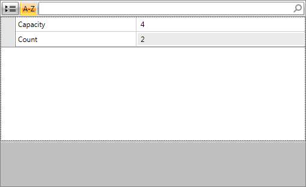

# Defining Property-Sets

With the __“Property sets”__ feature RadPropertyGrid enables its users to process multiple items, properties simultaneously. It is no longer needed to provide additional ViewModels to expose them or manage their changes backwards to your business object instances. Everything now happens under the hood.

## How does it work?

In order to benefit from this feature, one should set RadPropertyGrid’s PropertySetMode property an appropriate value and provide an IEnumerable based instance that contains the business objects. 

>You can check the "__Validating Property Sets__" section from the PropertyGrid`s [Validation]() article for information on how to apply validation for property sets.

* [Modes](#modes)

* [Customizing PropertyDefinitions](#customizing-propertydefinitions)

* [Disable creating object instance for null value](#disable-creating-object-instance-for-null-value)

## Modes

* [None](#none)

* [Union](#union)

* [Intersection](#intersection)

For the means of illustrating the separate mode values, the following types will be used:

#### __[C#] Example 1: Preparing sample data__

	{{region cs-radpropertygrid-defining-propertysets_0}}
	public class Ellipse
	{
	    public Color FillColor { get; set; }
	    public double RadiusX1 { get; set; }
	    public double RadiusX2 { get; set; }
	    public Point Center { get; set; }
	}
	public class RegularPolygon
	{
	    public int CornersCount { get; set; }
	    public Color FillColor { get; set; }
	    public Point Center { get; set; }
	    public double SideLength { get; set; }
	}
	public class ViewModel
	{
	    public IEnumerable<object> Shapes
	    {
	        get
	        {
	            return new List<object>()
	            {
	                new Ellipse()
	                {
	                    Center = new Point(1,1),
	                    FillColor = Colors.Red,
	                    RadiusX1 = 4, RadiusX2 = 2
	                    },
	                    new RegularPolygon()
	                {
	                    Center = new Point(3,2),
	                    FillColor = Colors.Blue,
	                    CornersCount = 3,
	                    SideLength = 10
	                }
	            };
	        }
	    }
	}
{{endregion}}

#### __[VB.NET] Example 1: Preparing sample data__

	{{region vb-radpropertygrid-defining-propertysets_0}}
	Public Class Ellipse
	    Public Property FillColor() As Color
	    Public Property RadiusX1() As Double
	    Public Property RadiusX2() As Double
	    Public Property Center() As Point
	End Class
	Public Class RegularPolygon
	    Public Property CornersCount() As Integer
	    Public Property FillColor() As Color
	    Public Property Center() As Point
	    Public Property SideLength() As Double
	End Class
	Public Class ViewModel
	    Public ReadOnly Property Shapes() As IEnumerable(Of Object)
	        Get
	            Return New List(Of Object)() From {
	                New Ellipse() With {
	                    .Center = New Point(1, 1),
	                    .FillColor = Colors.Red,
	                    .RadiusX1 = 4,
	                    .RadiusX2 = 2
	                },
	                New RegularPolygon() With {
	                    .Center = New Point(3, 2),
	                    .FillColor = Colors.Blue,
	                    .CornersCount = 3,
	                    .SideLength = 10
	                }
	            }
	        End Get
	    End Property
	End Class
{{endregion}}

#### __[XAML] Example 2: Defining RadPropertyGrid__

	{{region xaml-radpropertygrid-defining-propertysets_1}}
	<Grid>
	    <Grid.Resources>
	        <local:ViewModel x:Key="vm" />
	    </Grid.Resources>
	    <telerik:RadPropertyGrid DataContext="{StaticResource vm}" 
	                         Item="{Binding Shapes}" />
	</Grid>
{{endregion}}

### None

“None” is the default value of RadPropertyGrid’s PropertySetMode property. In this case the Item value is processed as a single object, regardless of its type. It is a List of objects instance in our occasion:

Both RegularPolygon and Ellipse’s properties has been disregarded and only the two public properties of List are displayed.

### Union

When “Union” is the active mode, a union set of items’ properties is constructed. In case that a property that is common for several items has the same value for each of them, RadPropertyGrid displays this value in the respective editor. On the other hand, if it has different values for the separate items, the editor displays either null, or the default value for this type

### Intersection

The “Intersection” mode works in a similar way to the “Union” mode, with a single difference – when it is used RadPropertyGrid constructs an intersection set instead. Here is the output when “Intersection” mode is applied over the same data source:

## Customizing PropertyDefinitions

RadPropertyGrid utilizes a DynamicObject ViewModel for the construction of the specified set. In order to provide a cross-platform data binding approach, an indexer has been exposed. However, as dynamic properties do not contain any information about their relying type an IValueConverter instance might be needed in certain scenarios:

#### __[XAML] Example 3: Defining editor template__

	{{region xaml-radpropertygrid-defining-propertysets_2}}
	<Grid x:Name="LayoutRoot">
	    <Grid.Resources>
	        <local:ViewModel x:Key="vm" />
	        <local:MyConverter x:Key="cnv" />
	        <DataTemplate x:Key="editorTemplate">
	            <telerik:RadNumericUpDown Value="{Binding CurrentPropertySet[CornersCount], Mode=TwoWay, Converter={StaticResource cnv}}" />
	        </DataTemplate>
	    </Grid.Resources>
	    <telerik:RadPropertyGrid DataContext="{StaticResource vm}" 
	                         Item="{Binding Shapes}" 
	                         PropertySetMode="Union" 
	                         AutoGeneratingPropertyDefinition="RadPropertyGrid_AutoGeneratingPropertyDefinition"/>
	</Grid>
{{endregion}}

#### __[C#] Example 4: Setting EditorTemplate of a PropertyDefinition__

	{{region cs-radpropertygrid-defining-propertysets_3}}
	private void RadPropertyGrid_AutoGeneratingPropertyDefinition(object sender, Telerik.Windows.Controls.Data.PropertyGrid.AutoGeneratingPropertyDefinitionEventArgs e)
	{
	    if (e.PropertyDefinition.DisplayName == "CornersCount")
	    {
	        e.PropertyDefinition.EditorTemplate = LayoutRoot.Resources["editorTemplate"] as DataTemplate;
	    }
	}
{{endregion}}
	
#### __[VB.NET] Example 4: Setting EditorTemplate of a PropertyDefinition__

	{{region vb-radpropertygrid-defining-propertysets_3}}
	Private Sub RadPropertyGrid_AutoGeneratingPropertyDefinition(sender As Object, e As Telerik.Windows.Controls.Data.PropertyGrid.AutoGeneratingPropertyDefinitionEventArgs)
	    If e.PropertyDefinition.DisplayName = "CornersCount" Then
	        e.PropertyDefinition.EditorTemplate = TryCast(LayoutRoot.Resources("editorTemplate"), DataTemplate)
	    End If
	End Sub
{{endregion}}
	
#### __[C#] Example 5: Defining IValueConverter__

	{{region cs-radpropertygrid-defining-propertysets_4}}
	public class MyConverter : IValueConverter
	{
	    public object Convert(object value, Type targetType, object parameter, System.Globalization.CultureInfo culture)
	    {
	        return Int32.Parse(value.ToString());
	    }
	    public object ConvertBack(object value, Type targetType, object parameter, System.Globalization.CultureInfo culture)
	    {
	        return value;
	    }
	}
{{endregion}}
	
#### __[VB.NET] Example 5: Defining IValueConverter__

	{{region vb-radpropertygrid-defining-propertysets_4}}
	Public Class MyConverter
	    Implements IValueConverter
	    Public Function Convert(value As Object, targetType As Type, parameter As Object, culture As System.Globalization.CultureInfo) As Object Implements IValueConverter.Convert
	        Return Int32.Parse(value.ToString())
	    End Function
	    Public Function ConvertBack(value As Object, targetType As Type, parameter As Object, culture As System.Globalization.CultureInfo) As Object Implements IValueConverter.ConvertBack
	        Return value
	    End Function
	End Class
{{endregion}}

## Disable creating object instance for null value

By default, __RadPropertyGrid__ will create an object instance for a property of custom data type with null value. This behavior can be altered through the __ShouldAddNullForNonMatchingValues__ boolean property. Its default value is __False__. When set to __True__, the control __will not create a new instance__ for __null property values__. 

#### __[XAML] Example 6: Setting the ShouldAddNullForNonMatchingValues property to True__

	{{region xaml-radpropertygrid-defining-propertysets_5}}

	      <telerik:RadPropertyGrid DataContext="{StaticResource vm}"
	                                 Item="{Binding Shapes}"
	                                 PropertySetMode="Union"
	                                 telerik:PropertySet.ShouldAddNullForNonMatchingValues="True"/>
{{endregion}}

# See Also

 * [Edit Modes]()
 
 * [Validation]() 
 

