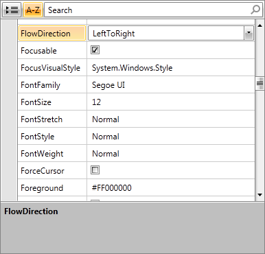

# Autogenerated Property Definitions

## 

Generally, the RadPropertyGrid creates its property definitions automatically based on the type of the corresponding properties. Thus the proper editor controls are text fields for string properties, CheckBoxes for Boolean, ComboBoxes for enums. 

  

However, you are free to change each of the property definitions displayed. What you need to do is to set the AutoGeneratePropertyDefinitions property of the RadPropertyGrid to "True" and handle the AutoGeneratingPropertyDefinition event. As it is cancelable, you may reject the cretion of a particular property definition.  

The arguments of the AutoGeneratingPropertyDefinition event are:

* Cancel - gets or set a value that indicates whether the operation should be cancelled;

* PropertyDefinition - gets or sets the property definition for each of the properties. You may edit the properties for each of the definitions.
          

* Binding - points to the data member to display/edit in the field
  

* Description - the description of a property
  

* DisplayName - the displayed name
  

* EditorTemplate - DataTemplate for the editor of the property. If left unset, a default editor will be generated
  

* GroupName - group name used to organize properties in categories
  

* HasNestedProperties - indicates whether this property definition has nested property definitions
  

* NestedProperties - the collection of nested properties
  

* OrderIndex - the index of the order
  

* ParentProperty - the parent property of this property definition
            

The AutoGeneratingPropertyDefinition event will be fired for each property of the item, thus enabling you to customize the view on property basis.
So, for example, let us decide on defining a Description for the Background property of the RadButton bound to the RadPropertyGrid.

#### __C#__

	{{region radpropertygrid-getting-started-autogenerated-property-definitions_0}}
	private void PropertyGrid1_AutoGeneratingPropertyDefinition(object sender, Telerik.Windows.Controls.Data.PropertyGrid.AutoGeneratingPropertyDefinitionEventArgs e)
	  {   
		   if(e.PropertyDefinition.DisplayName == "Background")
		   {
		  	  e.PropertyDefinition.Description = "This property displays the background property of the RadButton";       
		   }
	  }
	{{endregion}}

#### __VB.NET__

	{{region radpropertygrid-getting-started-autogenerated-property-definitions_1}}
	Private Sub PropertyGrid1_AutoGeneratingPropertyDefinition(sender As Object, e As Telerik.Windows.Controls.Data.PropertyGrid.AutoGeneratingPropertyDefinitionEventArgs)
	 If e.PropertyDefinition.DisplayName = "Background" Then
	  e.PropertyDefinition.Description = "This property displays the background property of the RadButton"
	 End If
	End Sub
	{{endregion}}

