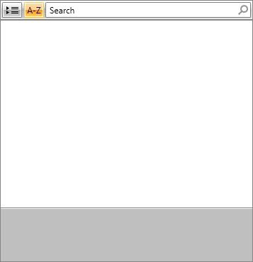

# Getting Started

This tutorial will walk your through the creation of a sample application that contains RadPropertyGrid and will show you how: 

* Use RadPropertyGrid in your project;

* Bind RadPropertyGrid to a single item;

For the purpose of this example, you will need to create an empty SilverlightWPF Application project and open it in Visual Studio. 

## Adding RadPropertyGrid to the Project

* Create a new SilverlightWPF project;

* Add references to the assemblies Telerik.Windows.Controls, Telerik.Windows.Controls.Data, Telerik.Windows.Controls.Input and Telerik.Windows.Data;

* Add the RadPropertyGrid as demonstrated below:

#### __XAML__

{{region radpropertygrid-getting-started-getting-started_0}}
	<UserControl x:Class="RadPropertyGrid_SL.MainPage"
	    xmlns="http://schemas.microsoft.com/winfx/2006/xaml/presentation"
	    xmlns:x="http://schemas.microsoft.com/winfx/2006/xaml"
	    xmlns:d="http://schemas.microsoft.com/expression/blend/2008"
	    xmlns:mc="http://schemas.openxmlformats.org/markup-compatibility/2006"
	    xmlns:telerik="http://schemas.telerik.com/2008/xaml/presentation"
	    mc:Ignorable="d"
	    d:DesignHeight="300" d:DesignWidth="400">
	 <Grid x:Name="LayoutRoot" Background="White">
	       <telerik:RadPropertyGrid x:Name="PropertyGrid1" /> 
	 </Grid>
	</UserControl>
	{{endregion}}



#### __XAML__

{{region radpropertygrid-getting-started-getting-started_1}}
	<Window x:Class="RadPropertyGrid_WPF.Window"
	    xmlns="http://schemas.microsoft.com/winfx/2006/xaml/presentation"
	    xmlns:x="http://schemas.microsoft.com/winfx/2006/xaml"
	    xmlns:d="http://schemas.microsoft.com/expression/blend/2008"
	    xmlns:mc="http://schemas.openxmlformats.org/markup-compatibility/2006"
	    xmlns:telerik="http://schemas.telerik.com/2008/xaml/presentation" 
	    mc:Ignorable="d"
	    d:DesignHeight="300" d:DesignWidth="400">
	 <Grid x:Name="LayoutRoot" Background="White">
	  <telerik:RadPropertyGrid x:Name="PropertyGrid1" /> 
	 </Grid>
	</Window>
	{{endregion}}



Two lines of code are important here:

* The import of the Telerik schema:

#### __XAML__

{{region radpropertygrid-getting-started-getting-started_2}}
	xmlns:telerik="http://schemas.telerik.com/2008/xaml/presentation"
	{{endregion}}

* The declaration of the RadPropertyGrid control inside the Grid:

#### __XAML__

{{region radpropertygrid-getting-started-getting-started_3}}
	<Grid x:Name="LayoutRoot" Background="White">
	  <telerik:RadPropertyGrid x:Name="PropertyGrid1" /> 
	</Grid>
	{{endregion}}

Now, if you run your application, an empty RadPropertyGrid will be visualized:

## Binding RadPropertyGrid to an item

* Binding to a data item - you may bind the RadRopertyGrid to a single data item. Thus you will be able to examine and edit it properties. The only thing you need is to set the Item property of the property grid. The binding may be performed both in xaml and it code-behind.

#### __C#__

{{region radpropertygrid-getting-started-getting-started_4}}
	this.PropertyGrid1.Item = new Employee() 
	   { FirstName = "Sarah",
	    LastName = "Blake", 
	    Occupation = "Supplied Manager", 
	    StartingDate = new DateTime(2005, 04, 12), 
	    IsMarried = true, Salary = 3500, Gender = Gender.Female 
	   };
	{{endregion}}

#### __VB.NET__

{{region radpropertygrid-getting-started-getting-started_5}}
	Me.PropertyGrid1.Item = New Employee() With { _
	  .FirstName = "Sarah", _
	  .LastName = "Blake", _
	  .Occupation = "Supplied Manager", _
	  .StartingDate = New DateTime(2005, 4, 12), _
	  .IsMarried = True, _
	  .Salary = 3500, _
	  .Gender = Gender.Female _
	}
	{{endregion}}

Once you set the Item and run the application, the RadPropertyGrid will be displayed as follows:

* Binding to a visual element - you may bind the Item property of the RadPropertyGrid to a visual element and again be able to view and edit its properties. The binding may be performed both in xaml and in code behind:

#### __XAML__

{{region radpropertygrid-getting-started-getting-started_6}}
	<telerik:RadButton x:Name="button1" Content="MyButton" />
	<telerik:RadPropertyGrid x:Name="PropertyGrid1" Item="{Binding ElementName= button1}"/>
	{{endregion}}

On running the application, the RadPropertyGrid will be visualized as follows:

## Binding PropertyDefinition to an existing property
        Binding to an existing property - you may bind the PropertyDefinition to a property of the data item. Thus you will be able to examine and edit this property.
        

#### __XAML__

{{region radpropertygrid-getting-started-getting-started_10}}
	  <telerik:RadPropertyGrid x:Name="PropertyGrid1"> 
	        <telerik:RadPropertyGrid.PropertyDefinitions>                
	                <telerik:PropertyDefinition Binding="{Binding FirstName}" DisplayName="My FirstName"/>
	        </telerik:RadPropertyGrid.PropertyDefinitions>
	  </telerik:RadPropertyGrid>
	{{endregion}}

## Nested Properties

Please check the article about [Nested Properties]().
        

## Other Properties

__LabelColumnWidth__ - you could change the width of the first column in the RadPropertyGrid by setting a value for this property of the RadPropertyGrid.
        

__IsGrouped__ - since Q3 2011 version of the RadControls we have added a property  that controls current RadPropertyGrid's state. You can set it to true in the xaml and you will have an initially grouped RadPropertyGrid. Or you can set it to false and you will have the GridView sorted.
       

__AutoGeneratePropertyDefinitions__ -  indicated whether property definitions will be autogenerated.
        

__DescriptionPanelVisibility__ - sets the visibility mode of the description panel.
        

__Item__ - the item to edit.
        

__PropertyDefinitions__ - collection of PropertyDefinitions describing the properties displayed or edited by RadPropertyGrid.
        

__SearchBoxVisibility__ - sets the visibility mode of the search box.
        

__SortAndGroupButtonsVisibility__ - sets the visibility mode of the sort and group buttons.
        

## Localization

Since Q3 SP1 2012 we have added Localization for CollectionEditor. Please check the common article about
          [Localization](http://www.telerik.com/help/silverlight/common-localization.html)[Localization](http://www.telerik.com/help/wpf/common-localization.html)
