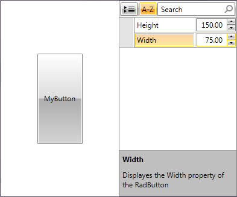

# Customized Property Definitions

## 

RadPropertyGrid auto-generates its property definitions by default based on the properties of the source object. They are stacked vertically in a standard form layout and depend on the type of each property. 

         
      

However, sometimes you may decide on customizing or totally changing them. This can be achieved by setting the AutoGeneratePropertyDefinitions to "False" and defining those you require in the PropertyDefinitions collection. For example, instead of using a simple TextBox for editing the Height and Width properties of the RadButton, you may use the RadNumericUpDown:

#### __XAML__

{{region radpropertygrid-gettingstarted-customized-property-definitions_0}}
	<telerik:RadPropertyGrid x:Name="PropertyGrid1" Item="{Binding ElementName= button1}"
	    AutoGeneratePropertyDefinitions="False" 
	             Grid.Column="1">
	 <telerik:RadPropertyGrid.PropertyDefinitions>
	  <telerik:PropertyDefinition Binding="{Binding Width}" Description="Displays the Width property of the RadButton" DisplayName="Width">
	   <telerik:PropertyDefinition.EditorTemplate>
	    <DataTemplate>
	     <telerik:RadNumericUpDown Value="{Binding Width, Mode=TwoWay}" />
	    </DataTemplate>
	   </telerik:PropertyDefinition.EditorTemplate>
	  </telerik:PropertyDefinition>
	  <telerik:PropertyDefinition Binding="{Binding Height}" Description="Displays the Height property of the RadButton" DisplayName="Height">
	   <telerik:PropertyDefinition.EditorTemplate>
	    <DataTemplate>
	     <telerik:RadNumericUpDown Value="{Binding Height, Mode=TwoWay}" />
	    </DataTemplate>
	   </telerik:PropertyDefinition.EditorTemplate>
	  </telerik:PropertyDefinition>
	 </telerik:RadPropertyGrid.PropertyDefinitions>
	</telerik:RadPropertyGrid>
	{{endregion}}

Thus, your RadPropertyGrid will be displayed as follows:

         
      

You may also use the RadPropertyGrid to edit directly the properties of the object it is bound to. So, once you change the values inside the RadPropertyGrid, the RadButton Width and Height will be resized:

         
      

