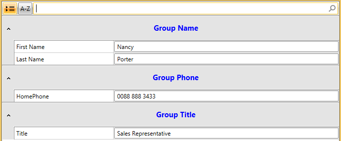

# Styling Groups

This article will show you how to assign a common style for all the groups of the __RadPropertyGrid__. You can achieve this by creating a style and assigning it to the __GroupStyle__ property of the RadPropertyGrid. 

>important This feature is only available with __RenderMode__ set to __"Flat"__

>tip The feature was introduced with Q1 2016

__1.__ First we declare an Employee class, an instance of which we will set as the RadPropertyGrid`s item: 

#### [C#] Example 1: Create the Employee class
	
	{{region cs-propertygrid-style-groups_0}}
	 class Employee
    {
        public string FirstName { get; set; }
        public string LastName { get; set; }
        public string Title { get; set; }
        public string HomePhone { get; set; }
    }
	{{endregion}}

__2.__ Declare the RadPropertyGrid in XAML:

#### [XAML] Example 2: Create the RadPropertyGrid

	{{regionpxaml-ropertygrid-style-groups_1}}
	<telerik:RadPropertyGrid x:Name="PropertyGrid" 
                             RenderMode="Flat"   
                             IsGrouped="True"
                             AutoGeneratePropertyDefinitions="False">
        <telerik:RadPropertyGrid.PropertyDefinitions>
                <telerik:PropertyDefinition Binding="{Binding FirstName}" GroupName="Group Name" DisplayName="First Name" />
                <telerik:PropertyDefinition Binding="{Binding LastName}" GroupName="Group Name" DisplayName="Last Name"/>
                <telerik:PropertyDefinition Binding="{Binding Title}" GroupName="Group Title" DisplayName="Title"/>
                <telerik:PropertyDefinition Binding="{Binding HomePhone}" GroupName="Group Phone" DisplayName="HomePhone"/>
            </telerik:RadPropertyGrid.PropertyDefinitions>
    </telerik:RadPropertyGrid>
	{{endregion}}        

__3.__ Instantiate the Employee object and set it as the item of the PropertyGrid control:

#### [C#] Example 3: Instantiate Employee object

	{{region cs-propertygrid-style-groups-2}}
		InitializeComponent();
        Employee employee = new Employee()
        {
            FirstName = "Nancy",
            LastName = "Porter",
            Title = "Sales Representative",
            HomePhone = "0088 888 3433"
        };
        PropertyGrid.Item = employee;
	{{endregion}}  

At this point we have the following appearance:

You then need to proceed with creating the specific style and assign it to the control.

__4.__ Create the common style as a static resource:

#### [XAML] Example 4: Create the style
	
	{{region xaml-propertygrid-style-groups-3}}
		
	{{endregion}}

__5.__ Set the __Group Style__ property of the RadPropertyGrid:

#### [XAML] Example 5: Set the GroupStyle property

	{{region xaml-propertygrid-style-groups-4}}
	<telerik:RadPropertyGrid x:Name="PropertyGrid" 
                             RenderMode="Flat"
							 GroupStyle="{StaticResource commonGroupStyle}">

	{{endregion}}  

The effect on the appearance of the control will be the following:

## See Also 

- [Group Style Selectors]()

- [Templates Structure]()

- [Property Grid Styles And Templates]()

        

 

