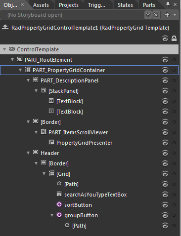

# Templates Structure

Like most SilverlightWPF controls, RadPropertyGrid allows you to template it in order to change the control from inside. Except for templating the whole control, you can template parts of it or even independent controls related to it. This topic will make you familiar with: 

* RadPropertyGrid Template Structure;

* PropertyGridField Template Structure;

>tipFor more information about templating and how to modify the default templates of the RadControls read the common topics on the matter.

## RadPropertyGrid Template

* __PART_RootElement__ - hosts the elements of the template. It represents the border of the RadPropertyGrid and is of type Border;

* __PART_PropertyGridContainer__- hosts the description panel, the items scroll viewer and the header;

* __PART_DescriptionPanel__- hosts the elements of RadPropertyGrid’s DescriptionPanel. It represents the border of this panel and is of type Border;

* __StackPanel__ - represents the DescriptionPanel and is of type StackPanel;

* __TextBlock__- represents the DisplayName of the Selected property definition;

* __TextBlock__ – represents the Description of the Selected property definition;

* __[Border]__ - represents the outer border of the ScrollViewer and is of type Border;

* __PART_ItemsScrollViewer__ - represents the control that handles the different types of presenters and is of type Border;

* __PropertyGridPresenter__-responsible for displaying PropertyGridFields and is of type PropertyGridPresenter;

* __Header__ - represents the outer border of the header and is of type Border;

* __[Border]__ - represents the inner border of the header and is of type Border;

* __[Grid]__ - hosts the elements of the Header of the header and is of type Grid;

* __[Path]__

* __SearchAsYouTypeTextBox__- represents the RadPropertyGrid’s SearchBox and is of type TextBox.

* __SortButton__- represents the RadPropertyGrid’s Sort Button and is of type RadRadioButton

* __GroupButton__- represents the RadPropertyGrid’s Group Button and is of type RadRadioButton

## PropertyGridField Template

* __PART_RootElement__ - hosts the elements of the template. It represents the border of the DataFormDataField and is of type Border;

* __PART_PropertyGridFieldGrid__ - provides columns for the template elements. It represents the background of the DataFormDataField and is of type Grid;

* __ColumnResizer__ - represents the PropertyGridField’s resizer and is of type Thumb;

* __[Border]__- represents the border around PropertyGridFields’s editor and is of type Border;

* __[ContentPresener]__ - displays the content and is of type ContentPresenter;

* __[Border]__- represents the border around PropertyGridFields’s TextBlock and is of type Border;

* __[TextBlock]__- displays the PropertyGridField’s DisplayName and is of type TextBlock;

* __[Border]__- represents the outer border of PropertyGridFields’s Indent and is of type Border;

* __[Border]__- represents the background of PropertyGrid’s Indent and is of type Border;

* __Background_Over__ - represents the outer border of the field, when the mouse is over it and is of type Border;

* __[Border]__ - represents the inner border and the background of the row, when the mouse is over it and is of type Border;

* __SelectionBackground__- represents the outer border of the field, when it is selected and is of type Border;

* __[Border]__ - represents the inner border and the background of the row, when the mouse is over it and is of type Border.

         
      

## Modifying RadPropertyGrid Template

When extracting the control template with MS Blend (as demonstrated in this  [ common article ]()) some dependency properties of controls that are defined in DataTemplates, does not have their values extracted correctly.
          You have two options:
        

1. Manually extract the template template from the Themes files we ship with every installation. You can find it together with all the other templates used for the PropertyGrid inside "Telerik.Windows.Controls.Data.xaml" file browsing to "InstallationFolder\Themes\OfficeBlack\Themes" folder.
            

1. Extract the template with Blend and manually add the missing __ItemsSource Bindings__ for the ItemsControl defined for the four templates.
                You can find instructions on how to fix the missing Bindings bellow:
              

1. Under __FlatRenderingTemplate__:
                   

#### __XAML__

{{region radpropertygrid-styles-and-templates-templates-structure_0}}
	<telerik:ItemsControl ItemsSource="{Binding}" VirtualizingStackPanel.VirtualizationMode="Standard" IsTabStop="False">
	{{endregion}}

1. Under __FlatTemplate__:
                  

#### __XAML__

{{region radpropertygrid-styles-and-templates-templates-structure_1}}
	<ItemsControl ItemsSource="{Binding Converter={StaticResource FlatItemSourceConverter}}" IsTabStop="False">
	{{endregion}}

1. Under __GroupTemplate__:
                    

#### __XAML__

{{region radpropertygrid-styles-and-templates-templates-structure_2}}
	<ItemsControl ItemsSource="{Binding ., Converter={StaticResource GroupingItemsSourceConverter}}">
	{{endregion}}

1. Under __VirtualizedFlatTemplate__:
                  

#### __XAML__

{{region radpropertygrid-styles-and-templates-templates-structure_3}}
	<ItemsControl ItemsSource="{Binding Converter={StaticResource FlatItemSourceConverter}}" VirtualizingStackPanel.VirtualizationMode="Standard" IsTabStop="False">
	{{endregion}}

