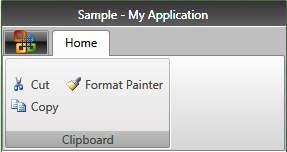
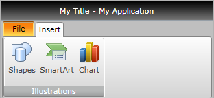

# Collapsible Panel

One of the most important features of the __RadRibbonView__ is the dynamic layout resizing. It refers to the __RadRibbonView__'s ability to optimize its layout depending on how much space is available. This process can't be automated, however, the __RadRibbonView__'s API makes your life easier by providing you with two built-in layout containers - [RadOrderedWrapPanel]() and __RadCollapsiblePanel__. You should use one of these panels to specify how you would like the resizing to occur.	  

The purpose of this tutorial is to introduce you the __RadCollapsiblePanel__.	  

>tip Consider reading the [Resizing]() topic, which is tightly connected with the __RadCollapsiblePanel__.		

## RadCollapsiblePanel - Fundamentals

The __RadCollapsiblePanel__ is very similar to the __StackPanel__. However, it has one distinctive feature - this panel is not aware about the active size variant. Instead, it always tries to lay out its children in the small space provided. If it is not possible, it lays them horizontally.		

>tip __RadCollapsiblePanel__ arranges itself automatically according to the __RibbonGroup__ size.		  

The panel has three states, which are quite self-explanatory:

* __Large__
	

* __Medium__
	
	
* __Small__
	

>tip If you refer to the Microsoft Office Word product, you will note that a similar layout behavior is used at the "Insert" tab. It is full of groups of three large buttons (e.g. the "Illustrations" group), laid out horizontally, which then become small buttons laid out vertically, when the group is shrunk. You could use the __RadRibbonCollapsible__ panel to achieve such an effect, combined with the resizing characteristics of the [RadRibbonButtons]().		  

### Buttons per Column in Small and Medium State

By default the __RadCollapsiblePanel__ displays 3 buttons while in __Medium__ or __Small__ state. However, you can change that number through the __RadCollapsiblePanel.SmallButtonsPerColumn__ attached property.			

#### __XAML__
{{region radribbonview-collapsible-panel-0}}
    <telerik:RadRibbonView Title="Sample"
                           ApplicationButtonImageSource="AppIcon.png"
                           telerik:RadCollapsiblePanel.SmallButtonsPerColumn="2">
        <telerik:RadRibbonTab Header="Home">
            <telerik:RadRibbonGroup Header="Clipboard">
                <telerik:RadCollapsiblePanel>
                    <telerik:RadRibbonButton CollapseToMedium="WhenGroupIsMedium"
                                             CollapseToSmall="WhenGroupIsSmall"
                                             SmallImage="/Images/RibbonView/FirstLook/cut.png"
                                             Text="Cut" />
                    <telerik:RadRibbonButton CollapseToMedium="WhenGroupIsMedium"
                                             CollapseToSmall="WhenGroupIsSmall"
                                             SmallImage="/Images/RibbonView/FirstLook/copy.png"
                                             Text="Copy" />
                    <telerik:RadRibbonButton CollapseToMedium="WhenGroupIsMedium"
                                             CollapseToSmall="WhenGroupIsSmall"
                                             SmallImage="/Images/RibbonView/FirstLook/formatpainter.png"
                                             Text="Format Painter" />
                </telerik:RadCollapsiblePanel>
            </telerik:RadRibbonGroup>
        </telerik:RadRibbonTab>
    </telerik:RadRibbonView>
{{endregion}}

>Please have in mind that this property should be applied in the __RadRibbonView__ definition and therefore it affects all __RadCollapsiblePanels__ throughout your ribbon UI.  

It is important to note that if the height of the __RibbonView__ cannot display the number of buttons indicated by the __RadCollapsiblePanel.SmallButtonsPerColumn__ property, the property will be disregarded. In this case the __RadCollapsiblePanel__ will display as many buttons as the __RibbonView Height__ allows.

### ItemSpacing

In __RadRibbonView__ you can also control the space between every two buttons in the __RadCollapsiblePanel__ while they are in __Small__ or __Medium__ states. This can be done through the __RadCollapsiblePanel.ItemSpacing__ attached property. It is of type __Int__ and its default value is 0.

## Using RadCollapsiblePanel

The next example demonstrates the usage of the __RadCollapsiblePanel__.

#### __XAML__
{{region radribbonview-collapsible-panel-1}}
	<telerik:RadRibbonView x:Name="radRibbonView" 
	                        Title="My Title"
	                        ApplicationButtonContent="File"
	                        ApplicationName="My Application">
	    <telerik:RadRibbonTab Header="Insert">
	        <telerik:RadRibbonGroup Header="Illustrations">
	            <telerik:RadCollapsiblePanel>
	                <telerik:RadRibbonButton CollapseToMedium="WhenGroupIsMedium" 
	                                            CollapseToSmall="WhenGroupIsSmall"
	                                            LargeImage="/RadRibbonViewSample;component/Images/IconMSOffice/32/Shapes.png"
	                                            Size="Large"
	                                            Text="Shapes" />
	                <telerik:RadRibbonButton CollapseToMedium="WhenGroupIsMedium" 
	                                            CollapseToSmall="WhenGroupIsSmall"
	                                            LargeImage="/RadRibbonViewSample;component/Images/IconMSOffice/32/SmartArt.png"
	                                            Size="Large"
	                                            Text="SmartArt" />
	                <telerik:RadRibbonButton CollapseToMedium="WhenGroupIsMedium" 
	                                            CollapseToSmall="WhenGroupIsSmall"
	                                            LargeImage="/RadRibbonViewSample;component/Images/IconMSOffice/32/chart.png"
	                                            Size="Large"
	                                            Text="Chart" />
	            </telerik:RadCollapsiblePanel>
	        </telerik:RadRibbonGroup>
	    </telerik:RadRibbonTab>
	</telerik:RadRibbonView>
{{endregion}}

## See Also
 * [Application Menu]()
 * [Backstage Menu]()
 * [Ribbon Gallery]()
 * [Ribbon Group]()
 * [Quick Access ToolBar]()
 * [Ribbon ComboBox]()
 * [Ribbon Tab]()
 * [Ribbon Buttons - Overview]()
