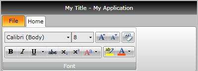

# Ordered Wrap Panel

One of the most important features of the __RadRibbonView__is the dynamic layout resizing. It refers to the __RadRibbonView__'s ability to optimize its layout depending on how much space is available. This process can't be automated, however, the __RadRibbonView__'s API makes your life easier by providing you with two built-in layout containers - __RadOrderedWrapPanel__ and [RadCollapsiblePanel](). You should use one of these panels to specify how you would like the resizing to occur.
			

The purpose of this tutorial is to introduce the __RadOrderedWrapPanel__.
			

>tip
				Consider reading the [Resizing]() topic, which is tightly connected with the __RadOrderedWrapPanel__.
			

## RadOrderedWrapPanel - Fundamentals

__RadOrderedWrapPanel__ is used together with __RadButtonGroup__ to create a layout known from the Microsoft Office applications. It has two states:
				

* __Normal__ state.
						The __RadOrderedWrapPanel__ displays its children along __two__ horizontal lines in the __normal__ state.
						

>tip
							When there is enough space, the __RadOrderedWrapPanel__ always tries to layout its children in __Normal__ state.
						

* __Compressed__ state
						In the __compressed__ state the __RadOrderedWrapPanel__ displays its children along __three__ horizontal lines, thus achieving a more compact and tightly packed structure.
						

>tipIf you refer to the Microsoft Office Word product, you will note that a similar layout behavior is used by the "Font" and "Paragraph" groups.

You have the ability to specify when the Panel should go into the __Compressed__ state by using the __RadOrderedWrapPanel__'s__CompressedThreshold__property__.__Its values are predefined in the __CollapseThreshold__ enumeration, which exposes the following fields:
				

* __Never__ - the panel never goes in __Compressed__ state.
					

* __WhenGroupIsSmall__ - the panel goes in __Compressed__ state when the group is in __Small__ variant.
					

* __WhenGroupIsMedium__ - the panel goes in __Compressed__ state when the group is in __Medium__ valiant.
					

At this point, if you fill your panel with RadControls, you will have a functioning layout that splits itself into two or three lines, depending on the available space. There is another important property - __CompressedItemsOrder__. It allows you to change the order of the panel's children upon being compressed. This is very useful because when your child controls are split into three lines, you may want to alter their order because some are being used more frequently than others. The __CompressedItemsOrder__ property is a simple __Int32__ collection, that you are able to set with a comma-delimited list of integers in XAML.
				

## Using RadOrderedWrapPanel

The next example demonstrates how to build a "Font" like __RadRibbonGroup__ using the __RadOrderedWrapPanel__.
				

#### __XAML__

{{region radribbonview-ordered-wrap-panel_0}}
	<telerik:RadRibbonView x:Name="radRibbonView" 
	                                Title="My Title"
	                                ApplicationName="My Application">
	    <telerik:RadRibbonTab Header="Home">
	        <telerik:RadRibbonGroup Header="Font">
	            <telerik:RadOrderedWrapPanel>
	                <StackPanel Orientation="Horizontal">
	                    <telerik:RadRibbonComboBox Width="135" SelectedIndex="1" telerik:ScreenTip.Title="Font" telerik:ScreenTip.Description="Change the font face.">
	                        <telerik:RadRibbonComboBoxItem Content="Arial" />
	                        <telerik:RadRibbonComboBoxItem Content="Calibri (Body)" />
	                        <telerik:RadRibbonComboBoxItem Content="Tahoma" />
	                        <telerik:RadRibbonComboBoxItem Content="Verdana"  />
	                        <telerik:RadRibbonComboBoxItem Content="Times New Roman" />
	                        <telerik:RadRibbonComboBoxItem Content="Cambria" />
	                    </telerik:RadRibbonComboBox>
	                    <telerik:RadRibbonComboBox Name="comboFontSize" Width="45" SelectedIndex="0" telerik:ScreenTip.Title="Font Size"  telerik:ScreenTip.Description="Change the font size.">
	                        <telerik:RadRibbonComboBoxItem Content="8" />
	                        <telerik:RadRibbonComboBoxItem Content="9" />
	                        <telerik:RadRibbonComboBoxItem Content="10" />
	                        <telerik:RadRibbonComboBoxItem Content="11" />
	                        <telerik:RadRibbonComboBoxItem Content="12" />
	                        <telerik:RadRibbonComboBoxItem Content="14" />
	                        <telerik:RadRibbonComboBoxItem Content="16" />
	                        <telerik:RadRibbonComboBoxItem Content="18" />
	                    </telerik:RadRibbonComboBox>
	                </StackPanel>
	                <telerik:RadButtonGroup>
	                    <telerik:RadRibbonButton SmallImage="/RadRibbonViewSample;component/Images/IconMSOffice/16/font-increasesize.png" telerik:ScreenTip.Title="Grow Font" />
	                    <telerik:RadRibbonButton SmallImage="/RadRibbonViewSample;component/Images/IconMSOffice/16/font-decreasesize.png" telerik:ScreenTip.Title="Shrink Font" />
	                </telerik:RadButtonGroup>
	                <telerik:RadButtonGroup>
	                    <telerik:RadRibbonButton SmallImage="/RadRibbonViewSample;component/Images/IconMSOffice/16/ClearFormatting16.png" Text="Clear Formatting" telerik:ScreenTip.Title="Clear Formatting" />
	                </telerik:RadButtonGroup>
	                <telerik:RadButtonGroup>
	                    <telerik:RadRibbonToggleButton x:Name="BoldButton" SmallImage="/RadRibbonViewSample;component/Images/IconMSOffice/16/bold.png" telerik:ScreenTip.Title="Bold" telerik:ScreenTip.Description="Make the selected text bold." />
	                    <telerik:RadRibbonToggleButton  x:Name="ItalicButton" SmallImage="/RadRibbonViewSample;component/Images/IconMSOffice/16/italic.png" telerik:ScreenTip.Title="Italic" telerik:ScreenTip.Description="Italicize the selected text." />
	                    <telerik:RadRibbonSplitButton  x:Name="UnderlineButton" SmallImage="/RadRibbonViewSample;component/Images/IconMSOffice/16/underline.png" telerik:ScreenTip.Title="Underline" telerik:ScreenTip.Description="Underline the selected text.">
	                        <telerik:RadRibbonSplitButton.DropDownContent>
	                            <StackPanel>
	                                <telerik:RadGallery ViewportWidth="157" ViewportHeight="184" ItemWidth="156" ItemHeight="26">
	                                    <telerik:RadGalleryItem Image="/RadRibbonViewSample;component/Images/IconMSOffice/underline1.png" ToolTipService.ToolTip="Underline" />
	                                    <telerik:RadGalleryItem Image="/RadRibbonViewSample;component/Images/IconMSOffice/underline2.png" ToolTipService.ToolTip="Double underline" />
	                                    <telerik:RadGalleryItem Image="/RadRibbonViewSample;component/Images/IconMSOffice/underline3.png" ToolTipService.ToolTip="Thick underline" />
	                                    <telerik:RadGalleryItem Image="/RadRibbonViewSample;component/Images/IconMSOffice/underline4.png" ToolTipService.ToolTip="Dotted underline" />
	                                    <telerik:RadGalleryItem Image="/RadRibbonViewSample;component/Images/IconMSOffice/underline5.png" ToolTipService.ToolTip="Dashed underline" />
	                                    <telerik:RadGalleryItem Image="/RadRibbonViewSample;component/Images/IconMSOffice/underline6.png" ToolTipService.ToolTip="Dot-dash underline" />
	                                    <telerik:RadGalleryItem Image="/RadRibbonViewSample;component/Images/IconMSOffice/underline7.png" ToolTipService.ToolTip="Dot-dot-dash underline" />
	                                    <telerik:RadGalleryItem Image="/RadRibbonViewSample;component/Images/IconMSOffice/underline8.png" ToolTipService.ToolTip="Wave underline" />
	                                </telerik:RadGallery>
	                                <telerik:RadContextMenu  BorderThickness="0">
	                                    <telerik:RadMenuItem Header="More underlines ..."/>
	                                    <telerik:RadMenuItem Header="Underline color">
	                                        <telerik:RadMenuItem.Icon>
	                                            <Image Source="/RadRibbonViewSample;component/Images/IconMSOffice/colorpicker.png"/>
	                                        </telerik:RadMenuItem.Icon>
	                                    </telerik:RadMenuItem>
	                                </telerik:RadContextMenu>
	                            </StackPanel>
	                        </telerik:RadRibbonSplitButton.DropDownContent>
	                    </telerik:RadRibbonSplitButton>
	                    <telerik:RadRibbonToggleButton SmallImage="/RadRibbonViewSample;component/Images/IconMSOffice/16/Strikethrough16.png" telerik:ScreenTip.Title="Strikethrough" telerik:ScreenTip.Description="Draw a line through the middle of the selected text." />
	                    <telerik:RadRibbonToggleButton SmallImage="/RadRibbonViewSample;component/Images/IconMSOffice/16/subscript.png" telerik:ScreenTip.Title="Subscript" telerik:ScreenTip.Description="Create small letters below the text baseline." />
	                    <telerik:RadRibbonToggleButton SmallImage="/RadRibbonViewSample;component/Images/IconMSOffice/16/superscript.png" telerik:ScreenTip.Title="Superscript" telerik:ScreenTip.Description="Create small letters above the line of text." />
	                    <telerik:RadRibbonDropDownButton SmallImage="/RadRibbonViewSample;component/Images/IconMSOffice/16/fontscheme.png" Text="Change Case" telerik:ScreenTip.Title="Change Case" telerik:ScreenTip.Description="Change all the selected text to UPPERCASE, lowercase, or other common capitalizations.">
	                        <telerik:RadRibbonDropDownButton.DropDownContent>
	                            <telerik:RadContextMenu BorderThickness="0">
	                                <telerik:RadMenuItem Header="Sentence case."/>
	                                <telerik:RadMenuItem Header="lowercase"/>
	                                <telerik:RadMenuItem Header="UPPERCASE"/>
	                                <telerik:RadMenuItem Header="Capitalize Each Word"/>
	                                <telerik:RadMenuItem Header="tOGGLE cASE"/>
	                            </telerik:RadContextMenu>
	                        </telerik:RadRibbonDropDownButton.DropDownContent>
	                    </telerik:RadRibbonDropDownButton>
	                </telerik:RadButtonGroup>
	                <telerik:RadButtonGroup>
	                    <telerik:RadRibbonButton SmallImage="/RadRibbonViewSample;component/Images/IconMSOffice/16/highlight.png" Text="Highlight Color" telerik:ScreenTip.Title="Text Highlight Color" telerik:ScreenTip.Description="Make text look like it was marked with a highlighter pen.">
	                    </telerik:RadRibbonButton>
	                    <telerik:RadRibbonDropDownButton SmallImage="/RadRibbonViewSample;component/Images/IconMSOffice/16/fontcolor.png" Text="Font Color" telerik:ScreenTip.Title="Font Color" telerik:ScreenTip.Description="Change the text color.">
	                        <telerik:RadRibbonDropDownButton.DropDownContent>
	                            <telerik:RadColorSelector/>
	                        </telerik:RadRibbonDropDownButton.DropDownContent>
	                    </telerik:RadRibbonDropDownButton>
	                </telerik:RadButtonGroup>
	            </telerik:RadOrderedWrapPanel>
	        </telerik:RadRibbonGroup>
	    </telerik:RadRibbonTab>
	</telerik:RadRibbonView>
	{{endregion}}

## Setting RadOrderedWrapPanel's CompressedThreshold Property

The __CompressedThreshold__property allows you to specify when the panel goes into __Compressed__ mode. For example, you may set this property to __CollapseThreshold.Never__.
				

#### __XAML__

{{region radribbonview-ordered-wrap-panel_1}}
	<telerik:RadOrderedWrapPanel CompressedThreshold="Never">
	{{endregion}}

In this case the panel never goes into __Compressed__ state, even though there isn't enough space to display all of its children.
				

## Setting RadOrderedWrapPanel's CompressedItemsOrder Property

The __RadOrderedWrapPanel__'s __CompressedItemsOrder__ property allows you to change the order of the panel's children upon being compressed. This is very useful because when your child controls are split into three lines, you may want to alter their order because some are being used more frequently than others.
				

The next snapshot shows you the wrap panel from the first example in __compressed__ state. The __CompressedItemsOrder__ property is not set. The different RadButton groups are marked with indexes from 0 to 4 (there are 5 button groups).
				

For example, you may wish to change the groups order. In this case you should set the __RadOrderedWrapPanel__'s __CompressedItemsOrder__property__.__ You can do it in XAML by specifying a comma-delimited list of integers like in the example below.
				

#### __XAML__

{{region radribbonview-ordered-wrap-panel_2}}
	<telerik:RadOrderedWrapPanel CompressedItemsOrder="0,3,2,4,1">
	{{endregion}}

And the result is shown on the next snapshot. Note how the order of the groups is altered.
