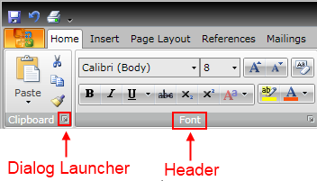
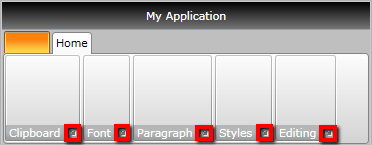
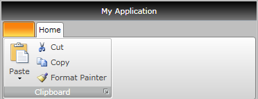

# Ribbon Group

Telerik __RadRibbonView__ provides a simple and consistent way for building interfaces similar to the ribbon cotnrol used in Microsoft Office. The __RadRibbonView__consists of various elements, one of which is the __Ribbon Group__. This topic discusses concepts fundamental to the __Ribbon Group__ at first and then goes into the usage of the __RadRibbonGroup__ class and its features.
	  

>tipBefore proceeding with this tutorial, it is recommended to get familiar with the [Visual Structure]() of the __RadRibbonView__ control.
		

## Ribbon Group - Fundamentals

* [Layout Resizing](#layout-resizing)

The __RadRibbonView__ helps end-users to quickly find the tools and options they need in order to complete a task. Tools and options are organized in__logical groups__ that are collected together under specific [tabs](). Or in other words - the __Ribbon Group__lets you categorize the commands to be displayed for the end-users.
		

__Ribbon Groups__are defined into the [Ribbon Tab](). A single __Ribbon Tab__ usually contains many __Ribbon Groups__ to layout its content.
		

Each Ribbon Group may have a __Header__ and a __Dialog Launcher__. The __Dialog Launcher__ appears in the bottom right corner of the group.
		

>tipThe class that represents the ribbon group is __Telerik.Windows.Controls.RadRibbonGroup__.
		  

The __RadRibbonGroup__is a [HeaderedItemsControl](http://msdn.microsoft.com/en-us/library/system.windows.controls.headereditemscontrol.aspx) and is the main part of the layout mechanism of the __RadRibbonView__.
		

## Layout Resizing

One of the most important feature of the __RadRibbonGroup__ is the __dynamic resizing__. It refers to the ability of the __RadRibbonView__to optimize its layout depending on how much space is available.
		

Each __RadRibbonGroup__ in a __RadRibbonTab__may have four possible sizes (__Variants__):
		

* __Large__ - this is the default size (__Variant__).
			

>tipThe __RadRibbonGroups__assumes their __DefaultVariant__ (which by default is __Large__) state whenever they can.
			  

* __Medium__

* __Small__

* __Collapsed__

For more information about the layout resizing mechanism, please refer to the [Resizing]() topic. Check out the rest of the topic which is entirely dedicated to the __RadRibbonGroup__.
		

## Adding Ribbon Groups to a RadRibbonView Control

As it is described in the [Fundamentals](#ribbon-group---fundamentals) section, various user commands are organized in logical groups that are collected together under specific __RadRibbonTabs__. So the first step before declaring the __RadRibbonGroups__ is to add __RadRibbonTabs__ to your ribbon control. For more information about how to add ribbon tabs, take a look at the [Ribbon Tab]() topic.
		

Adding __RadRibbonGroups__ is done through the __RadRibbonTab__'s __Items__ property. The next example shows how to add several __RadRibbonGroups__ and how to set their __Header__ property.
		

#### __XAML__

{{region radribbonview-ribbon-group_0}}
	<telerik:RadRibbonView x:Name="radRibbonView">
	    <telerik:RadRibbonTab Header="Home">
	        <telerik:RadRibbonGroup Header="Clipboard">
	        </telerik:RadRibbonGroup>
	        <telerik:RadRibbonGroup Header="Font">
	        </telerik:RadRibbonGroup>
	        <telerik:RadRibbonGroup Header="Paragraph">
	        </telerik:RadRibbonGroup>
	        <telerik:RadRibbonGroup Header="Styles">
	        </telerik:RadRibbonGroup>
	        <telerik:RadRibbonGroup Header="Editing">
	        </telerik:RadRibbonGroup>
	    </telerik:RadRibbonTab>
	</telerik:RadRibbonView>
	{{endregion}}

## Enabling the Dialog Launcher

Any group can have a dialog launcher button which appears in the bottom right corner of the group. By default the dialog launcher is not visible. In order to enable it you should set the __RadRibbonGroup__'s __DialogLauncherVisibility__ property to __Visibility.Visible__.
		

#### __XAML__

{{region radribbonview-ribbon-group_1}}
	<telerik:RadRibbonView x:Name="radRibbonView">
	    <telerik:RadRibbonTab Header="Home">
	        <telerik:RadRibbonGroup Header="Clipboard" DialogLauncherVisibility="Visible">
	        </telerik:RadRibbonGroup>
	        <telerik:RadRibbonGroup Header="Font" DialogLauncherVisibility="Visible">
	        </telerik:RadRibbonGroup>
	        <telerik:RadRibbonGroup Header="Paragraph" DialogLauncherVisibility="Visible">
	        </telerik:RadRibbonGroup>
	        <telerik:RadRibbonGroup Header="Styles" DialogLauncherVisibility="Visible">
	        </telerik:RadRibbonGroup>
	        <telerik:RadRibbonGroup Header="Editing" DialogLauncherVisibility="Visible">
	        </telerik:RadRibbonGroup>
	    </telerik:RadRibbonTab>
	</telerik:RadRibbonView>
	{{endregion}}

>tipThe default value of the __RadRibbonGroup__'s __DialogLauncherVisibility__ property is __Visibility.Collapsed.__

## Adding Content to the Ribbon Groups

The __RadRibbonGroup__is a [HeaderedItemsControl](http://msdn.microsoft.com/en-us/library/system.windows.controls.headereditemscontrol.aspx). Which means that the __RadRibbonGroup__contains a heading (or title) and multiple items. You already learned how to
		  [set](#adding-ribbon-groups-to-a-radribbonview-control) the __Header__ property. Now it's time to add some content to the __RadRibbonGroup__. You should do this using the __RadRibbonGroup__'s __Items__ property. The next example shows you how to build the "Clipboard" __RadRibbonGroup__.
		

#### __XAML__

{{region radribbonview-ribbon-group_2}}
	<telerik:RadRibbonView x:Name="radRibbonView">
	    <telerik:RadRibbonTab Header="Home">
	        <telerik:RadRibbonGroup DialogLauncherVisibility="Visible" Header="Clipboard">
	            <telerik:RadRibbonSplitButton LargeImage="Images/IconMSOffice/32/paste.png" 
	                                            Size="Large"
	                                            SmallImage="Images/IconMSOffice/16/paste.png"
	                                            telerik:ScreenTip.Description="Paste the contents of the Clipboard."
	                                            telerik:ScreenTip.Title="Paste"
	                                            Text="Paste">
	                <telerik:RadRibbonSplitButton.DropDownContent>
	                    <telerik:RadContextMenu BorderThickness="0">
	                        <telerik:RadMenuItem Header="Paste">
	                            <telerik:RadMenuItem.Icon>
	                                <Image Source="Images/IconMSOffice/16/paste.png" />
	                            </telerik:RadMenuItem.Icon>
	                        </telerik:RadMenuItem>
	                        <telerik:RadMenuItem Header="Paste Special...">
	                            <telerik:RadMenuItem.Icon>
	                                <Image Source="Images/IconMSOffice/16/pastespecial.png" />
	                            </telerik:RadMenuItem.Icon>
	                        </telerik:RadMenuItem>
	                        <telerik:RadMenuItem Header="Paste as Hyperlink" IsEnabled="False">
	                            <telerik:RadMenuItem.Icon>
	                                <Image Source="Images/IconMSOffice/16/pastehyperlink.png" />
	                            </telerik:RadMenuItem.Icon>
	                        </telerik:RadMenuItem>
	                    </telerik:RadContextMenu>
	                </telerik:RadRibbonSplitButton.DropDownContent>
	            </telerik:RadRibbonSplitButton>
	            <StackPanel>
	                <telerik:RadRibbonButton CollapseToSmall="WhenGroupIsMedium" 
	                                            SmallImage="Images/IconMSOffice/16/cut.png"
	                                            telerik:ScreenTip.Description="Cut the selection from the document and put it on the Clipboard."
	                                            telerik:ScreenTip.Title="Cut"
	                                            Text="Cut" />
	                <telerik:RadRibbonButton CollapseToSmall="WhenGroupIsMedium" 
	                                            SmallImage="Images/IconMSOffice/16/copy.png"
	                                            telerik:ScreenTip.Description="Copy the selection and put it on the Clipboard."
	                                            telerik:ScreenTip.Title="Copy"
	                                            Text="Copy" />
	                <telerik:RadRibbonButton CollapseToSmall="WhenGroupIsMedium" 
	                                            SmallImage="Images/IconMSOffice/16/formatpainter.png"
	                                            telerik:ScreenTip.Description="Copy formatting from one place and apply it to another.Double-click this button to apply the same formatting to multiple places in the document."
	                                            telerik:ScreenTip.Title="Format Painter"
	                                            Text="Format Painter" />
	            </StackPanel>
	        </telerik:RadRibbonGroup>
	    </telerik:RadRibbonTab>
	</telerik:RadRibbonView>
	{{endregion}}

## Setting Screen Tip

The Telerik __RadRibbonView__'s API allows you to associate screen tips with each one of the __RibbonGroup__s. For more information, take a look at the [Screen Tips]() topic.
		

## Specifying Group Variants

Each __RadRibbonGroup__ in a __RadRibbonTab__may have four possible sizes (__Variants__): __Large__, __Medium__, __Small__ and __Collapsed__. __Collapsed__ groups always look the same - only the __Header__ and an __image__ are shown.
		

The resizing of the elements is defined per __RadRibbonTab__. The resizing behavior of the tab is defined by setting the __Variant__ collection to each of its __RadRibbonGroups__ and is based on __priorities__. By default, if no __priorities__ are set to the __Variants__ of the __RibbonGroups,__ they will be resized from __right to left__. In order to customize the order by which the groups will be resized, the developer needs to specify a __Priority__ for each of the __RibbonGroup____Variants__.
		

For more information and explanations about the __Variants__ and __Priorities__, take a look at the [Resizing]() topic.
		

## Setting Collapsed Icon

When a __RibbonGroup__ is in __Collapsed__ state only __Header__ and __Icon__ (image) are shown. To set the image source for the collapsed icon you need to set the __RadRibbonGroup__'s __Icon__ property.
		

## Events

Any group can have a dialog launcher button. When you want to handle the click over this button you should attach to the __RadRibbonGroup__'s __LaunchDialog__ event.
		

#### __XAML__

{{region radribbonview-ribbon-group_3}}
	<telerik:RadRibbonGroup DialogLauncherVisibility="Visible" Header="Clipboard" LaunchDialog="RadRibbonGroup_LaunchDialog">
	 ...
	</telerik:RadRibbonGroup>
	{{endregion}}

The __LaunchDialog__ event handler receives two arguments:
		

* The sender argument contains the __RadRibbonGroup__. This argument is of type __object__, but can be cast to the __RadRibbonGroup__type.
			

* The second argument is a __RadRoutedEventArgs__ object.
			

For a full list of the exposed by the __RadRibbonView__ events, take a look at the [Events - Overview]() topic.
		

The __RadRibbonView__ is a complex control and the __ribbon groups__are only a small part of it. The __RadRibbonView__ consists of various elements such as:
		

* [Application Menu]()

* [Backstage Menu]()

* [Quick Access ToolBar]()

* [Ribbon Tab]()

* [Ribbon Gallery]()

* [RibbonButtons Overview]()

* [Ribbon ComboBox]()

* [Screen Tips]()

Additional features that you may find interesting are:

* [Selection]()

* [Resizing]()

* [Minimization]()

* [Localization]()

# See Also

 * [Styling the RadRibbonGroup]()
