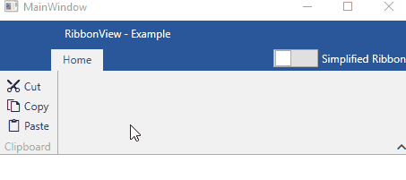

# Simplified Ribbon

Since the __R2 2019__ version, you have the option of changing the default layout mode to a simplified one. The idea of the simplified layout is to be more compact and take up less vertical space on the screen. 

## SimplifiedItems

Before switching the layout, you have to define what will be shown in the simplified state of the RadRibboonView. This is done through the new __SimplifiedItems__ property of the [RadRibbonTab](). 

#### __[XAML] Example 1: Setting the SimplifiedItems property__
{{region xaml-radribbonview-simplified-ribbon-0}}
    <telerik:RadRibbonView x:Name="ribbonView" ApplicationName="Example" Title="RibbonView" ShowLayoutModeButton="True">
        <telerik:RadRibbonView.Resources>
            <DataTemplate x:Key="IconTemplate">
                <Image Stretch="Fill" Width="16" Height="16" Source="{Binding}" />
            </DataTemplate>
        </telerik:RadRibbonView.Resources>
        
        <telerik:RadRibbonTab Header="Home">
            <telerik:RadRibbonTab.SimplifiedItems>
                <telerik:RadRibbonGroup Header="Clipboard">
                    <telerik:RadRibbonSplitButton SmallImage="{telerik:RadGlyph Glyph=&#xe65d;}"
                        Size="Small">
                        <telerik:RadRibbonSplitButton.DropDownContent>
                            <telerik:RadContextMenu>
                                <telerik:RadMenuItem Header="Cut"  Icon="{telerik:RadGlyph Type=Image, Glyph=&#xe65e;}" IconTemplate="{StaticResource IconTemplate}" />
                                <telerik:RadMenuItem Header="Copy"   Icon="{telerik:RadGlyph Type=Image, Glyph=&#xe65d;}" IconTemplate="{StaticResource IconTemplate}" />
                                <telerik:RadMenuItem Header="Paste"  Icon="{telerik:RadGlyph Type=Image, Glyph=&#xe65f;}" IconTemplate="{StaticResource IconTemplate}" />
                            </telerik:RadContextMenu>
                        </telerik:RadRibbonSplitButton.DropDownContent>
                    </telerik:RadRibbonSplitButton>
                </telerik:RadRibbonGroup>
            </telerik:RadRibbonTab.SimplifiedItems>

            <telerik:RadRibbonGroup Header="Clipboard">
                <telerik:RadCollapsiblePanel>
                    <telerik:RadRibbonButton Text="Cut" SmallImage="{telerik:RadGlyph Glyph=&#xe65e;}" />
                    <telerik:RadRibbonButton Text="Copy" SmallImage="{telerik:RadGlyph Glyph=&#xe65d;}" />
                    <telerik:RadRibbonButton Text="Paste" SmallImage="{telerik:RadGlyph Glyph=&#xe65f;}" />
                </telerik:RadCollapsiblePanel>
            </telerik:RadRibbonGroup>
        </telerik:RadRibbonTab>
    </telerik:RadRibbonView>
{{endregion}}

#### __Figure 1: Changing RadRibbonView layotu in the Office2016 theme__

> The __SimplifiedResourses__ property of the __RadRibbonTab__ can be used in order to add any resources that should be applied when the LayoutMode is Simplified.

>tip In an MVVM scenario, the __SimplifiedItemTemplate__ property of the RadRibbonView needs to be set instead. Read more about that in the [Use MVVM in RadRibbonView]() article. 

## LayoutMode

In order to change the default layout mode, there are two options. Switch the layout through the UI or programmatically. 

* __Switch the layout through the UI__: By default the button that switches between the default and the simplified layout is not visible. You can set the __ShowRibbonLayoutButton__ property to __True__ in order to show it. You can also set the __RibbonLayoutButtonContent__ in order to change the Content of the switch button.

    #### __[XAML] Example 2: Showing the LayoutMode button and changing its Content__
    {{region xaml-radribbonview-simplified-ribbon-1}}
        <telerik:RadRibbonView x:Name="ribbonView" ApplicationName="Example"  Title="RibbonView" ShowLayoutModeButton="True" LayoutModeButtonContent="Simplify" />
    {{endregion}}

    #### __Figure 2: LayoutMode button in the Office2016 theme__
    

* __Switch the layout programmatically__: In order to change the layout in code, you can set the __LayoutMode__ property to __Simplified__ or execute the __ToggleLayoutModeCommand__ command.

    #### __[C#] Example 2: Switching the layout in code__
    {{region cs-radribbonview-simplified-ribbon-1}}
        this.ribbonView.LayoutMode = RibbonLayout.Simplified;
                
        // or

        RibbonCommands.ToggleLayoutModeCommand.Execute(null, this.ribbonView);
    {{endregion}}

    #### __[VB.NET] Example 2: Switching the layout in code__
    {{region vb-radribbonview-simplified-ribbon-2}}
        Me.ribbonView.LayoutMode = RibbonLayout.Simplified

        'or

        RibbonCommands.ToggleLayoutModeCommand.Execute(Nothing, Me.ribbonView)
    {{endregion}}

## Simplifying the Layout

The __SimplifiedItems__ property, described in the first section, gives you full control over what is displayed, when the layout mode of the RadRibbonView is simplified. Here are some tips on how to adapt the normal layout accordingly.

* Remove elements (buttons, groups) that are not an integral part of your application. The idea of the simplified ribbon is to save vertical space, however it comes from the cost of the horizontal one. Keep in mind that, if a certain element is missing from the simplified layout, the user can always switch to the default one. 

* Whenever possible, try to combine multiple elements inside the drop down of a single one. For example, if you have "Cut", "Copy" and "Paste" buttons in the default layout, you can combine them in a single [RadRibbonSplitButton]() in the simplified layout, as demonstrated in __Example 1__.

## See Also

* [Getting Started]()
* [Events]()
* [Commands]()