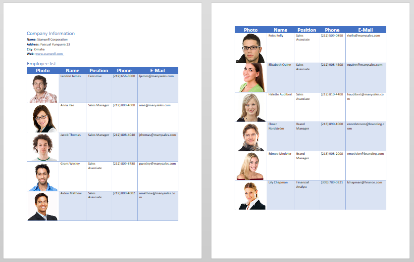
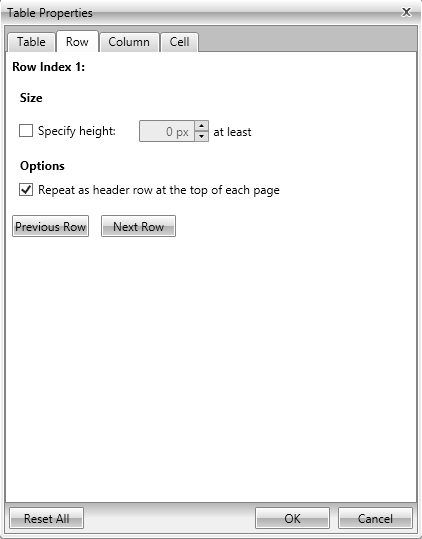

# Repeat Table Header Row

When working with large tables, they are visualized in more than one page. Header row repetition means that the header row(s) of a table will repeat at the top of each page on which the table spans. This article will show you how to work with this feature.

* [Overview](#overview)

* [How to Use Repeat Table Header Row](#how-to-use-repeat-table-header-row)

	* [Programmatically via the RadRichTextBox API](#programmatically-via-the-radrichtextbox-api)
	* [Via the Built-in UI](#via-the-built-in-ui)

## Overview  

__RadRichTextBox__ allows you to set a repeating header row for a table. You are free to choose whether there will be a single repeating row or multiple consecutive ones. The requirement for this feature to be visible is the table will span on two or more pages.

When the table header row is visible, a new (the same as the header row) row is visualized on the top of every slice of the table. This is only a visual change of the table representation – actually, a new row hasn’t been added to the table. __Figure 1__ shows what a table divided that spans over two pages looks like when its first row is configured to repeat on each page.

__Figure 1: Table with repeat header row applied__

>The feature is visible only in Paged layout mode and when printing (Print Preview). Repeating table rows was introduced in Q1 2016.

## How to Use a Repeat Table Header Row

You can set one or more rows as a repeat table header row(s) consecutively. In other words, if row N is added as a repeated header row, row N+1 can be added as well. However, if row N is not added to repeat on each page, row N+1 cannot be added. A gap of non-repeated header rows cannot exist between two rows that you want to mark as repeated header rows. Note that you must always include the first row of the table.

>tip When there isn’t enough space for the next non-repeating header row to be drawn on the page, the header row is not repeated – the row is drawn only on the first page (the page where the table begins).

### Programmatically via the RadRichTextBox API 

The __[TableRow class](http://docs.telerik.com/devtools/wpf/api/html/T_Telerik_Windows_Documents_Model_TableRow.htm)__ exposes a property called RepeatOnEveryPage of type *bool*. __Example 1__ shows how to set a row to repeat on each page the table appears on.

#### __[C#] Example 1: Set a Repeat Table Header Row using the RepeatOnEveryPage property__

{{region radrichtextbox-features-repeat-table-header-row_0}}
	TableRow row = new TableRow();
	row.RepeatOnEveryPage = true;
{{endregion}}

#### __[VB.NET] Example 1: Set a Repeat Table Header Row using the RepeatOnEveryPage property__

{{region radrichtextbox-features-repeat-table-header-row_1}}
	Dim row As New TableRow()
	row.RepeatOnEveryPage = True
{{endregion}}

Another option is to use the ChangeTableRowRepeatOnEveryPage() method of __RadRichTextBox__, which allows you to change whether a row will be repeated or not. __Example 2__ demonstrates how to get the first __TableRow__ in a __[RadDocument]()__ and set it as a repeated header row.

#### __[C#] Example 2: Set a Repeat Table Header Row using the ChangeTableRowRepeatOnEveryPage() method__

{{region radrichtextbox-features-repeat-table-header-row_2}}
	TableRow firstRow = this.radRichTextBox.Document.EnumerateChildrenOfType<TableRow>().First();
	this.radRichTextBox.ChangeTableRowRepeatOnEveryPage(firstRow);
{{endregion}}

#### __[VB.NET] Example 2: Set a Repeat Table Header Row using the ChangeTableRowRepeatOnEveryPage() method__

{{region radrichtextbox-features-repeat-table-header-row_3}}
	Dim firstRow As TableRow = Me.radRichTextBox.Document.EnumerateChildrenOfType(Of TableRow)().First()
	Me.radRichTextBox.ChangeTableRowRepeatOnEveryPage(firstRow)
{{endregion}}

### Via the Built-in UI 

Using the UI of __RadRichTextBox__, you have the ability to add or remove header rows.

The TableProperties dialog gives you a simple UI to add or remove a repeating header row.

__Figure 2: The RadRichTextBox Table Properties dialog__

>Through the dialog you can set only the first row from the table as a repeated header row. If another row is chosen (click on the next, previous row buttons), the checkbox is disabled. 

Repeating table header row(s) could be added or removed via the Table Tools’ contextual tab __Layout__, which contains a toggle button that sets the row as a repeating header row or not. To learn more about how to use the __RadRichTextBoxRibbonUI__, you could read [this topic]().

Using this approach, header rows can be added consecutively. In other words, if row N is added as repeated header row, row N+1 can be added as well. However, if the row N is not added to repeat on each page, row N+1 cannot be added. A gap of non-repeated header rows cannot exist between two rows that you want to mark as repeated header rows. 

__Figure 3: Repeat Table Header Rows button in the Table Tools contextual menu__

## See Also

* [Table]()

* [RadDocument]()

* [RadRichTextBoxRibbonUI]()
