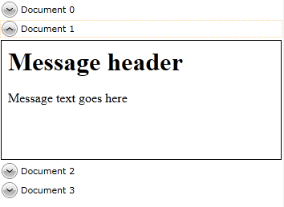

# Data Providers

The __RadRichTextBox__ control allows you to export and import its documents into various document formats - __HTML__, __XAML__, __RTF__, __DOCX__, __PDF__. You can export and import the document from and to __strings__ or __files__. For that purpose you could use the following classes:
      

* __XamlFormatProvider__

* __HtmlFormatProvider__

* __DocxFormatProvider__

* __RtfFormatProvider__

* __PdfFormatProvider__ (export only)
          

* __TxtFormatProvider__

>tipFor more information, check out the [Import/Export]() topic.
        

However, the format providers cannot be used in XAML and you have to implement a logic that will call their Import() and Export() methods. This is something that you might not want to be concerned with when using __RadRichTextBox__ in a data bound scenarios. For such cases, the __DataProvider__ classes are used. They wrap the __FormatProviders'__ functionality and allow its usage in XAML. Currently, the following __DataProvider__ classes are available:
      

* __XamlDataProvider__: Use when you want to bind XAML source to __RadRichTextBox__.
          

* __HtmlDataProvider__: Use when you want to bind HTML source to __RadRichTextBox__.
          

* __RtfDataProvider__: Use when you want to bind RTF source to __RadRichTextBox__.
          

* __DocxDataProvider__: Use when you want to bind a docx source to __RadRichTextBox__.
          

* __TxtDataProvider__: Use when you want to bind plain text source to __RadRichTextBox__.

>tipData providers have to be declared in the visual tree and not the Resource dictionary of a control. You don't have to worry about the place in the visual tree where a provider is, as it does not have a visual representation.          

>important RadRichTextBox's data providers encapsulate the logic of the format providers that come with the control. What they do internally is import/export the document using the respective format provider. By default, the property in your view model will be updated on each document change. As this triggers an export to the document you might notice some delay when typing in the control. You could try customizing this by setting the **UpdateSourceTrigger** property of the data provider to **LostFocus** or **Explicit**.

The __DataProviders__ can be easily used to bind __RadRichTextBox__ to a XAML, HTML, RTF or a plain text string. This is done only in XAML without the usage of any code-behind. Using a two way data binding, you can also keep the string up to date with the changes made to it through the __RadRichTextBox__. To implement a DataProvider class in your application, you'll have to create an instance and configure it via the following properties:
      

* __RichTextBox__: Specifies which __RadRichTextBox__ instance this data provider is attached to.
          
* __String Value__: Specifies the input/output of the __DataProvider__ in the respective format.  The name of the property is __Xaml__ for __XamlDataProvider__, __Html__ for __HtmlDataProvider__, __Text__ for __TxtDataProvider__ and __Rtf__ for __RtfDataProvider__. An exception to this rule is the __Docx__ property of __DocxDataProvider__ which is a byte array. 


>tipIt is best to declare data providers in the visual tree, as this way the binding will be properly updated when the data context is changed. You don't have to worry about the place in the visual tree where the provider is, as it does not have a visual representation.

>tipEach __DataProvider__ class is located in the same assembly as the corresponding __FormatProvider__ class. For example, the __XamlFormatProvider__ class is in the __Telerik.Windows.Documents.FormatProviders.Xaml.dll__ assembly. Only the __TxtDataProvider__ is located in the __Telerik.Windows.Documents__ assembly. In order to use a data provider, make sure to have referenced the required assembly.
        

>The __DataProviders__ can be accessed via the default Telerik namespace:
        

#### __XAML__

{{region radrichtextbox-features-data-providers_0}}
	xmlns:telerik="http://schemas.telerik.com/2008/xaml/presentation"
{{endregion}}

## Binding the provider to other UI Elements

In the following example, two simple UI controls are used - a plain __RadRichTextBox__ and a __TextBox__, which will display the document as a XAML text. The main functionality is contained in the __XamlDataProvider__ class. It's attached to the __RadRichTextBox__ and its __Xaml__ property is data bound to the __TextBox's Text__ property.
        

#### __XAML__

{{region radrichtextbox-features-data-providers_2}}
	<UserControl x:Class="DataProvidersDemo.MainPage"
	             xmlns:telerik="http://schemas.telerik.com/2008/xaml/presentation">
	    <Grid x:Name="LayoutRoot"
	          Background="White">
	        <Grid.RowDefinitions>
	            <RowDefinition />
	            <RowDefinition />
	        </Grid.RowDefinitions>
	        <telerik:XamlDataProvider x:Name="xamlDataProvider"
	            Xaml="{Binding ElementName=textBox, Path=Text, Mode=TwoWay}"
	            RichTextBox="{Binding ElementName=radRichTextBox}" />
	        <telerik:RadRichTextBox Margin="2" x:Name="radRichTextBox" />
	        <TextBox Margin="2" Grid.Row="1" x:Name="textBox" />
	    </Grid>
	</UserControl>
{{endregion}}

At some point, you may want to start customizing the documents' appearance or modify the document after it has been imported but before it is shown. Data providers facilitate this by exposing a __SetupDocument__ event. It's fired every time the data provider instantiates a new document so you can modify the document. The following code-snippet demonstrates how to do that.
        

#### __XAML__

{{region radrichtextbox-features-data-providers_3}}
	<telerik:XamlDataProvider Name="xamlDataProvider"
	           Xaml="{Binding ElementName=textBox, Path=Text, Mode=TwoWay}"
	           RichTextBox="{Binding ElementName=radRichTextBox}"
	           SetupDocument="XamlDataProvider_SetupDocument"/>
{{endregion}}

#### __C#__

{{region radrichtextbox-features-data-providers_2}}
	private void XamlDataProvider_SetupDocument(object sender, Telerik.Windows.Documents.FormatProviders.SetupDocumentEventArgs e)
	{
	    e.Document.LayoutMode = Telerik.Windows.Documents.Model.DocumentLayoutMode.Paged;
	}
{{endregion}}

#### __VB.NET__

{{region radrichtextbox-features-data-providers_3}}
	Private Sub XamlDataProvider_SetupDocument(sender As Object, e As Telerik.Windows.Documents.FormatProviders.SetupDocumentEventArgs)
	 e.Document.LayoutMode = Telerik.Windows.Documents.Model.DocumentLayoutMode.Paged
	End Sub
{{endregion}}

In the previous example, the document's __LayoutMode__ property is changed. However, you can apply any number of modifications to the document.
        

## Binding the DataProvider to Dynamic Data

The __DataProviders__ can also be used in __DataTemplates__ to enable __DataContext__ binding.
        

Here is an example using __RadRichTextBox__ in __ItemsControl__. For each item in the __ItemsSorce__ collection an expander is created. The content of the expander is __RadRichTextBox__ control bound to the __Body__ property of the __DataContext__ through __HtmlDataProvider__.
        

#### __XAML__

{{region radrichtextbox-features-data-providers_4}}
	<ItemsControl>
	    <ItemsControl.ItemTemplate>
	        <DataTemplate>
	            <telerik:RadExpander>
	                <telerik:RadExpander.Header>
	                    <TextBlock Text="{Binding Name}"/>
	                </telerik:RadExpander.Header>
	                <telerik:RadExpander.Content>
	                    <Grid>
	                        <telerik:HtmlDataProvider x:Name="HtmlProvider" 
	                                      RichTextBox="{Binding ElementName=richTextBox}"
	                                      Html="{Binding Body, Mode=TwoWay}" />
	                        <telerik:RadRichTextBox x:Name="richTextBox" Height="150" Width="350"
	                                HorizontalAlignment="Left" BorderBrush="Black" BorderThickness="1" />            
	                    </Grid>
	                </telerik:RadExpander.Content>
	            </telerik:RadExpander>
	        </DataTemplate>
	    </ItemsControl.ItemTemplate>
	</ItemsControl>
{{endregion}}

Here is a sample snapshot:

