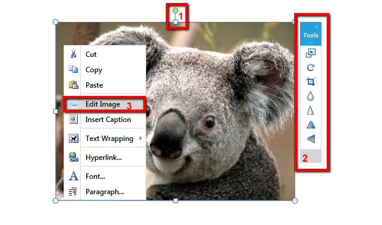
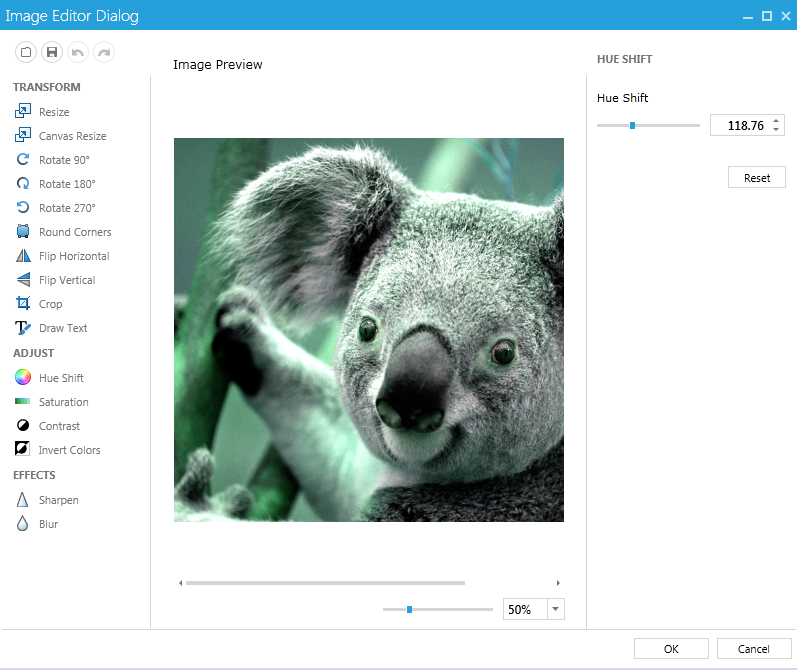

# Editing Images

This topic contains the following sections:

* [Using the UI](#using-the-ui)

* [Disable Image Editing Capabilities](#disable-image-editing-capabilities)

__RadRichTextBox__is integrated out of the box with
        [RadImageEditor]()
        to allow editing images that have been inserted in the editor. The supported image formats are as follows:
      

* JPEG

* PNG

* BMP

All you have to do in order to use the capabilities provided by the
        image editor is reference the __Telerik.Windows.Controls.ImageEditor.dll__.
      

## Using the UI

There are several editing options you can perform when you select an image in __RadRichTextBox__.
        

1. You can easily resize the image using the adorner that is shown around the image. In addition, the thumb that is shown on
              top allows you to rotate the image.
            

1. The __ImageMiniToolbar__ allows you to quickly perform some of the options provided by the image editor.
            

1. When an image is selected, a new item appears in the context menu – *Edit Image*. Clicking it
              opens the image using __RadImageEditorUI__ and allows you to edit it using the provided capabilities.
              Clicking the *OK* button applies the changes made to the image and shows its new state in the document.
            

## Disable Image Editing Capabilities

As most features of the editor, the image editing capabilities can be easily disabled.

To remove the image adorner from your application you can create a new __UILayersBuilder__ as shown
          [here]() and remove the __AdornerLayer__.
        

#### __C#__

{{region radrichtextbox-features-editing-images_0}}
	    public class CustomLayersBuilder : UILayersBuilder
	    {
	        protected override void BuildUILayersOverride(IUILayerContainer uiLayerContainer)
	        {
	            uiLayerContainer.UILayers.Remove("AdornerLayer");
	        }
	    }
	{{endregion}}

Alternatively, you can disable the capabilities of the image adorner by accessing it though RadRichTextBox's 
          __ImageSelectionAdornerSettings__ property. This allows you to set the bolean properties __CanDrag__, 
          __CanResize__ and __CanRotate__ which disable/enable respectively dragging of the
          image, resizing it or rotating it.
        

#### __C#__

{{region radrichtextbox-features-editing-images_5}}
	            this.radRichTextBox.ImageSelectionAdornerSettings.CanDrag = false;
	            this.radRichTextBox.ImageSelectionAdornerSettings.CanResize = false;
	            this.radRichTextBox.ImageSelectionAdornerSettings.CanRotate = false;
	{{endregion}}

In order to prevent the __ImageMiniToolBar__ from showing you should set the __IsImageMiniToolbarEnabled__
          property to false either in XAML or in code-behind.
        

#### __XAML__

{{region radrichtextbox-features-editing-images_1}}
	        <telerik:RadRichTextBox Name="radRichTextBox" IsImageMiniToolBarEnabled="False" />
	{{endregion}}

#### __C#__

{{region radrichtextbox-features-editing-images_2}}
	            this.radRichTextBox.IsImageMiniToolBarEnabled = false;
	{{endregion}}

As for removing the image editing option from the context menu, you can do that by creating a custom menu builder, which derives from
          __ContextMenuContentBuilder__ and override the __CreateImageCommands()__ method.
        

#### __C#__

{{region radrichtextbox-features-editing-images_3}}
	    public class CustomMenuBuilder : ContextMenuContentBuilder
	    {
	        private RadRichTextBox radRichTextBox;
	
	        public CustomMenuBuilder(RadRichTextBox radRichTextBox)
	            : base(radRichTextBox)
	        {
	            this.radRichTextBox = radRichTextBox;
	        }
	
	        protected override ContextMenuGroup CreateImageCommands()
	        {
	            ContextMenuGroup imageCommands = new ContextMenuGroup(ContextMenuGroupType.ImageCommands);
	            imageCommands.Add(RadMenuItemFactory.CreateMenuItem(LocalizationManager.GetString("Documents_ContextMenu_Image_InsertCaption"), "16/InsertCaption.png", this.radRichTextBox.Commands.ShowInsertCaptionDialogCommand));
	
	            return imageCommands;
	        }
	    }
	
	    internal static class RadMenuItemFactory
	    {
	        private const string BaseImagePath = "/Telerik.Windows.Controls.RichTextBoxUI;component/Images/MSOffice/";
	
	        public static RadMenuItem CreateMenuItem(string text, string relativePath)
	        {
	            return CreateMenuItem(text, relativePath, null, null);
	        }
	
	        public static RadMenuItem CreateMenuItem(string text, string imageRelativePath, RichTextBoxCommandBase command, object commandParameter = null)
	        {
	            RadMenuItem menuItem = new RadMenuItem();
	            menuItem.Header = text;
	
	            if (imageRelativePath != null)
	            {
	                menuItem.Icon = new System.Windows.Controls.Image() { Source = new BitmapImage(new Uri(BaseImagePath + imageRelativePath, UriKind.Relative)), Stretch = Stretch.None };
	            }
	
	            menuItem.Command = command;
	
	            if (commandParameter != null)
	            {
	                menuItem.CommandParameter = commandParameter;
	            }
	
	            return menuItem;
	        }
	    }
	{{endregion}}

What is left to do is assign an instance of your class to the __ContentBuilder__ property of the context menu:
        

#### __C#__

{{region radrichtextbox-features-editing-images_4}}
	            ContextMenu contextMenu = (ContextMenu)this.radRichTextBox.ContextMenu;
	            contextMenu.ContentBuilder = new CustomMenuBuilder(this.radRichTextBox);
	{{endregion}}

# See Also

 * [Inline images]()[RadImageEditor Overview]()

 * [Context menu]()
