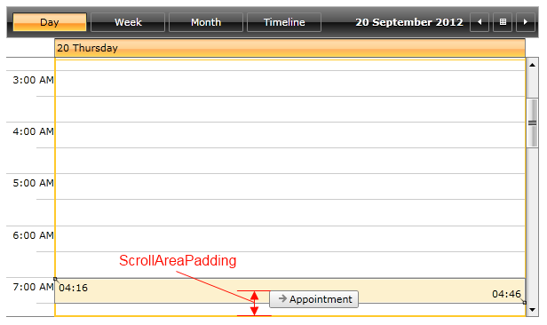
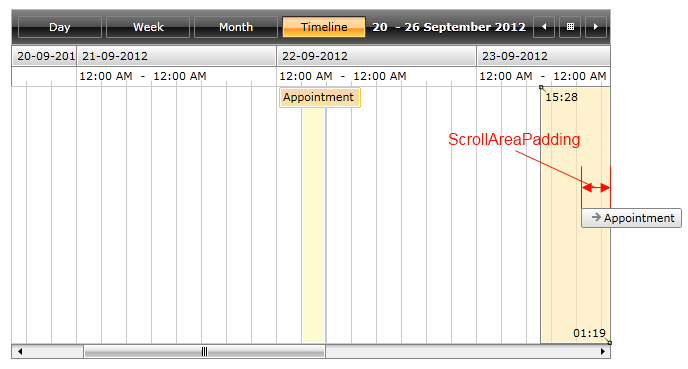
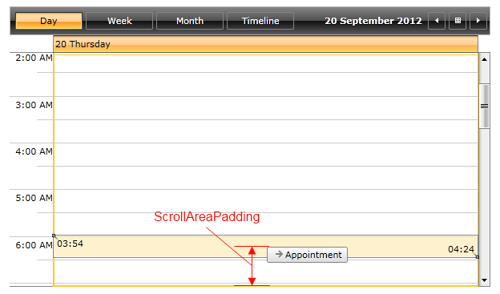

# AutoScrolling

With the official Q2 SP1 release of RadControls we introduce the auto scrolling feature for __RadScheduleView__. This feature will help end users by auto scrolling the visible area of the view while dragging appointments in the control.

This article covers the following topics:

* [Enabling and disabling auto scrolling;](#enabling-and-disabling-auto-scrolling)

* [Customizing the auto scrolling:](#customizing-the-auto-scrolling-feature)

* [ScrollStep;](#scrollstep)

* [ScrollStepTime;](#scrollsteptime)

* [ScrollAreaPadding.](#scrollareapadding)

## Enabling and disabling auto scrolling

By default the auto scrolling functionality is enabled. In order to disable it you need to set the __ScrollingSettingsBehavior.IsEnabled__ attached property to false:

#### __XAML__

{{region radscheduleview-features-autoscrolling-1}}
	<telerik:RadScheduleView telerik:ScrollingSettingsBehavior.IsEnabled="False">
		...
	</telerik:RadScheduleView>
	{{endregion}}

## Customizing the auto scrolling feature

It is possible to make some customizations to the auto scrolling behavior in RadScheduleView - for example change the scrolling step, set different time interval of the scrolling and adjust the scroll area padding.ScrollStep

The default value that is set to the __ScrollStep__ property is equal to 5px. This value determines how many pixels will be skipped while dragging the appointments.

The next code snippet demonstrates how to change the scrolling step in order to make the auto scrolling speed two times faster than its default value:

#### __XAML__

{{region radscheduleview-features-autoscrolling-2}}
	<telerik:RadScheduleView ScrollStep="10">
		…
	</telerik:RadScheduleView>
	{{endregion}}

ScrollStepTime

__ScrollStepTime__ sets the time interval between the scroll steps of the auto scrolling feature. The default value of this property is 0.01 sec and it could be set to any TimeSpan value.

The next code snippet demonstrates how to set the scroll time interval to half a second:

#### __XAML__

{{region radscheduleview-features-autoscrolling-3}}
	<telerik:RadScheduleView telerik:ScrollingSettingsBehavior.ScrollStepTime="00:00:00.5">
		…
	</telerik:RadScheduleView>
	{{endregion}}

ScrollAreaPadding

By setting __ScrollAreaPadding__ you can customize at which point the auto scrolling functionality will start. This property could be set in the same manner as the Padding property.  Its default value is 30px.

The next example shows how to set the ScrollAreaPadding in order to achieve top/bottom padding of 50px and right/left padding of 100px:

#### __XAML__

{{region radscheduleview-features-autoscrolling-4}}
	<telerik:RadScheduleView ScrollAreaPadding=" 100, 50, 100, 50">
		…
	</telerik:RadScheduleView>
	{{endregion}}

The next screenshots show the ScrollAreaPadding property set to its default value and to 50px:

* Without ScrollAreaPadding set (__default value__):

* With ScrollAreaPadding set to 50px:

# See Also
