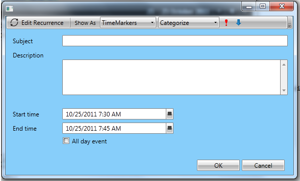

# Customizing Dialog Windows

>To customize the ScheduleView dialogs, e.g. the window content, please read the following article:
  		[Custom Dialogs]()

The dialogs in RadScheduleView are displayed by default in RadWindow instances. The RadWindow properties can be customized or it can be entirely replaced with any other ContentControl.
RadScheduleView uses the __IScheduleViewDialogHostFactory__ and __IScheduleViewDialogHost__ interfaces to abstract the dialog hosts and their generation. The default implementation of the IScheduleViewDialogHostFactory interface that creates RadWindow instances is named ScheduleViewDialogHostFactory.

## Customizing RadWindow properties

Create a new class, deriving from ScheduleViewDialogHostFactory and override the CreateNew method:

#### __C#__

{{region radscheduleview-features-customizing-dialog-windows_0}}
	public class CustomScheduleViewDialogHostFactory : ScheduleViewDialogHostFactory
	{
	    protected override IScheduleViewDialogHost CreateNew(ScheduleViewBase scheduleView, DialogType dialogType)
	    {
	        var host = base.CreateNew(scheduleView, dialogType);
	        var window = host as RadWindow;
	        // Set properties on RadWindow here.
	        return host;
	    }
	}
	{{endregion}}

Configure RadScheduleView to use the new class:

#### __XAML__

{{region radscheduleview-features-customizing-dialog-windows_1}}
	<telerik:RadScheduleView . . .>
		<telerik:RadScheduleView.SchedulerDialogHostFactory>
			<local:CustomScheduleViewDialogHostFactory />
		</telerik:RadScheduleView.SchedulerDialogHostFactory>
	</telerik:RadScheduleView>
	{{endregion}}

## Replacing RadWindow with ChildWindowWindow

Create a new class, deriving from WindowChildWindow and implement the __IScheduleViewDialogHost__ interface:
    

#### __C#__

{{region radscheduleview-features-customizing-dialog-windows_2}}
	public class WindowDialogHost : Window, IScheduleViewDialogHost
	{
		public new event EventHandler<WindowClosedEventArgs> Closed;
		public ScheduleViewBase ScheduleView
		{
			get;
			set;
		}
		protected override void OnClosed(System.EventArgs e)
		{
			base.OnClosed(e);
			if (this.Closed != null)
			{
				this.Closed(this, new WindowClosedEventArgs());
			}
		}
		public void Show(bool isModal)
		{
			if (this.Owner == null && this.ScheduleView != null)
			{
				this.Owner = this.ScheduleView.ParentOfType<Window>();
			}
			if (isModal)
			{
				this.ShowDialog();
			}
			else
			{
				this.Show();
			}
		}
	}
	{{endregion}}



#### __C#__

{{region radscheduleview-features-customizing-dialog-windows_3}}
	public class WindowDialogHost : ChildWindow, IScheduleViewDialogHost
	{
		private bool opened;
			
		protected override void OnOpened()
		{
			base.OnOpened();
			this.opened = true;
		}
		protected override void OnClosed(System.EventArgs e)
		{
			base.OnClosed(e);
			if (this.Closed != null && this.opened)
			{
				this.opened = false;
				this.Closed(this, new WindowClosedEventArgs());
			}
		}
	
		public new event EventHandler<WindowClosedEventArgs> Closed;
	
		public ScheduleViewBase ScheduleView { get; set; }
	
		void IScheduleViewDialogHost.Close()
		{
			if (this.opened)
			{
				this.Close();
			}
		}
	
		public void Show(bool isModal)
		{
			this.Show();
		}
	}
	{{endregion}}



Create a new class and implement the __IScheduleViewDialogHostFactory__:
    

#### __C#__

{{region radscheduleview-features-customizing-dialog-windows_5}}
	public class CustomScheduleViewDialogHostFactory : ScheduleViewDialogHostFactory
	{
	    protected override IScheduleViewDialogHost CreateNew(ScheduleViewBase scheduleView, DialogType dialogType)
	    {
	        var window = new WindowDialogHost
	        {
	            Content = new SchedulerDialog(),
	            ScheduleView = scheduleView, 
	            Width = 580,
	            Height = 350,
	            Background = new SolidColorBrush(Colors.LightSkyBlue)
	            // Set additional properties here
	        };
	        return window;
	    }
	}
	
	{{endregion}}



#### __C#__

{{region radscheduleview-features-customizing-dialog-windows_4}}
	public class CustomScheduleViewDialogHostFactory : IScheduleViewDialogHostFactory
	{
	    public virtual IScheduleViewDialogHost CreateNew(ScheduleViewBase scheduleView, DialogType dialogType)
	    {
	        var window = new WindowDialogHost
	        {
	            Content = new SchedulerDialog(),
	            ScheduleView = scheduleView
	            // Set additional properties here
	        };
	        return window;
	     }    
	}
	{{endregion}}



Configure RadScheduleView to use the new factory:
    

#### __XAML__

{{region radscheduleview-features-customizing-dialog-windows_1}}
	<telerik:RadScheduleView . . .>
		<telerik:RadScheduleView.SchedulerDialogHostFactory>
			<local:CustomScheduleViewDialogHostFactory />
		</telerik:RadScheduleView.SchedulerDialogHostFactory>
	</telerik:RadScheduleView>
	{{endregion}}



         
      		

         
      		
