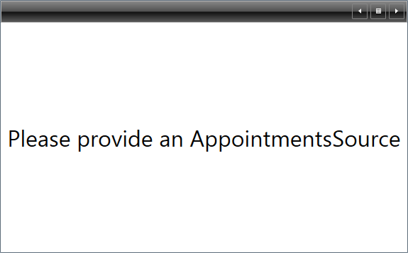
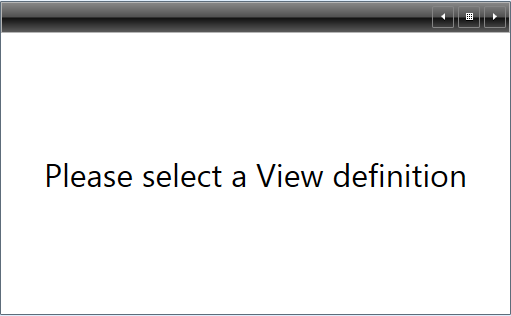
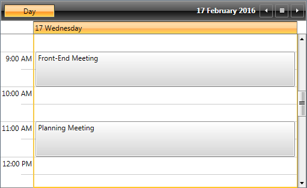

# Getting Started

This tutorial will walk you through the creation of a sample application that contains __RadScheduleView__.      

* [Assembly References](#assembly-references)
* [Adding RadScheduleView to the Project](#adding-radscheduleview-to-the-project)
* [Populating with Data](#populating-with-data)
* [Adding ViewDefinitions](#adding-viewdefinitions)
* [Resources, Grouping](#resources-grouping)

## Assembly References

In order to use the __RadScheduleView__ control in your projects you have to add references to the following assemblies:

* __Telerik.Windows.Controls__
* __Telerik.Windows.Controls.Input__
* __Telerik.Windows.Controls.Navigation__
* __Telerik.Windows.Controls.ScheduleView__
* __Telerik.Windows.Data__

## Adding RadScheduleView to the Project

Before proceeding with adding RadScheduleView to your project, make sure the required assembly references are added to the project. 

You can add __RadScheduleView__ manually by writing the XAML code in __Example 1__. You can also add the control by dragging it from the Visual Studio Toolbox and dropping it over the XAML view.

#### __[XAML] Example 1: Adding RadScheduleView in XAML__

{{region radscheduleview-getting-started_0}}
	<telerik:RadScheduleView />     
{{endregion}}

>In order to use __RadScheduleView__ in XAML you have to add the following namespace declaration:
>#### __[XAML] Example 2: Declaring Telerik Namespace__
>{{region telerik-schemas}}
>    xmlns:telerik="http://schemas.telerik.com/2008/xaml/presentation"
>{{endregion}}

If you run the application you will see an empty ScheduleView with a message saying that AppointmentsSource should be provided as demonstrated on __Figure 1__. 

#### __Figure1: The empty ScheduleView generated by the code in Example 1__

## Populating with Data

In order to populate __RadScheduleView__ with data, you should bind its __AppointmentsSource__ property to a collection of __Appointment__ objects. First, create a ViewModel class containing an ObservableCollection of Appointments as shown in __Example 3__

#### __[C#] Example 3: View Model Containing ObservableCollection of Appointments__

{{region radscheduleview-getting-started_1}}
	public class MyViewModel
	{
		private ObservableCollection<Appointment> appointments;

		public ObservableCollection<Appointment> Appointments
		{
			get
			{
				if (this.appointments == null)
				{
					this.appointments = this.CreateAppointments();
				}
				return this.appointments;
			}	      
		}

		private ObservableCollection<Appointment> CreateAppointments()
		{
			ObservableCollection<Appointment> apps = new ObservableCollection<Appointment>();

			var app1 = new Appointment()
			{
				Subject = "Front-End Meeting",
				Start = DateTime.Today.AddHours(9),
				End = DateTime.Today.AddHours(10)
			};
			apps.Add(app1);

			var app2 = new Appointment()
			{
				Subject = "Planning Meeting",
				Start = DateTime.Today.AddHours(11),
				End = DateTime.Today.AddHours(12)
			};
			apps.Add(app2);

		return apps;
		}   
	}
{{endregion}}

#### __[VB.NET] Example 3: View Model Containing ObservableCollection of Appointments__

{{region radscheduleview-getting-started_1}}
	Public Class MyViewModel

		Private m_appointments As ObservableCollection(Of Appointment)

		Public ReadOnly Property Appointments() As ObservableCollection(Of Appointment)
			Get
				If Me.m_appointments Is Nothing Then
					Me.m_appointments = Me.CreateAppointments()
				End If
				Return Me.m_appointments
			End Get
		End Property

		Private Function CreateAppointments() As ObservableCollection(Of Appointment)
			Dim apps As New ObservableCollection(Of Appointment)()

			Dim app1 As New Appointment() With {
				.Subject = "Front-End Meeting",
				.Start = DateTime.Today.AddHours(9),
				.[End] = DateTime.Today.AddHours(10)
			}
			apps.Add(app1)

			Dim app2 = New Appointment() With {
				.Subject = "Planning Meeting",
				.Start = DateTime.Today.AddHours(11),
				.[End] = DateTime.Today.AddHours(12)
			}
			apps.Add(app2)

			Return apps
		End Function
	End Class
{{endregion}}

Now that you have prepared the needed sample data, it is time to bind RadScheduleView to it. For that purpose, you should set the __RadScheduleView's AppointmentsSource__ property to the collection of Appointments.

__Example 4__ demonstrates how you can bind the AppointmentsSource collection in XAML. The _local_ namespace in the example corresponds to the namespace where __MyViewModel__ resides.

#### __[XAML] Example 4: Bind RadScheduleView__

{{region radscheduleview-getting-started_2}}
    <Grid.Resources>
        <local:MyViewModel x:Key="MyViewModel" />
    </Grid.Resources>
    <telerik:RadScheduleView DataContext="{StaticResource MyViewModel}"  AppointmentsSource="{Binding Appointments}" />
{{endregion}}

If you run the application at this stage you will see again an empty ScheduleView with a message saying that a View Definition should be selected as shown on __Figure 2__. 

#### __Figure2: The empty ScheduleView generated by the code in Example 4__

## Adding ViewDefinitions

__Example 5__ demonstrates how you can add a DayViewDefinition to the __RadScheduleView__ control:

#### __[XAML] Example 5: Add DayViewDefinition__

{{region radscheduleview-getting-started_3}}
	<telerik:RadScheduleView DataContext="{StaticResource MyViewModel}" AppointmentsSource="{Binding Appointments}">
		<telerik:RadScheduleView.ViewDefinitions>
			<telerik:DayViewDefinition />
		</telerik:RadScheduleView.ViewDefinitions>
	</telerik:RadScheduleView>
{{endregion}}

>You can add more than one ViewDefinition. There are four view definitions available:
>* DayViewDefinition
>* WeekViewDefinition
>* TimelineViewDefinition
>* MonthViewDefinition
> 
>For additional details check [ViewDefinitions Overview]() topic.

Running the application containing the code from Examples 1 - 5 will result in a populated __RadScheduleView__ like on __Figure 3__.

__Figure 3: RadScheduleView bound to a collection of Appointments__

## Resources, Grouping

Using Resources you can associate additional information with the Appointments. Moreover, you can group the Appointments in __RadScheduleView__ according to the Resources assigned to them. For detailed information on this functionality check the [Resources] () topic.

# See Also

 * [Understanding Appointments]()
  
 * [Data Binding Support]()
 
 * [ViewDefinitions]()
 
 * [Resources] ()