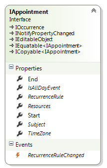
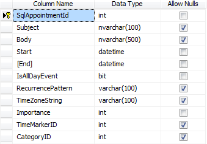
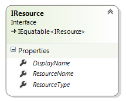
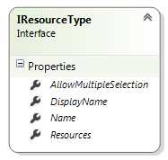
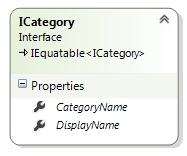
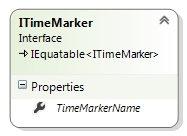

# Table Definitions and Relationships

The database diagram is very common to the class diagram of the RadScheduleView interfaces:

## Table Definitions

We have table definitions in the database according for the following types in the RadScheduleView:

<table><tr><td>

IAppointment & IExtendedAppointment</td><td>

SqlAppointments</td></tr><tr><td>

IResource</td><td>

SqlResources</td></tr><tr><td>

IExceptionOccurrence</td><td>

SqlExceptionOccurrences</td></tr><tr><td>

IResourceType</td><td>

SqlResourceTypes</td></tr><tr><td>

ICategory</td><td>

Categories</td></tr><tr><td>

ITimeMarker</td><td>

TimeMarkers</td></tr></table>

## Relationships

Here are some explanations about the keys and the relationships in the data tables:
<table><th><tr><td>Name</td><td>Between</td><td>Type</td><td>Update/delete rule</td></tr></th><tr><td>FK_SqlResources_SqlResourceTypes</td><td>SqlResourceTypes  - SqlResources</td><td>One-to-many</td><td>No Action</td></tr><tr><td>FK_SqlAppointmentResources_SqlResource</td><td>SqlResources - SqlAppointmentResources</td><td>One-to-many</td><td>Cascade</td></tr><tr><td>FK_SqlExceptionResources_SqlResource</td><td>SqlResources -  SqlExceptionResources</td><td>One-to-many</td><td>Cascade</td></tr><tr><td>FK_SqlExceptionOccurrences_SqlAppointments</td><td>SqlAppointments -  SqlExceptionOccurrences</td><td>One-to-many</td><td>Cascade</td></tr><tr><td>FK_SqlExceptionAppointments_SqlExceptionOccurrences</td><td>SqlExceptionOccurrences -  SqlExceptionAppointments</td><td>One-to-many</td><td>Cascade</td></tr><tr><td>FK_SqlAppointments_TimeMarkers</td><td>TimeMarkers -  SqlAppointments</td><td>One-to-many</td><td>No Action</td></tr><tr><td>FK_SqlExceptionAppointments_TimeMarkers</td><td>TimeMarkers -  SqlExceptionAppointments</td><td>One-to-many</td><td>No Action</td></tr><tr><td>FK_SqlAppointments_Categories</td><td>Categories -   SqlAppointments</td><td>One-to-many</td><td>No Action</td></tr><tr><td>FK_SqlExceptionAppointments_Categories</td><td>Categories -  SqlExceptionAppointments</td><td>One-to-many</td><td>No Action</td></tr><tr><td>FK_SqlExceptionResources_SqlExceptionAppointment</td><td>Categories -  SqlExceptionAppointments</td><td>One-to-many</td><td>Cascade</td></tr><tr><td>FK_SqlAppointmentResources_SqlAppointment</td><td>SqlAppointment -  SqlAppointmentResources</td><td>One-to-many</td><td>Cascade</td></tr></table>

>

* 
							There is no table definition for the __IRecurrenceRule__ type because we don’t need it. Storing the __RecurrencePattern__ is enough to generate the recurrence rules at run-time.
						

* 
							We cannot save the Brush type into the database directly, that’s why we can save a string that represents the color and convert the string to __SolidColerBrush__ object when the TimeMarkers & Categories are loaded.
						

* 
							The __SqlAppointmentResource__ and __SqlExceptionResources__ are cross-tables between:
							

* SqlAppointments & SqlResources

* SqlExceptionAppointments & SqlResources
