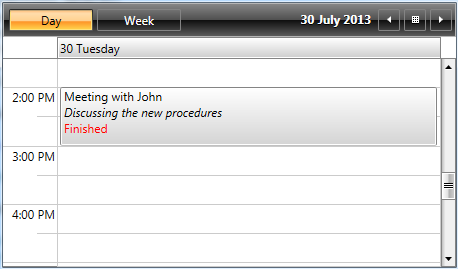

# Appointment Template

This help topic explains in details how you can customize the template of the appointments using AppointmentItemContentTemplate or AppointmentItemContentTemplateSelector properties. The second approach is used when you need to apply different templates according to some custom logic.

## Setting AppointmentItemContentTemplate

RadScheduleView provides an easy way to change the appointment template through its __AppointmentContentTemplate__ property.

The DataContext of the defined DataTemplate that we will be set to __AppointmentContentTemplate__ is of type __AppointmentProxy__ - it holds the most important properties of the Appointment and the Appointment itself. 

Let's for example have a [Custom Appointment]() with IsDone custom property:

#### __C#__

{{region radscheduleview-styles-and-templates-appointment-template_1}}
	public class Task : Appointment
	{
	    private bool isDone;
	    public bool IsDone
	    {
	        get
	        {
	            return this.Storage<Task>().isDone;
	        }
	        set
	        {
	            var storage = this.Storage<Task>();
	            if (storage.isDone != value)
	            {
	                storage.isDone = value;
	                this.OnPropertyChanged(() => this.IsDone);
	            }
	        }
	    }
		...
	}
{{endregion}}

We will create the following DataTemplate in order to show some additional information about the appointment:

#### __XAML__

{{region radscheduleview-styles-and-templates-appointment-template_0}}
	<telerik:BooleanToVisibilityConverter x:Key="BooleanToVisibilityConverter" />
	<DataTemplate x:Key="AppointmentTemplate">
		<StackPanel>
			<TextBlock Text="{Binding Subject}" TextWrapping="Wrap" TextTrimming="WordEllipsis"/>
			<TextBlock Text="{Binding Body}" FontStyle="Italic" TextWrapping="Wrap" TextTrimming="WordEllipsis"/>
			<TextBlock Text="Finished" Foreground="Red" Visibility="{Binding Appointment.IsDone, Converter={StaticResource BooleanToVisibilityConverter}}" />            
		</StackPanel>
	</DataTemplate>
{{endregion}}

>Note that custom properties should be bound through Appointment property of the DataContext.

Then the DataTemplate should be set to __AppointmentContentTemplate__ property of the ScheduleView control:        

#### __XAML__

{{region radscheduleview-styles-and-templates-appointment-template_2}}
	<telerik:RadScheduleView 
			AppointmentsSource="{Binding Appointments}"						
			AppointmentItemContentTemplate="{StaticResource AppointmentTemplate}">
		...
	</telerik:RadScheduleView>
{{endregion}}

Here is the end result:

## Setting AppointmentItemContentTemplateSelector

In some cases there is a need to apply different templates to the appointments according to some condition - this can be achieved by setting __AppointmentItemContentTemplateSelector__ property of the ScheduleView control.

Let's, for example create separate appointment templates for the different ViewDefinitions of the control - a more detailed template for DayViewDefinition and a simple template for WeekViewDefinition.

First, we will have to create a custom class which inherits from Telerik.Windows.Controls.ScheduleViewDataTemplateSelector, define the needed DataTemplates in it and override SelectTemplate method:

#### __C#__

{{region radscheduleview-styles-and-templates-appointment-template_3}}
	public class CustomAppointmentTemplateSelector : Telerik.Windows.Controls.ScheduleViewDataTemplateSelector
	{
	    public DataTemplate DayAppointmentTemplate { get; set; }
		public DataTemplate DefaultAppointmentTemplate { get; set; }
			
	
		public override DataTemplate SelectTemplate(object item, DependencyObject container, Telerik.Windows.Controls.ViewDefinitionBase activeViewDefinition)
		{
	        if (activeViewDefinition is WeekViewDefinition)
	            return this.DefaultAppointmentTemplate;
	
			if (activeViewDefinition is DayViewDefinition)
				return this.DayAppointmentTemplate;		
	
			return base.SelectTemplate(item, container, activeViewDefinition);
		}
	}
{{endregion}}

Then define the CustomAppointmentTemplateSelector and the DataTemplates in XAML:

#### __XAML__

{{region radscheduleview-styles-and-templates-appointment-template_4}}
	<local:CustomAppointmentTemplateSelector x:Key="CustomAppointmentTemplateSelector">
	    <local:CustomAppointmentTemplateSelector.DayAppointmentTemplate>
	        <DataTemplate>
	            <StackPanel>
	                <TextBlock Text="{Binding Subject}" TextWrapping="Wrap" TextTrimming="WordEllipsis"/>
	                <TextBlock Text="{Binding Body}" TextWrapping="Wrap" TextTrimming="WordEllipsis"/>
	                <TextBlock Text="Finished" Foreground="Red" Visibility="{Binding Appointment.IsDone, Converter={StaticResource BooleanToVisibilityConverter}}" />
	            </StackPanel>
	        </DataTemplate>
	    </local:CustomAppointmentTemplateSelector.DayAppointmentTemplate>
	    <local:CustomAppointmentTemplateSelector.DefaultAppointmentTemplate>
	        <DataTemplate>
	            <TextBlock Text="{Binding Subject}" TextWrapping="Wrap" TextTrimming="WordEllipsis"/>
	        </DataTemplate>
	    </local:CustomAppointmentTemplateSelector.DefaultAppointmentTemplate>
	</local:CustomAppointmentTemplateSelector>
{{endregion}}

And apply it to the ScheduleView:

#### __XAML__

{{region radscheduleview-styles-and-templates-appointment-template_5}}
	<telerik:RadScheduleView 
			AppointmentsSource="{Binding Appointments}"						
			AppointmentItemContentTemplateSelector="{StaticResource CustomAppointmentTemplateSelector}">
			...
	</telerik:RadScheduleView>
{{endregion}}

The following screenshot shows how the same appointment looks in different ViewDefinitions:

