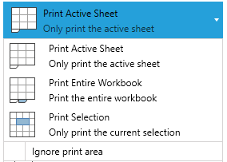
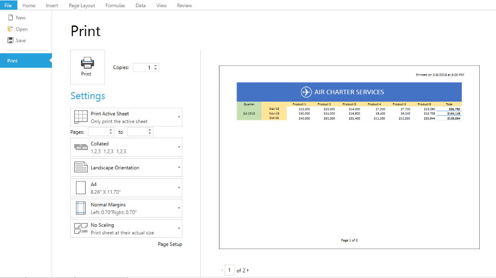

# Printing

Printing in __RadSpreadsheet__ allows you to prepare and display spreadsheet data the most suitable way depending on your needs. Using different printing options such as defining the print page, the scale factor or whether to print gridlines you may customize the way to present your data. Additionally __Print Area__ and __Page Breaks__ allows to print only what you need to print and separate big documents on pages just the way you want your data to be separated. Together with printing on a real printer, __RadSpreadsheet’s__ printing gives you the opportunity to export your spreadsheet data in different file formats with the help of virtual printers.
      

This article aims to present the __Printing API__ of __RadSpreadsheet__ and demonstrate how to specify what and how to print the document. It contains the following subsections:
      

* [How to print RadSpreadsheet?](#how-to-print-radspreadsheet?)

* [Worksheet page setup](#worksheet-page-setup)

* [Print preview](#print-preview)

## How to print RadSpreadsheet?

__RadSpreadsheet__ provides you with variety of options for organizing and preparing the document’s data for printing.
        

Using the __PrintWhatSettings__ class you may specify:
        

* __ExportWhat option__ – Enumeration specifying whether to print the __Active Sheet__, the __Entire Workbook__ or the current __Selection__.
            

* __IgnorePrintArea option__ – Boolean value indicating whether or not to ignore print area when printing worksheets. 

Printing __RadSpreadsheet__ is easily done through the __Print__ method which prints according to some given __PrintWhatSettings__ instance. Here follows a code snippet showing how to print using RadSpreadsheet’s __Print method__:
          

#### __C#__

{{region radspreadsheet-ui-printing_0}}
	            PrintWhatSettings printWhatSettings = new PrintWhatSettings(ExportWhat.ActiveSheet, false);
	            this.radSpreadsheet.Print(printWhatSettings);
{{endregion}}



Depending on whether you want to show a __PrintDialog__ before printing you may use some of the following __RadSpreadsheet’s__ print method overloads:
          

* __Print(PrintWhatSettings printWhatSettings, string printDescription = null)__ – prints depending on specified PrintWhatSettings instance, showing a __PrintDialog__, so that the user can choose a printer and set some printer specific options from the dialog.
              

* __Print(PrintWhatSettings printWhatSettings, PrintDialog printDialog, string printDescription = null)__ – prints depending on specified __PrintWhatSettings__ instance. This overload prints silently (without showing the __PrintDialog__) by using an already initialized __PrintDialog__ instance.
              

The following code snippet demonstrate the use of the above described Print method overloads:
          

#### __C#__

{{region radspreadsheet-ui-printing_1}}
	            PrintWhatSettings printWhatSettings = new PrintWhatSettings(ExportWhat.ActiveSheet, false);
	
	            // Prints showing the print dialog.
	            this.radSpreadsheet.Print(printWhatSettings);
	
	            // Prints silently to the default printer without showing the print dialog.
	            this.radSpreadsheet.Print(printWhatSettings, new PrintDialog());
	
{{endregion}}



## Worksheet page setup

When you need to set different print option such as page size, page orientation or when you want to print the spreadsheet grid lines you may set this options using the worksheet's page setup. For more detailed information you may follow [this link]() to __WorksheetPageSetup__ documentation article.
        

## Print preview

In order to preview the pages before printing you may use the __PrintPreviewControl__ class and set its __RadSpreadsheet property__ to the __RadSpreadsheet__ instance that you want to be previewed. This control will provide ready to use functionality for previewing print pages and setting different print options.
        

The following code snippet shows how to integrate the print preview with RadRibbonView's backstage.
        

#### __XAML__

{{region radspreadsheet-ui-printing_0}}
	        <telerik:RadRibbonBackstageItem Header="Print" IsDefault="false">
	            <spreadsheetControls:PrintPreviewControl RadSpreadsheet="{Binding Path=RadSpreadsheet, Mode=OneTime}" />
	        </telerik:RadRibbonBackstageItem>
{{endregion}}

