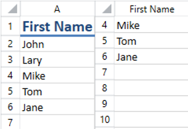
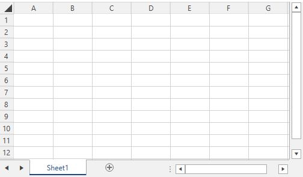
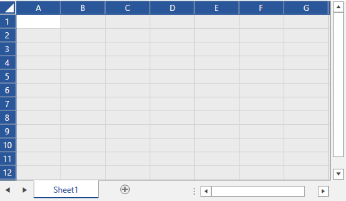

# Customize Row and Column Headers

Giving your data meaningful names helps you better understand it. For example, if your document contains a column with the first names of your employees, the column name A does not help you understand the meaning of the data contained in that column. For the same reason, you probably will have one header row in the document that will store the names of your columns. But when a user scrolls down, the content of the header row will be hidden and the user will not see the names.
      

It will be useful if you can set the column heading name when the first row is not visible like shown in the below image.

#### **Figure 1: Column with custom heading name**

## Change the Row and Column Headings

Each worksheet has a property called __RenderNameConverter__, which provides a mechanism for changing the row and column headings for UI purposes, including PDF export and [Printing](). All you need to do is create a custom name converter and assign an instance of it to the RenderNameConverter property. The converter class must inherit from __HeaderNameRenderingConverterBase__.
        

__Example 1__ shows a simple implementation for the converter class used for creating the snapshots above.
        

#### __[C#] Example 1: Create a custom name converter__

{{region radspreadsheet-howto-customize-row-column-headers_0}}
	    public class CustomNameConverter : HeaderNameRenderingConverterBase
	    {
	        protected override string ConvertColumnIndexToNameOverride(HeaderNameRenderingConverterContext context, int columnIndex)
	        {
	            if (columnIndex == 0 &&
	                context.VisibleRange.FromIndex.RowIndex >= 1 && context.VisibleRange.FromIndex.RowIndex <= 5)
	            {
	                return "First Name";
	            }
	
	            return base.ConvertColumnIndexToNameOverride(context, columnIndex);
	        }
	    }
{{endregion}}

After implementing your custom name converter you need to instantiate it and assign it to the worksheet __RenderNameConverter__ property. __Example 2__ sets a new instance of the CustomNameConverter created in __Example 1__ to a __RadSpreadsheet__'s worksheet.
        

#### __[C#] Example 2: Instantiate and assign a custom converter__

{{region radspreadsheet-howto-customize-row-column-headers_1}}
	            this.radSpreadsheet.Workbook.Worksheets[0].HeaderNameRenderingConverter = new CustomNameConverter();
	{{endregion}}

That's it. The column heading is changed.
        

>tipYou can download a runnable project of the previous example from our online SDK repository [here](https://github.com/telerik/xaml-sdk), the example is listed as __Spreadsheet / CustomRowAndColumnHeadings__.

## States of the Row and Column Headings

The headings of the rows and columns have different states. You can use these states to apply different styles of the items depending on whether they appear in a selection. This section will describe the possible states of the headings in RadSpreadsheet.

* **HeadingState**: It is a property of the RowColumnHeadingBase type. It is an enum type and could have the following values:
	* **Normal**: The heading is not included in any selection.
	
	* **Selected**: A cell from the row/column appears in a selection. 
	
	* **FullySelected**: All the cells included in the row/column are selected. 

          
* **SelectAllControlState**: This is a property of the SelectAllControl and determines whether this control is selected. It is an enum type and could have the following values:
	
	* **Normal**: The control is not selected.
	
		#### **Figure 2: SelectAllControl in normal state**
		

	
	* **Selected**: The control is selected.
	
		#### **Figure 3: SelectAllControl in selected state**
		

# See Also

 * [Hide Row and Column Headers and Gridlines]()
 * [Customize Selection]()