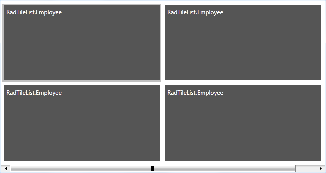
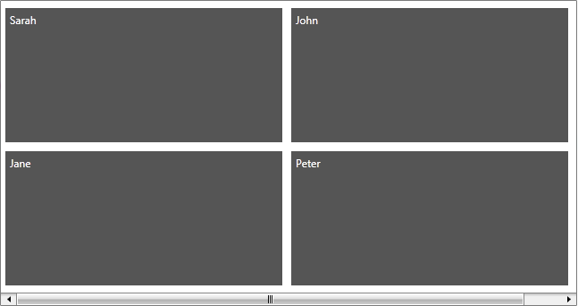
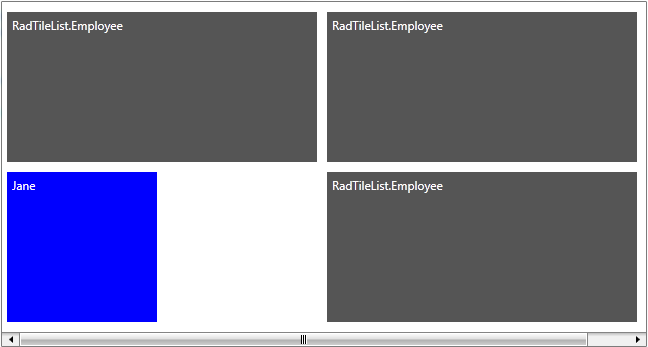

# Autogenerated Tiles

When you want the tiles of __RadTileList__ to be automatically generated on the basis of a collection, use the __ItemsSource__ property.  

* Create a new class named Employee. The class' structure is shown on the next code-snippet.
          

#### __C#__
{{region radtilelist-autogenerated-tiles_0}}

	    public class Employee
	    {
	        public string FirstName
	        {
	            get;
	            set;
	        }
	        public string LastName
	        {
	            get;
	            set;
	        }
	        public string Occupation
	        {
	            get;
	            set;
	        }
	        public int Salary
	        {
	            get;
	            set;
	        }
	    }
	{{endregion}}

#### __VB.NET__

{{region radtilelist-autogenerated-tiles_1}}

	    Public Class Employee
	        Public Property FirstName() As String
	            Get
	                Return m_FirstName
	            End Get
	            Set(value As String)
	                m_FirstName = Value
	            End Set
	        End Property
	        Private m_FirstName As String
	        Public Property LastName() As String
	            Get
	                Return m_LastName
	            End Get
	            Set(value As String)
	                m_LastName = Value
	            End Set
	        End Property
	        Private m_LastName As String
	        Public Property Occupation() As String
	            Get
	                Return m_Occupation
	            End Get
	            Set(value As String)
	                m_Occupation = Value
	            End Set
	        End Property
	        Private m_Ocupation As String
	        Public Property Salary() As Integer
	            Get
	                Return m_Salary
	            End Get
	            Set(value As Integer)
	                m_Salary = Value
	            End Set
	        End Property
	        Private m_Salary As Integer
	    End Class
	{{endregion}}

* Once the class Employee is defined, we will extend it by a single static method - GetEmployees() that will return an ObservableCollection, containing several hard-coded employees:
          

#### __C#__

{{region radtilelist-autogenerated-tiles_2}}

	    public class Employee
	    {
	
	        public Employee()
	        { }
	
	        public static ObservableCollection<Employee> GetEmployees()
	        {
	            ObservableCollection<Employee> employees = new ObservableCollection<Employee>();
	            employees.Add(new Employee() { FirstName = "Sarah", LastName = "Blake", Occupation = "Suppliess Manager", Salary = 3500 });
	            employees.Add(new Employee() { FirstName = "Jane", LastName = "Simpson", Occupation = "Security", Salary = 2000 });
	            employees.Add(new Employee() { FirstName = "John", LastName = "Peterson", Occupation = "Consultant", Salary = 2600 });
	            employees.Add(new Employee() { FirstName = "Peter", LastName = "Bush", Occupation = "Cashier", Salary = 2300 });
	            return employees;
	        }
	    }
	{{endregion}}

#### __VB.NET__

{{region radtilelist-autogenerated-tiles_3}}

	    Public Class Employee
	
	        Public Sub New()
	        End Sub
	        Public Shared Function GetEmployees() As ObservableCollection(Of Employee)
	            Dim employees As New ObservableCollection(Of Employee)()
	  employees.Add(New Employee() With { _
	   Key .FirstName = "Sarah", _
	   Key .LastName = "Blake", _
	   Key .Occupation = "Supplies Manager", _
	   Key .Salary = 3500 _
	  })
	  employees.Add(New Employee() With { _
	   Key .FirstName = "Jane", _
	   Key .LastName = "Simpson", _
	   Key .Occupation = "Security", _
	   Key .Salary = 2000 _
	  })
	  employees.Add(New Employee() With { _
	   Key .FirstName = "John", _
	   Key .LastName = "Peterson", _
	   Key .Occupation = "Consultant", _
	   Key .Salary = 2600 _
	  })
	  employees.Add(New Employee() With { _
	   Key .FirstName = "Peter", _
	   Key .LastName = "Bush", _
	   Key .Occupation = "Cashier", _
	   Key .Salary = 2300 _
	  })
	            Return employees
	        End Function
	
	    End Class
	{{endregion}}

* Set the ItemsSource property of the RadTileList.

#### __C#__

{{region radtilelist-autogenerated-tiles_4}}

    public MainPage()
	{
	   InitializeComponent();   
	   this.RadTileList.ItemsSource = Employee.GetEmployees();
	  }
	{{endregion}}

#### __VB.NET__

{{region radtilelist-autogenerated-tiles_5}}

	    Public Sub New()
	        InitializeComponent()
	        Me.RadTileList.ItemsSource = Employee.GetEmployees()
	    End Sub
	{{endregion}}

Run your demo. The result should be similar to the next image:
          

The reason for this result is that the RadTileList "still doesn't know" how to display these business objects. You need to "say" explicitly what to be displayed. You can set a ItemTemplate.
          

* Create a DataTemplate and set it as a ItemTemplate.

#### __XAML__

{{region radtilelist-autogenerated-tiles_6}}

	 <Grid>
	        <Grid.Resources>
	            <DataTemplate x:Key="ItemTemplate">
	                <TextBlock Text="{Binding FirstName}"/>
	            </DataTemplate>
	        </Grid.Resources>
	        <telerik:RadTileList x:Name="RadTileList" 
	                             ScrollViewer.HorizontalScrollBarVisibility="Visible"
	                             ItemTemplate="{StaticResource ItemTemplate}"/>
	</Grid>
	{{endregion}}

The result is shown on the next image:

When the ItemsSource is specified, Tiles containers are generated for each item in the collection. By using the AutoGeneratingTile event of the RadTileList you can control the appearance and the look of the items in the collection.

>As AutoGeneratingTile event is cancelable, you may reject the cretion of a particular tile.
      

#### __C#__

{{region radtilelist-autogenerated-tiles_7}}

	    private void RadTileList_AutoGeneratingTile(object sender, AutoGeneratingTileEventArgs e)
	        {
	            Employee employee = e.Tile.Content as Employee;
	            if (employee.FirstName == "Jane")
	            {
	                e.Tile.Content = new TextBlock {Text=employee.FirstName };
	                e.Tile.Background = new SolidColorBrush(Colors.Blue);
	                e.Tile.TileType = TileType.Single;
	            }
	        }
	{{endregion}}

The final result is shown on the next image:
      

