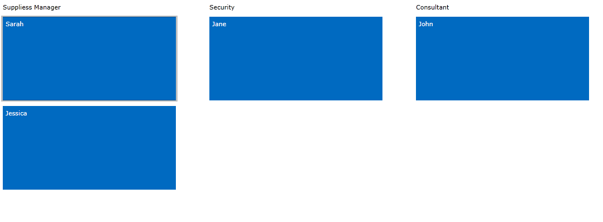
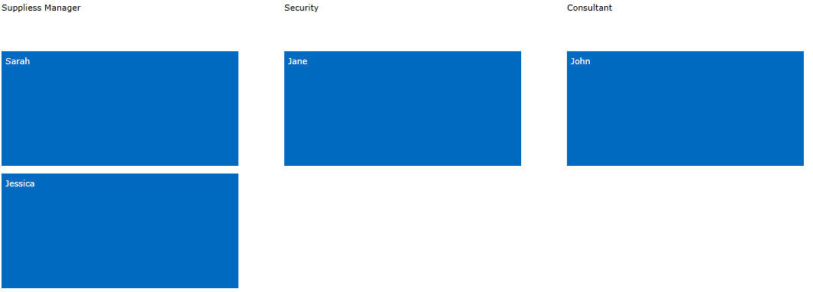
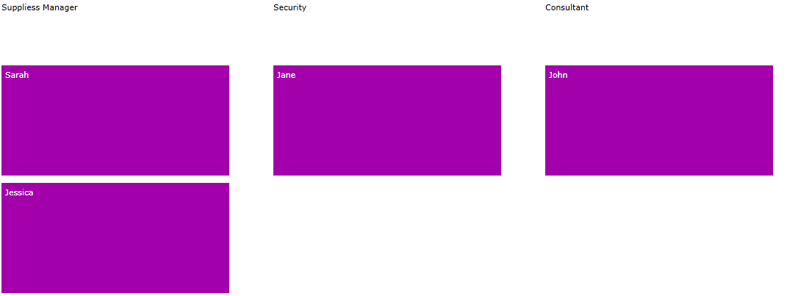
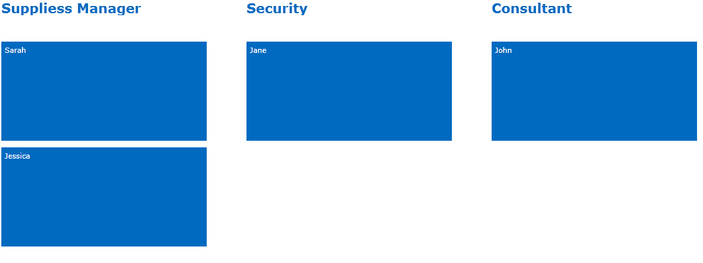
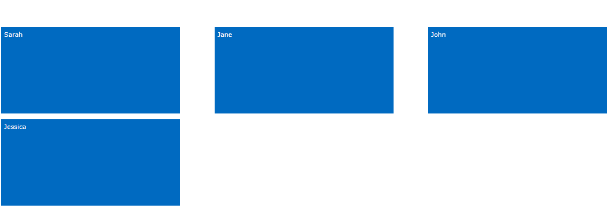
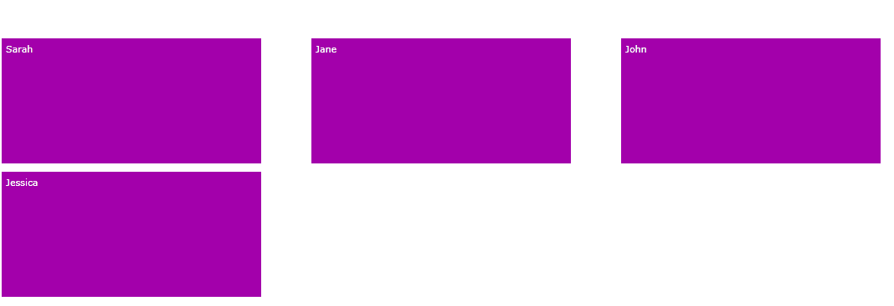
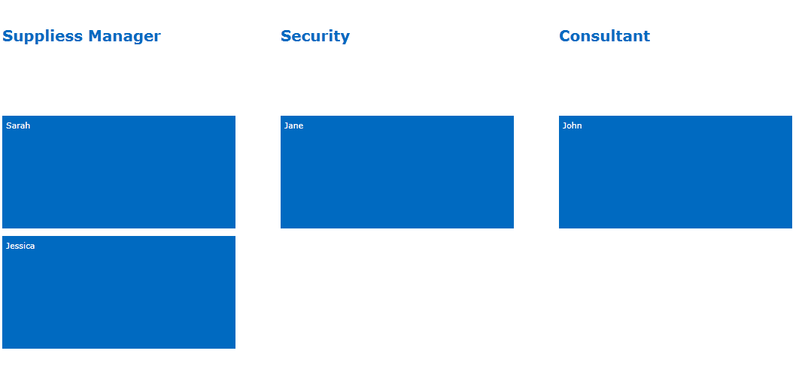
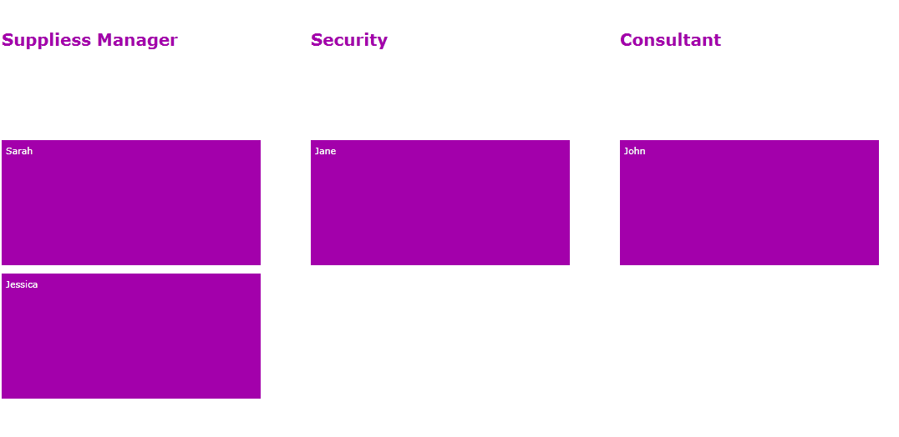

# Modifying TileList view

* [Resizing Tile](#resizing-tile)
* [Vertical Tiles Alignment](#verticaltilesalignment)
* [GroupTemplate](#grouptemplate)
* [GroupHeaderVisibility](#groupheadervisibility)
* [GroupHeaderHeight](#groupheaderheight)

## Resizing Tile

There are three sizes for tiles:
* Single
* Double
* Quadruple

__RadTileList__ also suggests an option to further customize the size. For the purpose you can set __TilePlaceholderSide__ property to the desired value. It will update the value based on a single size - i.e. setting __TilePlaceholderSide="120"__ will result in having Single tiles sized __120x120__, Double - __120x240__, Quadruple - __240x240__. 

## VerticalTilesAlignment

RadTileList exposes VerticalTilesAlignment property that controls the position of the tiles independently of the group they belong to. It can be set no matter if being in a grouped state or not. Its type is of type VerticalAlignment and the default value is Center. Modifying it will result in: 

* Top 




* Bottom 



## GroupTemplate

__RadTileList__ has __GroupTemplate__ property that control the way the header of a groups looks.
        

For example:        

#### __XAML__

{{region radtilelist-modifying-tilelist-view-0}}

			<Grid.Resources>
				<DataTemplate x:Key="GroupTemplate">
					<TextBlock Text="{Binding}" FontWeight="Bold" Foreground="#FF006AC1" FontSize="20"/>
				</DataTemplate>
			</Grid.Resources>
	
			<telerik:RadTileList x:Name="RadTileList" 
	                      GroupMember="Occupation"
	                      ItemsSource="{Binding Employees}"
	                      ItemTemplate="{StaticResource ItemTemplate}"/>
	
	
{{endregion}}





## GroupHeaderVisibility

__RadTileList__ exposes a __GroupHeaderVisibility__ property that sets whether the headers of the groups will be visible or not. Thus, once you set it to collapse, your control will be organized in groups, but will not have any text above:
        

#### __XAML__

{{region radtilelist-modifying-tilelist-view-1}}

			<telerik:RadTileList x:Name="RadTileList" 
	                             GroupHeaderVisibility="Collapsed"/>
{{endregion}}





## GroupHeaderHeight

__RadTileList__ gives the opportunity to set the height of the headers with a single property __GroupHeaderHeight__.
        

#### __XAML__

{{region radtilelist-modifying-tilelist-view-2}}

			<telerik:RadTileList x:Name="RadTileList" 
	                        GroupHeaderHeight="100"
	                        GroupTemplate="{StaticResource GroupTemplate}"
	                        ItemsSource="{Binding Source={StaticResource GroupedItems}}"
	                        ItemTemplate="{StaticResource ItemTemplate}"/>
	
{{endregion}}




