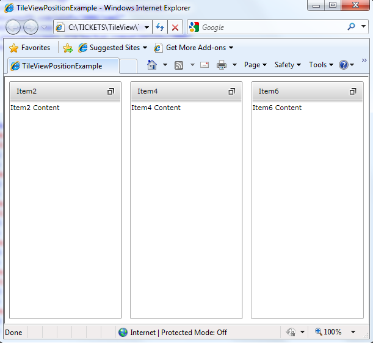
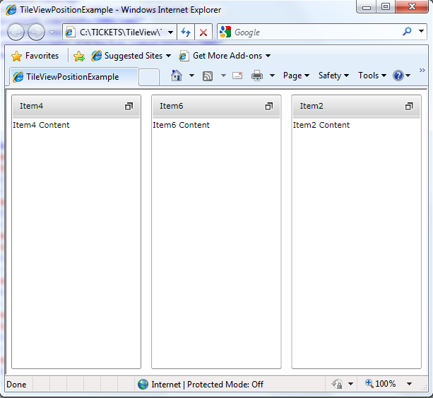

# Customize Position

The __RadTileView__ allows customization of the position of its items. There are two properties that control the position of a __RadTileViewItem__ - __Visibility__ and __Position__.

##  Setting the RadTileViewItem Visibility 

The __Visibility__ property of the __TileViewItem__ allows you to choose which items to be displayed at any given moment. 

#### __XAML__

{{region radtileview-positioning_0}}
	<telerik:RadTileView x:Name="RadTileView1">
	 <telerik:RadTileViewItem Header="Item1" Visibility="Collapsed">
	  <TextBlock Text="Item1 Content" />
	 </telerik:RadTileViewItem>
	 <telerik:RadTileViewItem Header="Item2">
	  <TextBlock Text="Item2 Content" />
	 </telerik:RadTileViewItem>
	 <telerik:RadTileViewItem Header="Item3" Visibility="Collapsed">
	  <TextBlock Text="Item3 Content" />
	 </telerik:RadTileViewItem>
	 <telerik:RadTileViewItem Header="Item4">
	  <TextBlock Text="Item4 Content" />
	 </telerik:RadTileViewItem>
	 <telerik:RadTileViewItem Header="Item5" Visibility="Collapsed">
	  <TextBlock Text="Item5 Content" />
	 </telerik:RadTileViewItem>
	 <telerik:RadTileViewItem Header="Item6">
	  <TextBlock Text="Item6 Content" />
	 </telerik:RadTileViewItem>
	</telerik:RadTileView>
{{endregion}}

## Controlling the RadTileViewItem Position

The __Position__ property of the __TileViewItems__ controls the positions of the __Restored__ and/or __Minimized__ items. However, if there is a __Maximized__ item, by default it will be on __Position__ 0. Therefore setting another __RadTileViewItem Position__ to 0, will maximize this item instead. 

#### __XAML__

{{region radtileview-positioning_1}}
	<telerik:RadTileView x:Name="RadTileView1">
	 <telerik:RadTileViewItem Header="Item1" Visibility="Collapsed">
	  <TextBlock Text="Item1 Content" />
	 </telerik:RadTileViewItem>
	 <telerik:RadTileViewItem Header="Item2" Position="2">
	  <TextBlock Text="Item2 Content" />
	 </telerik:RadTileViewItem>
	 <telerik:RadTileViewItem Header="Item3" Visibility="Collapsed">
	  <TextBlock Text="Item3 Content" />
	 </telerik:RadTileViewItem>
	 <telerik:RadTileViewItem Header="Item4" Position="0">
	  <TextBlock Text="Item4 Content" />
	 </telerik:RadTileViewItem>
	 <telerik:RadTileViewItem Header="Item5" Visibility="Collapsed">
	  <TextBlock Text="Item5 Content" />
	 </telerik:RadTileViewItem>
	 <telerik:RadTileViewItem Header="Item6" Position="1">
	  <TextBlock Text="Item6 Content" />
	 </telerik:RadTileViewItem>
	</telerik:RadTileView>
{{endregion}}

More information and a sample project you can find [here](http://blogs.telerik.com/zarkovidolov/posts/10-11-08/two_new_features_in_telerik_tileview.aspx).