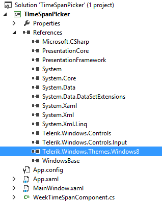
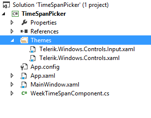
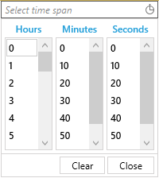

# Setting a Theme

This article will demonstrates how the user could easily apply one of the built-in themes to __RadTimeSpanPicker__.

>__RadTimeSpanPicker__ like all other WPF Telerik controls supports styling using Implicit Styles. [Here]() you could find some more detailed information concerning Implicit Styles.

The first thing you need to do in order a theme to be applied correctly is to merge the following Xaml files:

* Telerik.Windows.Controls.xaml

* Telerik.Windows.Controls.Input.xaml

There are two apporaches that you could use in order to merge the files:

* The first one is directly from the theme assembly:

For example let's demonstrate how to apply Windows8 theme to __RadTimeSpanPicker__ - please, notice that the Telerik.Windows.Themes.Windows8.dll should be added as well:

__Figure 1:__ Adding the needed references	

After that merge the xaml files in the App.xaml as shown in __Example 1__:

#### __[XAML] Example 1: Merging the .xaml files__
{{region xaml-radtimespanpicker-styles-and-templates-setting-theme_0}}
	 <Application.Resources>
		<ResourceDictionary>
			<ResourceDictionary.MergedDictionaries>
				<ResourceDictionary Source="/Telerik.Windows.Themes.Windows8;component/Themes/Telerik.Windows.Controls.xaml" />
				<ResourceDictionary Source="/Telerik.Windows.Themes.Windows8;component/Themes/Telerik.Windows.Controls.Input.xaml" />
			</ResourceDictionary.MergedDictionaries>
		</ResourceDictionary>
	</Application.Resources>
{{endregion}}
	
* The second appraoch that you could use in order to apply the desired theme is to add references to the required assemblies from Binaries.NoXaml folder. For that purpose a folder named Themes needs to be created. That folder should contain the corresponding .xaml files from Themes.Implicit/../Windows8/../Themes/ folder located in the installation folder:

	__Figure 2:__ Copying the .xaml files
	
	
	__Example 2__ shows how to merge the copied .xaml files.            

	#### __[XAML] Example 2: Merging the .xaml files__

	{{region xaml-radtimespanpicker-styles-and-templates-setting-theme_1}}
		<Application.Resources>
			<ResourceDictionary>
				<ResourceDictionary.MergedDictionaries>
					<ResourceDictionary Source="Themes/Telerik.Windows.Controls.xaml" />
					<ResourceDictionary Source="Themes/Telerik.Windows.Controls.Navigation.xaml" />
				</ResourceDictionary.MergedDictionaries>
			</ResourceDictionary>
		</Application.Resources>
	{{endregion}}
	
Either way you choose, the end result will be the following:

__Figure 3:__ TimeSpanPicker with Windows8 theme applied

# See Also

 * [Getting Started]()

 * [Visual Structure]()