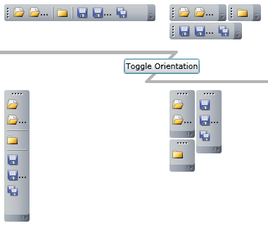

# Orientation

## Values

The __Orientation__ property is of type __System.Windows.Controls.Orientation__. Possible values are:
* __Orientation.Horizontal__: the tollbar/tray is oriented horizontal;
* __Orientation.Vertical__: the tollbar/tray is oriented vertical;						

> You can change the orientation at run-time.

<!-- -->
> The orientation of the tray overrides the toolbar's orientation, i.e. the layout will respects only the tray's orientation.

<!-- -->
> Sometime it is necessary to adjust the horizontal and vertical alignments when you have changed the orientation - all this depends on the container that holds the __ToolBar__ or the tray control.					

#### __XAML__

{{region radtoolbar-orientation_1}}
	xmlns:telerik="http://schemas.telerik.com/2008/xaml/presentation"
	<telerik:RadToolBar Orientation="Horizontal" HorizontalAlignment="Stretch" VerticalAlignment="Top" />
	<telerik:RadToolBarTray Orientation="Vertical" HorizontalAlignment="Left" VerticalAlignment="Top" />
{{endregion}}

#### __C#__

{{region radtoolbar-orientation_0}}
	using Telerik.Windows.Controls;

	private void ToggleOrientation_Click(object sender, RoutedEventArgs e)
	{
		if (this.myToolbarTray.Orientation == Orientation.Horizontal)
		{
			this.myToolbarTray.Orientation = Orientation.Vertical;
			this.myToolbarTray.VerticalAlignment = VerticalAlignment.Stretch;
			this.myToolbarTray.HorizontalAlignment = HorizontalAlignment.Left;
			this.myToolbar.Orientation = Orientation.Vertical;
			this.myToolbar.VerticalAlignment = VerticalAlignment.Stretch;
			this.myToolbar.HorizontalAlignment = HorizontalAlignment.Left;
		}
		else
		{
			this.myToolbarTray.Orientation = Orientation.Horizontal;
			this.myToolbarTray.VerticalAlignment = VerticalAlignment.Top;
			this.myToolbarTray.HorizontalAlignment = HorizontalAlignment.Stretch;
			this.myToolbar.Orientation = Orientation.Horizontal;
			this.myToolbar.VerticalAlignment = VerticalAlignment.Top;
			this.myToolbar.HorizontalAlignment = HorizontalAlignment.Stretch;
		}
	}
{{endregion}}

#### __VB.NET__

{{region radtoolbar-orientation_0}}
	Imports Telerik.Windows.Controls

	Private Sub ToggleOrientation_Click(ByVal sender As Object, ByVal e As RoutedEventArgs)
		If Me.myToolbarTray.Orientation = Orientation.Horizontal Then
			Me.myToolbarTray.Orientation = Orientation.Vertical
			Me.myToolbarTray.VerticalAlignment = VerticalAlignment.Stretch
			Me.myToolbarTray.HorizontalAlignment = HorizontalAlignment.Left
			Me.myToolbar.Orientation = Orientation.Vertical
			Me.myToolbar.VerticalAlignment = VerticalAlignment.Stretch
			Me.myToolbar.HorizontalAlignment = HorizontalAlignment.Left
		Else
			Me.myToolbarTray.Orientation = Orientation.Horizontal
			Me.myToolbarTray.VerticalAlignment = VerticalAlignment.Top
			Me.myToolbarTray.HorizontalAlignment = HorizontalAlignment.Stretch
			Me.myToolbar.Orientation = Orientation.Horizontal
			Me.myToolbar.VerticalAlignment = VerticalAlignment.Top
			Me.myToolbar.HorizontalAlignment = HorizontalAlignment.Stretch
		End If
	End Sub	
{{endregion}}

## Preview
