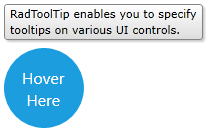
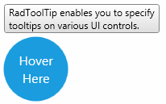

# Getting Started

## 

In order to use __RadToolTip__ you should take advantage of the __RadToolTipService__. You can set the attached property __RadToolTipService.TooltipContent__ on some element in XAML in order to show tooltip over it.

#### __XAML__

     <Grid x:Name="LayoutRoot" Background="White">
        <Ellipse x:Name="ellipse"
                 Width="80"
                 Height="80"
                 Fill="#FF1B9DDE"
                 Stroke="#FF1B9DDE"
                 StrokeThickness="2"
                 Visibility="Visible"
                   telerik:RadToolTipService.VerticalOffset="-5"
                 telerik:RadToolTipService.Placement="Top"
                 telerik:RadToolTipService.ToolTipContent="RadToolTip enables you to specify&#x0a;tooltips on various UI controls.">
            <telerik:RadToolTipService.ToolTipContentTemplate>
                <DataTemplate>
                    <telerik:RadToolTipContentView>
                        <TextBlock Text="{Binding}" />
                    </telerik:RadToolTipContentView>
                </DataTemplate>
            </telerik:RadToolTipService.ToolTipContentTemplate>
        </Ellipse>

        <TextBlock Name="tBlock"
                   HorizontalAlignment="Center"
                   VerticalAlignment="Center"
                   FontFamily="Segoe UI"
                   FontSize="16"
                   Foreground="White"
                   IsHitTestVisible="False">
            <Run Text="Hover"/>
            <LineBreak />
            <Run Text=" Here" />
        </TextBlock>
     </Grid>

Figure 1 demonstrates how the code above is rendered on screen.





The same configuration can be achieved from code like this:

#### __C#__
    RadToolTipService.SetToolTipContent(this.ellipse, "RadToolTip enables you to specify&#x0a;tooltips on various UI controls.");
    RadToolTipService.SetPlacement(this.ellipse, System.Windows.Controls.Primitives.PlacementMode.Center);

#### __VB.NET__
    RadToolTipService.SetToolTipContent(Me.ellipse, "RadToolTip enables you to specify&#x0a;tooltips on various UI controls.")
    RadToolTipService.SetPlacement(Me.ellipse, System.Windows.Controls.Primitives.PlacementMode.Center)

The __RadToolTipService__ controls the open/close functionality as well as the visual appearance of a __RadToolTip__ object. Also, the service provides a rich set of properties customizing the visualization of the __RadToolTip__ object.

For example you can change the element next to which a tooltip will be opened. This can be achieved by setting the __RadToolTipService.PlacementTarget__ property

#### __XAML__

    <StackPanel Orientation="Horizontal">
		<Rectangle Width="30"
		           Height="30"
		           Margin="20 0"
		           Fill="Red"
		           telerik:RadToolTipService.Placement="Top"
		           telerik:RadToolTipService.PlacementTarget="{Binding ElementName=rect}"
		           telerik:RadToolTipService.ToolTipContent="ToolTip on foreign element"
		           telerik:RadToolTipService.VerticalOffset="-5" />
		<Rectangle x:Name="rect"
		           Width="30"
		           Height="30"
		           VerticalAlignment="Center"
		           Fill="Blue" />
	</StackPanel>

Figure 2 shows how the ToolTip will be visualized with the above defined settings





## Properties

Below are listed all properties exposed by the RadToolTipService along with short description.

* __BetweenShowDelay__ - of type int and gets or sets the maximum time between the display of two tooltips where the second tooltip appears without a delay.
            

* __HorizontalOffset__ - of type double which gets or sets the offset from the left of the area that is specified for the tooltip by the PlacementRectangle and PlacementTarget properties.
            

* __InitialShowDelay__ - of type int and gets or sets the  time in miliseconds before a tooltip opens.
            

* __IsEnabled__ - of type bool which gets or sets a value controlling wheter the tooltip should appear.
            

* __Placement__ - of type PlacementMode and gets or sets orientation of the tooltip when it opens and specifies how the tooltip behaves when it overlaps screen boundaries.
            

* __PlacementRectangle__ - of type Rect and gets or sets the rectangular area relative to which the tooltip is positioned.
            

* __PlacementTarget__ - of type UIElement and gets or sets the object relative to which the tooltip is positioned.
            

* __ShowDuration__ - of type int and gets or sets the time in miliseconds that a tooltip remains visible.
            

* __ToolTipContent__ - of type object and gets or sets the content of the ToolTip.
            

* __ToolTipContentTemplate__ - of type DataTemplate and gets or sets the content template of the ToolTip.
            

## Events

The __RadToolTipService__ exposes the following events:

* __ToolTipOpening__ - occures when a tooltip is in process of opening.
            

* __ToolTipClosing__ - occures when a tooltip is in process of closing.

