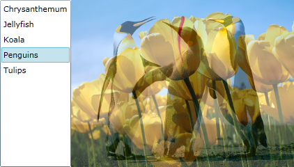
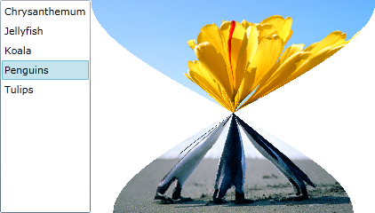
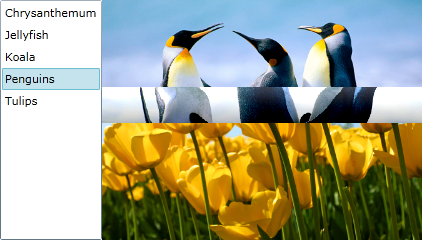
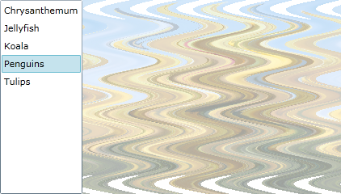

# Transitions

The __RadTransitionControl__ applies a transition effect to its content when it gets changed. There are several built-in effects, but you are able to create your own via the __HLSL__ language. 

For more information read the following sections:

* [Built-in Transition Effects](#built-in-transition-effects)

* [Custom Transition Effects](#fadetransition)

>tipYou are also capable of specifying the transition [duration](#transition-duration) and [an animation easing function](#transition-easing).

## Built-in Transition Effects

The built-in transition effects are:

* [FadeTransition](#fadetransition)

* [FlipWrapTransition](#flipwraptransition)

* [LinearFadeTransition](#linearfadetransition)

* [MotionBlurredZoomTransition](#motionblurredzoomtransition)

* [RollTransition](#rolltransition)

* [SlideAndZoomTransition](#slideandzoomtransition)

* [WaveTransition](#wavetransition)

>The __Transition__ property of __RadTransitionControl__ is of type __TransitionProvider__. It has a type converter so you could quickly select a transition in XAML. Please note that although the short syntax comes handy you will not be able to configure the transitions. They will appear with the default settings.        

The short syntax to set the transition in XAML is:

#### __XAML__

{{region xaml-radtransition-features-transitions_7}}
	<telerik:RadTransitionControl Transition="Fade" />
{{endregion}}

>The transition could also be set to one of the:            
>	* Fade
>	* FlipWarp
>	* LinarFade
>	* MotionBlurredZoom
>	* PerspectiveRotation
>	* Pixelate
>	* Roll
>	* SlideAndZoom
>	* Wave

Below you can find information for each of them, together with a sample snapshot.

## FadeTransition

The __FadeTransition__ fades out the old content and fades in the new one. It has no properties for additional customization.

#### __XAML__

{{region xaml-radtransition-features-transitions_0}}
	<telerik:RadTransitionControl x:Name="radTRansitionControl1">
	    <telerik:RadTransitionControl.Transition>
	        <telerikTransitions:FadeTransition />
	    </telerik:RadTransitionControl.Transition>
	</telerik:RadTransitionControl>
{{endregion}}

## FlipWrapTransition

The __FlipWrapsTransition__ flips the old content from the bottom to the top and on the other side the new content is visualized. It has no properties for additional customization.

#### __XAML__

{{region xaml-radtransition-features-transitions_1}}
	<telerik:RadTransitionControl x:Name="radTRansitionControl1">
	    <telerik:RadTransitionControl.Transition>
	        <telerikTransitions:FadeTransition />
	    </telerik:RadTransitionControl.Transition>
	</telerik:RadTransitionControl>
{{endregion}}

## LinearFadeTransition

The __LinearFadeTransition__ is a fade transition which follows a linear pattern. A line moves across the content under an angle and the old content below it gets fade out, while behind the line the new content is visible. The behavior of the linear fade can be controlled via the following properties:

* __Angle__ - represents the angle, under which the line travels through the content. The default value is __0.5__, which directs the line diagonally from the top left corner to the bottom right corner. A value of __0__ will cause the line to travel horizontally from top to bottom and a value of __1__ vertically from left to right.

* __Darker__ - represents the opacity of the line fill, which is black. The default value is __0.5__. Set it to __0__ for complete transparency of the line and full visibility of the fading below it. A value of __1.0__ will make the line fully black and the fading below it won't be fully observable.

* __Thickness__ - represents the thickness of the line. The default value is __0.5__.

#### __XAML__

{{region xaml-radtransition-features-transitions_2}}
	<telerik:RadTransitionControl x:Name="radTRansitionControl2">
	    <telerik:RadTransitionControl.Transition>
	        <telerikTransitions:LinearFadeTransition Darker="0.5"
	                                         Angle="0.5"
	                                         Thickness="0.5" />
	    </telerik:RadTransitionControl.Transition>
	</telerik:RadTransitionControl>
{{endregion}}

## MotionBlurredZoomTransition

The __MotionBlurredZoomTransition__ is basically a fade transition with motion blur and zoom effects applied to the old and new content. The behavior of the __MotionBlurredZoomTransition__ can be controlled by its properties:

* __Center__ - it is of type __Point__ and specifies the center of the motion blur effect towards the content. The default value is __0.5, 0.5__, which means that the center of the zoom is the center of the content. For reference: __0, 0__ - top left corner, __1, 1__ - bottom right corner.

* __InBlurRatio__ - specifies the ratio of the motion blur effect applied to the new content. The default value is __0.3__. A value of __0__ will neutralize the motion blur. A __negative value__ will direct the motion blur outside the object and it will behave like it had been zoomed out. A motion blur with a __positive value__ will give the impression of zooming in.

* __OutBlurRatio__ - specifies the ratio of the motion blur effect applied to the old content. The default value is __-0.3__. A value of __0__ will neutralize the motion blur. A __negative value__ will direct the motion blur outside of the object and it will behave like it had been zoomed out. A motion blur with a __positive value__ will give the impression of zooming in.

>tipSetting the __InBlurRatio__ and the __OutBlurRatio__ to 0 will make the __MotionBlurredZoomTransition__ behave like a normal __FadeTransition__.

* __Samples__ - for each pixel in point __P__ it creates a line that contains that point and the __Center__ point. Then __Samples__ count of points are selected from the new content and Samples count of points of the old content are selected forming two sets of points for the old and the new values. The distance of the selected points to the __P__ depends on __InBlurRatio__ and __OutBlurRatio__ and the __progress__ inverting the values for example from 0.3, -0.3 to -0.3, 0.3 will make the image to go zoom out instead of zoom in. The colors in the two sets of points are summed up and the average values of these two groups are selected as the old and the new color. The final pixel color for __P__ is the sum of these two values get with different weight depending on the __progress__. The default value is __7__.

#### __XAML__

{{region xaml-radtransition-features-transitions_3}}
	<telerik:RadTransitionControl x:Name="radTRansitionControl3">
	    <telerik:RadTransitionControl.Transition>
	        <telerikTransitions:MotionBlurredZoomTransition Center="0.5,0.5"
	                                                InBlurRatio="0.3"
	                                                OutBlurRatio="-0.3"
	                                                Samples="7" />
	    </telerik:RadTransitionControl.Transition>
	</telerik:RadTransitionControl>
{{endregion}}

## RollTransition

The __RollTransition__ rolls out the new content above the old one. You can also specify the old content to be rolled in over the new one. Here is a list of properties you can use in order to customize the behavior of the transition.

* __InterpolationFunction__ - specifies the interpolation function for the transition. The default value is __2__.

* __IsRollOut__ - indicates whether the new content is already rolled out and the old one should be rolled in. The default value is __False__.

* __IsTopToBottom__ - specifies whether the direction should be reversed. The default value is __True__, which makes the direction top to bottom or left to right.

* __LightIntensity__ - specifies the intensity of the light, which creates a shadow effect on the roll - the upper part is lighter and the bottom part is shadowed. The default value is __0.5__.

* __Orientation__ - specifies whether the direction is __Vertical__ or __Horizontal__. The __Vertical__ orientation is the default one.

* __RelativeRollWidth__ - specifies how tight is the roll relatively to the content. The smaller the value, the tighter the content is rolled. The default value is __0.3__.

* __RollSize__ - specifies the size of the roll relatively to the content. The default value is __0.15__.

#### __XAML__

{{region xaml-radtransition-features-transitions_4}}
	<telerik:RadTransitionControl x:Name="radTRansitionControl4">
	    <telerik:RadTransitionControl.Transition>
	        <telerikTransitions:RollTransition InterpolationFunction="2"
	                                    IsRollOut="False"
	                                    IsTopToBottom="True"
	                                    Orientation="Vertical"
	                                    LightIntensity="0.5"
	                                    RelativeRollWidth="0.15"
	                                    RollSize="0.15" />
	    </telerik:RadTransitionControl.Transition>
	</telerik:RadTransitionControl>
{{endregion}}

## SlideAndZoomTransition

The __SlideAndZoomTransition__ zooms out the old content and decreases its opacity, while sliding it off the view. Meanwhile the new content gets slide in and zoomed in to its normal size. Here is a list of properties you can use in order to customize the behavior of the transition.

* __MinAlpha__ - specifies the end opacity value for the old content, when the slide out is over. The default value is __0.1__. A value of __1__ will cause the content not to fade away.

* __MinZoom__ - specifies the zoom factor to which the old content will get zoomed out before sliding out of the view. The default value is __0.9__ (90% zoom). A value of __1__ will neutralize the zooming.

* __SlideDirection__ - specifies the direction of the slide - __LeftToRight__ or __RightToLeft__. The __LeftToRight__ is the default value.

* __StartSlideAt__ - specifies the start time for the slide and is relative to the transition duration. The time before the slide starts will be used for animating the zoom. The default value is __0.25__.

#### __XAML__

{{region xaml-radtransition-features-transitions_5}}
	<telerik:RadTransitionControl x:Name="radTRansitionControl5">
	    <telerik:RadTransitionControl.Transition>
	        <telerikTransitions:SlideAndZoomTransition MinAlpha="0.1"
	                                            MinZoom="0.9"
	                                            SlideDirection="LeftToRight"
	                                            StartSlideAt="0.25" />
	    </telerik:RadTransitionControl.Transition>
	</telerik:RadTransitionControl>
{{endregion}}

## WaveTransition

The __WaveTransition__ creates a wave effect over the old content. When the waves reach their peak, the content is changed and the waves begin to fall and clarify the new content. Here is a list of properties you can use in order to customize the behavior of the transition.

* __Amplitude__ - represents the amplitude of the waves relatively to the content width. The default value is __0.2__.

* __Angle__ - specifies the angle of the wave. The default value is __0.5__. The greater the value is, the more distorted the content gets.

* __Fade__ - specifies the rate of the fade between the new and the old content. A value of __1__ will cause a complete fade between the change and a value of __0__ will cause no fade at all. The default value is __0.7__.

#### __XAML__

{{region xaml-radtransition-features-transitions_6}}
	<telerik:RadTransitionControl x:Name="radTRansitionControl6">
	    <telerik:RadTransitionControl.Transition>
	        <telerikTransitions:WaveTransition Amplitude="0.2"
	                                    Angle="0.5"
	                                    Fade="0.7" />
	    </telerik:RadTransitionControl.Transition>
	</telerik:RadTransitionControl>
{{endregion}}

## Custom Transition Effects

You are allowed to create your own custom transition effects. This is done via the HLSL language and the base classes provided by the __Telerik RadTransitionControl API__. To learn more about how to create such effects, take e look at [How to Create Custom Transitions]().

# See Also

 * [Working with the RadTransitionControl]()

 * [Data Binding]()

 * [Integration with Content Controls]()
