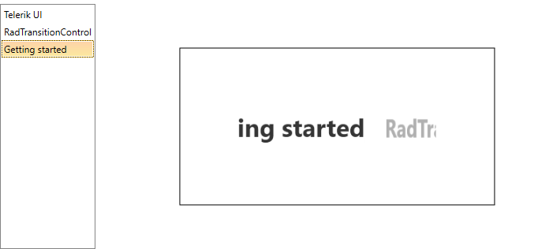

# Getting Started

The __RadTransitionControl__ derives form the __ContentControl__ and its purpose is to visualize some content (__UserControls__, __UIElements__, __Data__ etc). Additionally it can apply transition effects upon changing its content. This tutorial will help you to get started with the __RadTransitionControl__ basics. It will show you how to:

* [Add a RadTransitionControl to your application](#Add_a_RadTransitionControl_to_your_application)

* [Display Images listed in a ListBox](#Display_Images_listed_in_a_ListBox)

* [Apply transitions when the Image is changed](#Apply_transitions_when_the_Image_is_changed)

## Add a RadTransitionControl to your application

In order to add a __RadTransitionControl__ to your application, you have to simply create an instance of it in your XAML. Here is a sample code:

>As the __RadTransitionControl__ is located in the __Telerik.Windows.Controls__namespace of the __Telerik.Windows.Controls__assembly, you have to add the following namespace declaration in your __UserControl__:

#### __XAML__

{{region radtransition-getting-started_4}}
	xmlns:telerik="clr-namespace:Telerik.Windows.Controls;assembly=Telerik.Windows.Controls"
	{{endregion}}

#### __XAML__

{{region radtransition-getting-started_0}}
	<telerik:RadTransitionControl x:Name="radTransitionControl" />
	{{endregion}}

>The __RadTransitionControl__ doesn't have any visual elements, so if it has no content, nothing will be visualized.

## Display Images listed in a ListBox

The __RadTransitionControl__ is a content control. Besides displaying content it can apply transition effects upon its change. To make you familiar with this, a collection of images will be used in this tutorial, which will be listed in a __ListBox__ control. The selected image should appear as content of the __RadTransitionControl__. Changing the selected image should change the content of the control, too.

Here is a sample __ListBox__ definition, which is populated with objects of type __Photo__ (string __Name__, string __ImageUrl__).

#### __XAML__

{{region radtransition-getting-started_1}}
	<ListBox x:Name="PhotosListBox"
	            DisplayMemberPath="Name"
	            ItemsSource="{Binding PhotosCollection}" />
	{{endregion}}

The content of the __RadTransitionControl__ should be represented by the __SelectedItem__ of the __ListBox__. This can be done by using element to element binding.

>tipYou can learn more about binding the __RadTransitionControl__ in the [Data Binding]() topic.

>As the __SelectedItem__ is represented by the respective data item, you have to define a __DataTemplate__ for the content of the __RadTransitionControl__ and bind it to the appropriate property of the data item (in this case __ImageUrl__). Note that as the __Content__ property is bound to the data item, the latter is the __DataContext__ for the elements in the __ContentTemplate__.

#### __XAML__

{{region radtransition-getting-started_2}}
	<Grid x:Name="LayoutRoot">
	    <Grid.ColumnDefinitions>
	        <ColumnDefinition Width="Auto" />
	        <ColumnDefinition />
	    </Grid.ColumnDefinitions>
	<ListBox x:Name="PhotosListBox"
	        DisplayMemberPath="Name"
	        ItemsSource="{Binding PhotosCollection}" />
	    <telerik:RadTransitionControl Grid.Column="1"
	                                    Content="{Binding SelectedItem, ElementName=PhotosListBox}">
	        <telerik:RadTransitionControl.ContentTemplate>
	            <DataTemplate>
	                <Image Source="{Binding ImageUrl}"
	                        Stretch="Uniform"
	                        Width="320"
	                        Height="240" />
	            </DataTemplate>
	        </telerik:RadTransitionControl.ContentTemplate>
	    </telerik:RadTransitionControl>
	</Grid>
	{{endregion}}

If you run your application at this point, the content of the __RadTransitionControl__ should change when you select an item in the __ListBox__. Note that no transition will apply. This is because there is no transition effect set to the __RadTransitionControl__. Read the next section to learn how to set transition effects.

## Apply transitions when the Image is changed

The __RadTransitionControl__ automatically detects when the content is changed and applies a transition to the content. By default there is no preset transition, so you have to set it via the __Transition__ property.

>tipTo learn more about the transitions in the __RadTransitionControl__ read [this topic]().

>As the built-in transition effects are located in the __Telerik.Windows.Controls.TransitionEffects__namespace of the __Telerik.Windows.Controls__assembly, you have to add the following namespace declaration in your __UserControl__:

#### __XAML__

{{region radtransition-getting-started_5}}
	xmlns:telerikTransitions="clr-namespace:Telerik.Windows.Controls.TransitionEffects;assembly=Telerik.Windows.Controls" 
	{{endregion}}

#### __XAML__

{{region radtransition-getting-started_3}}
	<telerik:RadTransitionControl Grid.Column="1"
	                              Content="{Binding SelectedItem, ElementName=PhotosListBox}">
	    <telerik:RadTransitionControl.Transition>
	        <telerikTransitions:MotionBlurredZoomTransition />
	    </telerik:RadTransitionControl.Transition>
	</telerik:RadTransitionControl>
	{{endregion}}

Now, if you run your application and select an image from the list, you should see the transition upon the content change.

         
      

# See Also

 * [Working with the RadTransitionControl]()

 * [Transitions]()

 * [Data Binding]()

 * [Integration with Content Controls]()
