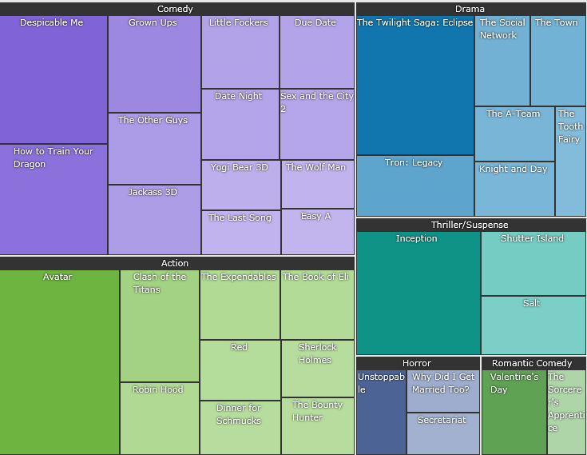

# Overview







## 

Thank you for choosing Telerik __RadTreeMap__!

__RadTreeMap__and __RadPivotMap__are data visualization controls used to display hierarchical data as a set of nested rectangles. Each rectangle has an area proportional to a specified dimension on the data. Both controls are useful in scenarios where a lot of items have to be compared in a limited space. When the color and size dimensions are correlated in some way with the tree structure, you can easily see patterns that would be difficult to spot in other ways.

__RadTreeMap__control can be bound to collections hence the data has to be converted into a tree. __RadPivotMap__can be bound to a flat data where the control automatically groups the data to be visualized.

>In order to use __RadTreeMap__control in your projects you have to add references to __Telerik.Windows.Controls.dll, Telerik.Windows.Controls.DataVisualization.dll__and__Telerik.Windows.Data.dll.__

The Layout Orientation (Vertical or Horizontal) will be chosen automatically - by calculating the available space for the given data. When Horizontal Orientation is applied - the child tiles are going to be stacked horizontally. Respectively Vertical Orientation will make the child tiles to be stacked vertically.

Currently you can choose between two tiling algorithms to visualize the data:

* *Squarified*

* *Slice and Dice

*The default one is* Slice and Dice*.

         
      
