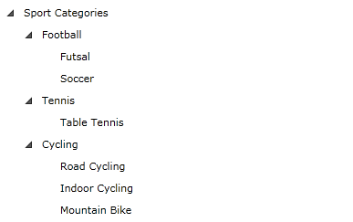
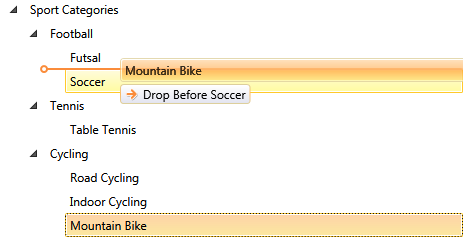
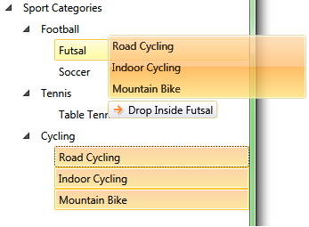
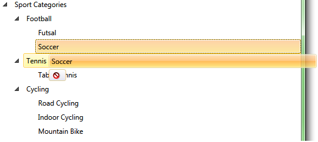
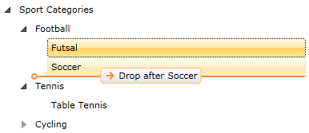
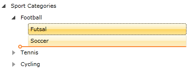
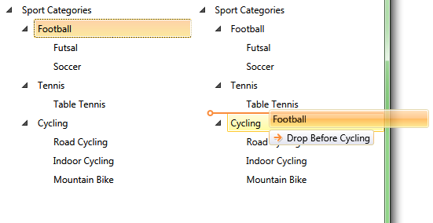

# Drag and Drop

The Telerik __RadTreeView__ control enhances further your application's capabilities through the rich drag-and-drop functionality. Your users can create and re-order any hierarchical structures and easily perform various drag-and-drop operations.
	  

This tutorial will walk you through the following common tasks:

* [Enable drag and drop behavior declaratively and programmatically.](#enable-drag-and-drop)
* [Explain the visual elements of the drag and drop operation.](#visual-elements-of-the-drag-and-drop-operation)
* [Enable drag of multiple nodes declaratively and programmatically.](#enable-drag-of-multiple-items)
* [Disable drop operation on specific item declaratively and programmatically.](#disable-drop-operation-on-specific-item)
* [Disable drag preview declaratively and programmatically.](#disable-drag-preview)
* [Disable drag tooltip declaratively and programmatically.](#disable-drag-tooltip)
* [Disable drop preview line declaratively and programmatically.](#disable-drop-preview-line)
* [Using DragDropManager events to manage the drag and drop process.](#using-dragdropmanager-events-to-manage-the-drag-and-drop-process)
* [Using the TreeViewDragDropOptions object](#using-the-treeviewdragdropoptions-object)
* [Customizing the DragDrop AutoScrolling Settings](#dragdrop-autoscrolling-behavior)
* [Drag and drop between treeviews.](#drag-and-drop-between-treeviews)
* [Drag and drop between treeview and other controls (TextBox, DataGrid).](#drag-and-drop-between-treeview-and-other-controls)

>importantWith the Q2 2013 release we extended the __RadTreeView DragDrop__ built-in implementation to also use the __DragDropManager__. For the moment the old __RadDragAndDropManager__ logic will be kept but you need to set the __TreeViewSettings.DragDropExecutionMode__ property to __Legacy__ in order to enable it. However, it is important to note that we will remove this __Legacy DragDropExecutionMode__ as soon as the __RadDragAndDropManager__ is removed. 

For the purposes of this tutorial will be used the following treeview declaration: 

#### __XAML__

{{region radtreeview-features-drag-and-drop-0}}
	<telerik:RadTreeView x:Name="radTreeView" IsDragDropEnabled="True">
	    <telerik:RadTreeViewItem Header="Sport Categories">
	        <telerik:RadTreeViewItem Header="Football">
	            <telerik:RadTreeViewItem Header="Futsal"/>
	            <telerik:RadTreeViewItem Header="Soccer"/>
	        </telerik:RadTreeViewItem>
	        <telerik:RadTreeViewItem Header="Tennis">
	            <telerik:RadTreeViewItem Header="Table Tennis"/>
	        </telerik:RadTreeViewItem>
	        <telerik:RadTreeViewItem Header="Cycling">
	            <telerik:RadTreeViewItem Header="Road Cycling"/>
	            <telerik:RadTreeViewItem Header="Indoor Cycling"/>
	            <telerik:RadTreeViewItem Header="Mountain Bike"/>
	        </telerik:RadTreeViewItem>
	    </telerik:RadTreeViewItem>
	</telerik:RadTreeView>
	{{endregion}}

## Enable Drag and Drop

To allow drag and drop functionality in __RadTreeView__, set the __IsDragDropEnabled__ attribute to __True__. Find your treeview declaration and add the following attribute:

#### __XAML__

{{region radtreeview-features-drag-and-drop-1}}
	<telerik:RadTreeView x:Name="radTreeView" IsDragDropEnabled="True" >
	{{endregion}}

The drag and drop behavior can be enabled in the code-behind. In order to do that you need to set the __IsDragDropEnabled__  property of an instance of the __RadTreeView__ class to __True__.

#### __C#__

{{region radtreeview-features-drag-and-drop_2}}
	  private void EnableDragAndDrop()
	        {
	            radTreeView.IsDragDropEnabled = true;
	        }
	{{endregion}}
	
#### __VB.NET__

{{region radtreeview-features-drag-and-drop_3}}
	Private Sub EnableDragAndDrop()
	    radTreeView.IsDragDropEnabled = True
	End Sub
	{{endregion}}

>tip If the treeview is bound, it is best to be bound to an __ObservableCollection__. Otherwise the result of the drag and drop will not be visible. Also the __ItemsSource__ collection of the items to which the leaves nodes of the treeview are bound, need to be initialized as well, otherwise drops in them will not be possible.

>If the __ItemSource__ of the __RadTreeView__ (__RadTreeViewItem__) is not an __IList__, then the __drop__ operation is not allowed.

## Visual Elements of the Drag and Drop Operation 

Once enabled, dragging behavior by default allows items to be dropped on other items and between items. A line between the __Items__ will be displayed briefly as a visual indicator that the node can be dropped in the location of the line. See the next figure.

The __Drag and Drop__ operation contains three visual elements (tooltips):		

* Drag Preview
* Drag Tooltip
* Drop Preview Line

More details about how to disable each one of the elements you will find later in the topic.

## Enable Drag of Multiple Items

To allow multiple items to be dragged at one time, you need to set the __SelectionMode__ attribute of the treeview to __Multiple__  or __Extended__. Add the following attribute to your treeview declaration:

#### __XAML__

{{region radtreeview-features-drag-and-drop-2}}
	<telerik:RadTreeView x:Name="radTreeView" 
						 IsDragDropEnabled="True" 
						 SelectionMode="Multiple">
	{{endregion}}

Dragging multiple nodes at once can be enabled in the code-behind. In order to do so, you need to set the __SelectionMode__ property of an instance of the __RadTreeView__ class to __Multiple__ or __Extended__.
		

#### __C#__

{{region radtreeview-features-drag-and-drop_5}}
	private void EnableDragOfMultipleNodes()
	{
	    radTreeView.SelectionMode = Telerik.Windows.Controls.SelectionMode.Multiple;
	}
	{{endregion}}

#### __VB.NET__

{{region radtreeview-features-drag-and-drop_6}}
	Private Sub EnableDragOfMultipleNodes()
	    radTreeView.SelectionMode = Telerik.Windows.Controls.SelectionMode.Multiple
	End Sub
	{{endregion}}

Here is the result: 

## Disable Drop Operation on Specific Item 

You can further tailor the drag and drop behavior per Node by setting the boolean __RadTreeViewItem__ property __IsDropAllowed__.
		

For example, if you want to disable the __drop__ on the treeview item with __Header__ "Tennis", add the following attribute to the treeview item declaration:
		

#### __XAML__

{{region radtreeview-features-drag-and-drop-3}}
	<telerik:RadTreeViewItem Header="Tennis" x:Name="radTreeViewItemTennis" IsDropAllowed="False">
	{{endregion}}
	
In order to disable drop operation on specific item you should set the __IsDropAllowed__ property of an instance of the __RadTreeViewItem__ class to __False__.

#### __C#__

{{region radtreeview-features-drag-and-drop_8}}
	private void DisableDropOnSpecificItem()
	{
	    radTreeViewItemTennis.IsDropAllowed = false;
	}
	{{endregion}}

#### __VB.NET__

{{region radtreeview-features-drag-and-drop_9}}
	Private Sub DisableDropOnSpecificItem()
	    radTreeViewItemTennis.IsDropAllowed = False
	End Sub
	{{endregion}}

Here is the result: 

By default each visual element (drag preview, drop preview line, drag tooltip) of the drag and drop operation is enabled. In the next several sections you will see how to disable each one of them.

## Disable Drag Preview

In order to disable the __Drag Preview__ you need to set the __IsDragPreviewEnabled__ attribute of the treeview to __False__. Find your treeview declaration and add the following attribute:

#### __XAML__

{{region radtreeview-features-drag-and-drop-4}}
	<telerik:RadTreeView x:Name="radTreeView" IsDragDropEnabled="True" IsDragPreviewEnabled="False">
	{{endregion}}

The same operation can be done in the code-behind. In order to do that you need to set the __IsDragPreviewEnabled__ property of an instance of the __RadTreeView__ class to __False__.

#### __C#__

{{region radtreeview-features-drag-and-drop_11}}
	private void DisableDragPreview()
	{
	    radTreeView.IsDragPreviewEnabled = false;
	}
	{{endregion}}

#### __VB.NET__

{{region radtreeview-features-drag-and-drop_12}}
	Private Sub DisableDragPreview()
	    radTreeView.IsDragPreviewEnabled = False
	End Sub
	{{endregion}}

Here is the result. When you drag treeview items, the drag preview element is no longer visible.

## Disable Drag Tooltip 

In order to disable the __Drag Tooltip__ you need to set the __IsDragTooltipEnabled__ attribute of the treeview to __False__. Find your treeview declaration and add the following attribute:

#### __XAML__

{{region radtreeview-features-drag-and-drop-5}}
	<telerik:RadTreeView x:Name="radTreeView" IsDragDropEnabled="True"
	    IsDragPreviewEnabled="False"
	    IsDragTooltipEnabled="False">
	{{endregion}}

The same operation can be done in the code-behind. In order to do that you need to set the __IsDragTooltipEnabled__ property of an instance of the __RadTreeView__ class to __False__.
		

#### __C#__

{{region radtreeview-features-drag-and-drop_14}}
	private void DisableDragTooltip()
	{
	    radTreeView.IsDragTooltipEnabled = false;
	}
	{{endregion}}

#### __VB.NET__

{{region radtreeview-features-drag-and-drop_15}}
	Private Sub DisableDragTooltip()
	    radTreeView.IsDragTooltipEnabled = False
	End Sub
	{{endregion}}

Here is the result. When you drag treeview items, the drag preview and drag tooltip elements are no longer visible. 

## Disable Drop Preview Line 

In order to disable the last visual element - the  __Drag Preview Line__ you need to set the __IsDropPreviewLineEnabled__ attribute of the treeview to __False__. Find your treeview declaration and add the following attribute:

#### __XAML__

{{region radtreeview-features-drag-and-drop-6}}
	<telerik:RadTreeView x:Name="radTreeView" 
						IsDragDropEnabled="True"
						IsDragPreviewEnabled="False"
						IsDragTooltipEnabled="False"
						IsDropPreviewLineEnabled="False">
	{{endregion}}

The same operation can be done in the code-behind. In order to do that you need to set the __IsDropPreviewLineEnabled__ property of an instance of the __RadTreeView__ class to __False__.
		

#### __C#__

{{region radtreeview-features-drag-and-drop_17}}
	private void DisableDropPreviewLine()
	{
	    radTreeView.IsDropPreviewLineEnabled = false;
	}
	{{endregion}}

#### __VB.NET__

{{region radtreeview-features-drag-and-drop_18}}
	Private Sub DisableDropPreviewLine()
	    radTreeView.IsDropPreviewLineEnabled = False
	End Sub
	{{endregion}}

Here is the result. When you drag treeview items, all visual elements are disabled (hidden).
 

## RadDragAndDropManager Events 

>importantPlease note that these events are only available with the __Legacy DragDropExecutionMode__ which will be removed. This is why we highly recommend that you use the __DragDropExecutionMode.New__ which since Q2 2014 is the default setting. Its events are described in the [Using DragDropManager events to manage the drag and drop process](#using-dragdropmanager-events-to-manage-the-drag-and-drop-process) section.

The __RadTreeView__ API offers you four events for managing the drag and drop behavior:

* __PreviewDragStarted__
* __DragStarted__
* __PreviewDragEnded__
* __DragEnded__

#### __XAML__

{{region radtreeview-features-drag-and-drop-7}}
	<telerik:RadTreeView x:Name="radTreeView" IsDragDropEnabled="True"
	    PreviewDragStarted="radTreeView_PreviewDragStarted"
	    DragStarted="radTreeView_DragStarted"
	    PreviewDragEnded="radTreeView_PreviewDragEnded"
	    DragEnded="radTreeView_DragEnded">
	{{endregion}}
	
>The __RadTreeView__ actually uses and handles the __DragDrop__ events of the __RadDragAndDropManager__. In fact, they can be used for managing the drag and drop process, too. You should use the __AddHandler()__ method of the treeview.

>public void AddHandler( RoutedEvent routedEvent, Delegate handler, bool handledEventsToo );			  

When __RadTreeView__ detects a valid drag operation, it generates a __PreviewDragStarted__ and __DragStarted__  routed events. When a valid drop operation (the selected Item is dropped onto another Item or in between Items) is detected, a __PreviewDragEnded__ and __DragEnded__ events are generated. Both __PreviewDragStarted__ and __PreviewDragEnded__ events can be cancelled by setting the __Handled__ property of the event argument to __True__ in the event handler.
		

#### __C#__

{{region radtreeview-features-drag-and-drop_20}}
	private void radTreeView_PreviewDragEnded( object sender, RadTreeViewDragEndedEventArgs e )
	{
	    e.Handled = true;
	}
	{{endregion}}

#### __VB.NET__

{{region radtreeview-features-drag-and-drop_21}}
	Private Sub radTreeView_PreviewDragEnded(ByVal sender As Object, ByVal e As RadTreeViewDragEndedEventArgs)
	    e.Handled = True
	End Sub
	{{endregion}}

>tipHandling the __PreviewDragStarted__ event will cancel the __drag__ operation. This is equivalent to set the __RadTreeView__'s __IsDragDropEnabled__ property to __False__. 'e.Handled = True' - where 'e' is the RadTreeViewDragEventArgs class passed as an argument of the event handler.

>tip Handling the __PreviewDragEnded__ event will cancel the __drop__ operation. This is useful, when you want to cancel adding/removing items from the __RadTreeView__'s __ItemsCollection__. 'e.Handled = True' - where 'e' is the RadTreeViewDragEventArgs class passed as an argument of the event handler.

The type of the event arguments for the __PreviewDragStarted__ and __DragStarted__ events is __RadTreeViewDragEventArgs__. Via the __RadTreeViewDragEventArgs__ you can get access to the items being dragged:

#### __C#__

{{region radtreeview-features-drag-and-drop_22}}
	private void radTreeView_DragStarted( object sender, RadTreeViewDragEventArgs e )
	{
	    Collection<Object> draggedItems = e.DraggedItems;
	}
	{{endregion}}

#### __VB.NET__

{{region radtreeview-features-drag-and-drop_23}}
	Private Sub radTreeView_DragStarted(ByVal sender As Object, ByVal e As RadTreeViewDragEventArgs)
	    Dim draggedItems As Collection(Of [Object]) = e.DraggedItems
	End Sub
	{{endregion}}

The type of the event arguments for the __PreviewDragEnded__ and __DragEnded__ events is __RadTreeViewDragEndedEventArgs__. Via the __RadTreeViewDragEndedEventArgs__ you can get access to the following items and properties:

* __DraggedItems__- a collection of Items being dragged (this is useful when multi-selection is enabled - __SelectionMode__ property of the __RadTreeView__ is set to __True__).
* __DropPosition__- indicates the relationship of the Items being dropped and can be a __DropPosition__ enumeration value __After__, __Below__ or __Inside.__
* __TargetDropItem__- the Item being dragged to.
* __IsCanceled__- boolean property, indicates whether the drag and drop operation is cancelled or not.

#### __C#__

{{region radtreeview-features-drag-and-drop_24}}
	private void radTreeView_DragEnded( object sender, RadTreeViewDragEndedEventArgs e )
	{
	    // Get the dragged items.
	    Collection<Object> draggedItems = e.DraggedItems;
	    // Get the drop position.
	    DropPosition dropPosition = e.DropPosition;
	    switch ( dropPosition )
	    {
	        case DropPosition.After:
	            MessageBox.Show( "After" );
	            break;
	        case DropPosition.Before:
	            MessageBox.Show( "Before" );
	            break;
	        case DropPosition.Inside:
	            MessageBox.Show( "Inside" );
	            break;
	    }
	    // Get is canceled
	    bool isCanceled = e.IsCanceled;
	    // Target drop item
	    RadTreeViewItem targetDropItem = e.TargetDropItem;
	    if ( targetDropItem.Header.ToString() == "Tennis" )
	    {
	        // Do something
	    }
	}
	{{endregion}}

#### __VB.NET__

{{region radtreeview-features-drag-and-drop_25}}
	Private Sub radTreeView_DragEnded(ByVal sender As Object, ByVal e As RadTreeViewDragEndedEventArgs)
	    ' Get the dragged items.
	    Dim draggedItems As Collection(Of [Object]) = e.DraggedItems
	
	    ' Get the drop position.
	    Dim dropPosition__1 As DropPosition = e.DropPosition
	    Select Case dropPosition__1
	        Case DropPosition.After
	            MessageBox.Show("After")
	            Exit Select
	        Case DropPosition.Before
	            MessageBox.Show("Before")
	            Exit Select
	        Case DropPosition.Inside
	            MessageBox.Show("Inside")
	            Exit Select
	    End Select
	
	    ' Get is canceled
	    Dim isCanceled As Boolean = e.IsCanceled
	
	    ' Target drop item
	    Dim targetDropItem As RadTreeViewItem = e.TargetDropItem
	    If targetDropItem.Header.ToString() = "Tennis" Then
	        ' Do something
	    End If
	End Sub
	{{endregion}}

Note that the __TargetDropItem__ property may be null if the drop is in an empty treeview. That's why when you use that property it always has to be checked:
		  
	private void radTreeView_DragEnded(object sender, RadTreeViewDragEndedEventArgs e)
	{
	  // Target drop item
	  RadTreeViewItem targetDropItem = e.TargetDropItem;
	  if (targetDropItem != null && targetDropItem.Header.ToString() == "Tennis" )
	  {
		// Do something
	  }
	}		

## Using DragDropManager events to manage the drag and drop process

With Q2 2012 you can use the __DragDropManager__ events to customize the new __DragDrop__ logic of __RadTreeView__.

__RadTreeView__ internally handles the following __DragDropManager__ events:

* __DragInitialize__ - The DragInitialize event occurs when an object is about to be dragged. Therefore the __RadTreeView__ handles it internally to set all needed information regarding the drag - the DraggedItems, the DragVisual and the settings of the operation. This information is wrapped in a [TreeViewDragDropOptions](#using-the-treeviewdragdropoptions-object) object and passed to the arguments of the event.

* __GiveFeedback__ - This event is continuously fired by the drag source during a drag-and-drop operation. Therefore the __RadTreeView__ handles it internally to apply an __Arrow__ cursor during the drag operation.
* __DragOver__ - This event occurs continuously while an object is dragged (moved) within the drop target's boundary. Therefore the __RadTreeView__ handles it internally to update the __DropPreview Line__ position as well as the current action and position of the drop.
* __DragLeave__ - This event occurs when an object is dragged out of the drop target's boundary. Therefore the __RadTreeView__ handles it internally to update the __DropPreview Line__ position as well as the current action and position of the drop.
* __Drop__ - This event occurs when an object is dropped on the drop target. Therefore the __RadTreeView__ handles it internally to implement the drop operation.
* __DragDropCompleted__ - This event occurs when an object is dropped on the drop target and is used to notify the source that the drag operation is over. Therefore the __RadTreeView__ handles it internally to update its state and items based on the __DropAction__ type of a successful drop.
As __RadTreeView__ handles internally the above __DragDropManager__ events, in order to invoke a custom handler, you need to explicitly specify that you're adding a handler that should be invoked even for already handled events. This is done through the last - __bool__ argument of the __DragDropManager.Add[Event]Handler__ extension method.

#### C#
	DragDropManager.AddDragOverHandler(xTreeView, OnDragOver,true);  

#### VB.NET	
	DragDropManager.AddDragOverHandler(xTreeView, OnDragOver, True) 
		

>tipYou can find more information about the __DragDropManager__ events in the [Events](http://www.telerik.com/help/silverlight/dragdropmanager-events.html)[Events](http://www.telerik.com/help/wpf/dragdropmanager-events.html) tutorial.

## Using the TreeViewDragDropOptions object

When a drag operation starts, __RadTreeView__ creates an object of type __TreeViewDragDropOptions__ and passes it as the __Data__ of the drag. You can extract that object through the event arguments of the __DragDropManager__ events.

#### __C#__

{{region radtreeview-features-drag-and-drop_1}}
	private void DisableDragPreview()
	{
	    radTreeView.IsDragPreviewEnabled = false;
	}
	{{endregion}}

#### __VB.NET__

{{region radtreeview-features-drag-and-drop_1}}
	Private Sub DisableDragPreview()
	    radTreeView.IsDragPreviewEnabled = False
	End Sub
	{{endregion}}

The __TreeViewDragDropOptions__ class exposes the following properties:
		

* __DropAction__ - Gets or sets the drop action that should be executed when drag drop operation completes. It is an enumeration of type __DropAction__ that exposes the following members:

	* __Copy__ - dragged items will be added to the destination and will not be removed from the source.
	* __Move__ - dragged items will be added to the destination and will be removed from the source.
	* __Delete__ - dragged items will not be added to the destination and will be removed from the source.
	* __None__ - dragged items will not be added to the destination and will not be removed from the source. If the drop operation is allowed, the default __DropAction__ is __Move__. And in order to change this logic, it would be best to define a custom __DragOverHandler__ and customize the __DropAction__ value in it. However, please note that you need to handle the __DragDropManager DragOver__ event of the __RadTreeView__ that is acting as a destination for the drop operation.

	#### __C#__

	{{region radtreeview-features-drag-and-drop_3}}
		private void EnableDragAndDrop()
		{
			radTreeView.IsDragDropEnabled = true;
			TreeViewSettings.SetDragDropExecutionMode(radTreeView, TreeViewDragDropExecutionMode.New);
			 DragDropManager.AddDragOverHandler(radTreeView2, OnTreeItemDragOver, true);
		}
		
		private void OnTreeItemDragOver(object sender, Telerik.Windows.DragDrop.DragEventArgs e)
		{
			var options = DragDropPayloadManager.GetDataFromObject(e.Data, TreeViewDragDropOptions.Key) as TreeViewDragDropOptions;
			options.DropAction = DropAction.Copy;
		}
		{{endregion}}

	#### __VB.NET__

	{{region radtreeview-features-drag-and-drop_3}}
		Private Sub EnableDragAndDrop()
			radTreeView.IsDragDropEnabled = True
		End Sub
		{{endregion}}
* __DropPosition__ - Gets or sets the drop position of the dragged items. It is an enumeration of type __DropPosition__ that provides the following members:
	* __Before__ - indicates that the dragged items will be dropped before the target.
	* __Inside__ - indicates that the dragged items will be dropped inside the target.
	* __After__ - indicates that the dragged items will be dropped after the target.
	* __Undefined__ - indicates that the drop position of the item is not yet determined.	
* __DragVisual__ - Gets or sets a visual representation of the drag/drop operation state. By default a [TreeViewDragVisual ](http://www.telerik.com/help/silverlight/t_telerik_windows_controls_treeview_treeviewdragvisual.html)[TreeViewDragVisual ](http://www.telerik.com/help/wpf/t_telerik_windows_controls_treeview_treeviewdragvisual.html) object is created automatically.
* __DraggedItems__ - Gets an __IEnumerable__ collection populated with the dragged items.
* __DragSourceItem__ - Gets the __RadTreeViewItem__ which has started the current drag/drop operation. This property is initialized when the drag operation starts and it will be __null__ if the __RadTreeView__ control is not the source of the operation.
* __DropTargetItem__ - Gets the __RadTreeViewItem__ laying under the drop point. This property is initialized while dragging directly over a __RadTreeViewItem__ and it is set to __null__ as soon as the drag leaves the bounds of the __RadTreeViewItem__.
* __DropTargetTree__ - Gets the __RadTreeView__ laying under the drop point. This property is initialized while dragging directly over a __RadTreeView__ and it is set to __null__ as soon as the drag leaves the bounds of the __RadTreeView__.
The __TreeViewDragDropOptions__ exposes one method - __UpdateDragVisual()__. It should be used to update the __DragVisual__ property value in case it is of type __TreeViewDragVisual__.

>tip You need to call the __TreeViewDragDropOptions UpdateDragVisual()__ method when the changes in the values of the __TreeViewDragDropOptions__ members should be reflected in the __DragVisual__. For instance, if you need to disable a drag operation and you set the __TreeViewDragDropOptions DropAction__ value to __None__, the visual feedback of the operation won't reflect that change although the drop operation will be forbidden. And in order to make the __RadTreeView__ instance update its __DragVisual__ to display a *DropImpossible* indicator, you need to invoke the __UpdateDragVisual()__ method.

## DragDrop AutoScrolling Behavior

With Q2 2013, if you use the __New TreeViewSettings.DragDropExecutionMode__, then you will be able to take advantage of the built-in auto-scrolling functionality implemented in __RadTreeView__. Moreover, there are a set pf properties exposed to allow you to customize the auto-scrolling functionality to better fit your needs.

The auto-scrolling functionality is controlled through the following attached properties:

* __ScrollingSettingsBehavior.IsEnabled__ - gets or sets a __bool__ value indicating whether the auto-scrolling behavior is enabled.
* __ScrollingSettingsBehavior.ScrollStep__ - gets or sets a __double__ value defining the scrolling offset used to define a single step during the scroll operation.
* __ScrollingSettingsBehavior.ScrollStepTime__ - gets or sets a __TimeSpan__ value defining the timeout period between two scroll steps.

## Drag and Drop Between TreeViews 

The  Telerik __RadTreeView__ allows you to perform drag and drop between treeviews - this is a default behavior.

Let's define the sports categories __RadTreeView__ twice in our view:

#### __XAML__

{{region radtreeview-features-drag-and-drop-8}}
	<Grid.ColumnDefinitions>
		<ColumnDefinition/>
		<ColumnDefinition/>
	</Grid.ColumnDefinitions>
	<telerik:RadTreeView x:Name="radTreeView1" IsDragDropEnabled="True">
		<telerik:RadTreeViewItem Header="Sport Categories">
			<telerik:RadTreeViewItem Header="Football">
				<telerik:RadTreeViewItem Header="Futsal"/>
				<telerik:RadTreeViewItem Header="Soccer"/>
			</telerik:RadTreeViewItem>
			<telerik:RadTreeViewItem Header="Tennis">
				<telerik:RadTreeViewItem Header="Table Tennis"/>
			</telerik:RadTreeViewItem>
			<telerik:RadTreeViewItem Header="Cycling">
				<telerik:RadTreeViewItem Header="Road Cycling"/>
				<telerik:RadTreeViewItem Header="Indoor Cycling"/>
				<telerik:RadTreeViewItem Header="Mountain Bike"/>
			</telerik:RadTreeViewItem>
		</telerik:RadTreeViewItem>
	</telerik:RadTreeView>
	<telerik:RadTreeView x:Name="radTreeView2" Grid.Column="1" IsDragDropEnabled="True">
		<telerik:RadTreeViewItem Header="Sport Categories">
			<telerik:RadTreeViewItem Header="Football">
				<telerik:RadTreeViewItem Header="Futsal"/>
				<telerik:RadTreeViewItem Header="Soccer"/>
			</telerik:RadTreeViewItem>
			<telerik:RadTreeViewItem Header="Tennis">
				<telerik:RadTreeViewItem Header="Table Tennis"/>
			</telerik:RadTreeViewItem>
			<telerik:RadTreeViewItem Header="Cycling">
				<telerik:RadTreeViewItem Header="Road Cycling"/>
				<telerik:RadTreeViewItem Header="Indoor Cycling"/>
				<telerik:RadTreeViewItem Header="Mountain Bike"/>
			</telerik:RadTreeViewItem>
		</telerik:RadTreeViewItem>
	</telerik:RadTreeView>
	{{endregion}}

Now you can drag and drop items from one treeview to another: 

## Drag and Drop Between TreeView and Other Controls 

You can use the built-in __RadTreeView DragDrop__ when implementing drag-drop between the tree and other controls such as a __ListBox__. For  more information you can read the topic [How To Implement Drag and Drop Between TreeView and ListBox]().

# See Also
 * [Enable Only Drop Inside]()
 * [Disable Drop at Specific Location]()
 * [Implement Copy Drag]()
 * [Auto Expand on Drag Over]()
