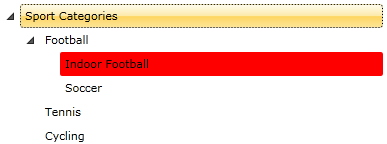

# How to Edit An Item

__RadTreeView__ supports editing the displayed text of the item. The purpose of this tutorial is to show you:

* How to enable/disable the item editing behavior.
* How to start, end and cancel editing declaratively and programmatically.
* What kind of events the treeview API offers you for managing the edit process.

Here is a snapshot of a regular __RadTreeView__ with a couple of items. 

And this is the XAML declaration:

#### __XAML__

{{region radtreeview-feautres-treeviewitem-item-editing_0}}
	<telerik:RadTreeView Margin="8" x:Name="radTreeView">
	    <telerik:RadTreeViewItem Header="Sport Categories">
	        <telerik:RadTreeViewItem Header="Football">
	            <telerik:RadTreeViewItem Header="Futsal"
	        x:Name="radTreeViewItemFutsal"/>
	            <telerik:RadTreeViewItem Header="Soccer"/>
	        </telerik:RadTreeViewItem>
	        <telerik:RadTreeViewItem Header="Tennis"/>
	        <telerik:RadTreeViewItem Header="Cycling"/>
	    </telerik:RadTreeViewItem>
	</telerik:RadTreeView>
	{{endregion}}

## Enable editing declaratively 

By default the treeview is not editable (its __IsEditable__ property is set to __False__). In order to enable editing you need to add the following attribute to the __RadTreeView__ declaration:

#### __XAML__

{{region radtreeview-feautres-treeviewitem-item-editing_1}}
	<telerik:RadTreeView Margin="8" x:Name="radTreeView" IsEditable="True">
	{{endregion}}

## Enable Editing Programmatically  

If you want to enable the edit behavior of the treeview in the code-behind, you should set the __IsEditable__ property of an instance of the __RadTreeView__ class to __True__.

#### __C#__

{{region radtreeview-feautres-treeviewitem-item-editing_2}}
	private void EnableTreeViewForEdit()
	{
	    radTreeView.IsEditable = true;
	}
	{{endregion}}

#### __VB.NET__

{{region radtreeview-feautres-treeviewitem-item-editing_3}}
	Private Sub EnableTreeViewForEdit()
	    radTreeView.IsEditable = True
	End Sub
	{{endregion}}

## Start Editing by Using Keyboard

Once the edit behavior is enabled, you can start the editing process by selecting the item and pressing the __F2__ key.

## Start Editing Programmatically

The edit process can be started programmatically (in the code-behind). In order to do that you need to set the __IsInEditMode__ property of an instance of the __RadTreeViewItem__ class to __True__.

#### __C#__

{{region radtreeview-feautres-treeviewitem-item-editing_4}}
	private void StartEdit()
	{
	    radTreeViewItemFutsal.IsInEditMode = true;
	}
	{{endregion}}

#### __VB.NET__

{{region radtreeview-feautres-treeviewitem-item-editing_5}}
	Private Sub StartEdit()
	    radTreeViewItemFutsal.IsInEditMode = True
	End Sub
	{{endregion}}

The next snapshot shows a treeview item which is in edit mode.

## Saving the Changes by Using the Keyboard

After entering the new text, in order to save your changes you should press the __Enter__ key.

## Saving the Changes Programmatically

If you want to finish the process of editing in code-behind and to save the changes, you need to set the __IsInEditMode__ property of the editing treeview item to __False.__

#### __C#__

{{region radtreeview-feautres-treeviewitem-item-editing_6}}
	private void EndEdit()
	{
	    radTreeViewItemFutsal.IsInEditMode = false;
	}
	{{endregion}}

#### __VB.NET__

{{region radtreeview-feautres-treeviewitem-item-editing_7}}
	Private Sub EndEdit()
	    radTreeViewItemFutsal.IsInEditMode = False
	End Sub
	{{endregion}}

## Cancelling the Edit Operation by Using the Keyboard

If you want to cancel the current edit operation and to preserve any text changes, you should press the __Esc__ key.

## Cancelling the Edit Operation Programmatically

In order to cancel the edit process in the code-behind you need to invoke the __CancelEdit()__ method of the editing treeview item. This method discards modifications to data since the last save.

#### __C#__

{{region radtreeview-feautres-treeviewitem-item-editing_8}}
	private void CancelEdit()
	{
	    radTreeViewItemFutsal.CancelEdit();
	}
	{{endregion}}

#### __VB.NET__

{{region radtreeview-feautres-treeviewitem-item-editing_9}}
	Private Sub CancelEdit()
	    radTreeViewItemFutsal.CancelEdit()
	End Sub
	{{endregion}}

## Events

The Telerik __RadTreeView__ and __RadTreeViewItem__ classes offer you five events for managing the edit process. These events are available both on the __RadTreeView__ and on the __RadTreeViewItem__ classes.

#### __XAML__

{{region radtreeview-feautres-treeviewitem-item-editing_10}}
	<telerik:RadTreeView Margin="8" x:Name="radTreeView" IsEditable="True"
	        PreviewEditStarted="radTreeView_PreviewEditStarted"
	        EditStarted="radTreeView_EditStarted"
	        PreviewEdited="radTreeView_PreviewEdited"
	        EditCanceled="radTreeView_EditCanceled"
	        Edited="radTreeView_Edited">
	{{endregion}}

The __PreviewEditStarted__ event occurs when the treeview item is about to be edited. The __EditStarted__ event is fired when the treeview item is already in edit mode. The type of the passed event arguments for both of the events is __RadRoutedEventArgs__. In the event handlers you can place some code. For example, if you want to access the edited treeview item, then use the following line of code: 

#### __C#__

{{region radtreeview-feautres-treeviewitem-item-editing_11}}
	private void radTreeView_PreviewEditStarted( object sender, RadRoutedEventArgs e )
	{
	    RadTreeViewItem targetItem = e.Source as RadTreeViewItem;
	}
	{{endregion}}

#### __VB.NET__

{{region radtreeview-feautres-treeviewitem-item-editing_12}}
	Private Sub radTreeView_PreviewEditStarted(ByVal sender As Object, ByVal e As RadRoutedEventArgs)
	    Dim targetItem As RadTreeViewItem = TryCast(e.Source, RadTreeViewItem)
	End Sub
	{{endregion}}

The __PreviewEdited__ event is fired just before the new __Header__ text of the item is applied. If the treeview is data bound you can update your DataSource with the new value. The __Edited__ event is fired once the new __Header__ text for the item is applied. Via the __RadTreeViewItemEditedEventArgs__ of the __PreviewEdited__ and __Edited__ events you can get access to the new text of the __Header__ property, as well as to the old one.

>If your __ItemEditTemplate__ does not contain a __TextBox__, then the __NewText__ and __OldText__ properties will not be used.

In the event handler you can place some code that has to be executed when the item is edited. For example, change the background color of the edited item: 

#### __C#__

{{region radtreeview-feautres-treeviewitem-item-editing_13}}
	private void radTreeView_Edited( object sender, RadTreeViewItemEditedEventArgs e )
	{
	    ( e.Source as RadTreeViewItem ).Background = new SolidColorBrush( Colors.Red );
	}
	{{endregion}}

#### __VB.NET__

{{region radtreeview-feautres-treeviewitem-item-editing_14}}
	Private Sub radTreeView_Edited(ByVal sender As Object, ByVal e As RadTreeViewItemEditedEventArgs)
	    TryCast(e.Source, RadTreeViewItem).Background = New SolidColorBrush(Colors.Red)
	End Sub
	{{endregion}}

Here is a snapshot of the final result. 

## ItemEditTemplate and ItemEditTemplateSelector

Telerik __RadTreeView__ also supports __ItemEditTemplate__ and __ItemEditTemplateSelector__. To learn more on how to do that, visit the [Item Edit Template]() and [Item Edit Template Selector]() topics.

## See Also
 * [Item Images]()
 * [Enable and Disable Items]()
 * [Working with Selections]()
 * [Expanding and Collapsing Items]()
 * [BringIntoView Support]()