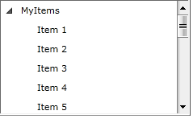
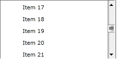
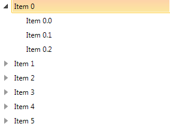
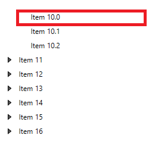
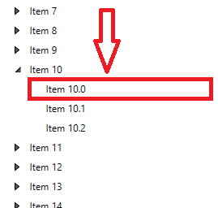

# BringIntoView Support

The __RadTreeView__ API offers __BringIntoView__ support through the following methods:	  

When you invoke any of these methods, the __RadTreeView__ will attempt to bring the provided item into view.	  

## BringIndexIntoView()

>importantThe __BringIndexIntoView()__ method can only work for __immediate items__. However, please note that the method won't be able to bring a __RadTreeViewItem__ into view before the __item containers have been generated__.		  

Consider the following example. A __RadTreeView__ is data bound to a collection of business objects.		

#### __[XAML] Example 1: Declaring RadTreeView control in XAML__
{{region radtreeview-features-treeviewitem-bring-into-view-support_0}}
	<Grid x:Name="LayoutRoot"
			Background="White">
		<Grid.Resources>
			<DataTemplate x:Key="treeViewTemplate">
				<TextBlock Text="{Binding Title}" />
			</DataTemplate>
		</Grid.Resources>
		<telerik:RadTreeView x:Name="RadTreeView">
			<telerik:RadTreeViewItem x:Name="RadTreeViewItem"
									 Header="MyItems"
									 ItemTemplate="{StaticResource treeViewTemplate}">
			</telerik:RadTreeViewItem>
		</telerik:RadTreeView>
	</Grid>
{{endregion}}

#### __[C#] Example 2: The class which holds a collection of a business objects__
{{region radtreeview-features-treeviewitem-bring-into-view-support_1}}
	public class MyViewModel 
	{
		private static int idCounter;
		private string title;
		public MyViewModel()
		{
			this.Id = idCounter++;
		}
		public int Id
		{
			get;
			protected set;
		}
		public String Title
		{
			get
			{
				return this.title;
			}
			set
			{
				if ( this.title != value )
				{
					this.title = value;
				}
			}
		}
	}
	//.....
	RadTreeViewItem.ItemsSource = Enumerable.Range( 1, 40 ).Select( i => new MyViewModel()
	{
		Title = "Item " + i
	} ).ToList();
{{endregion}}

#### __[VB.NET] Example 2: The class which holds a collection of a business objects__
{{region radtreeview-features-treeviewitem-bring-into-view-support_2}}
	Public Class MyViewModel
	 Private Shared idCounter As Integer
	 Private m_title As String
	 Public Sub New()
	  Me.Id = System.Math.Max(System.Threading.Interlocked.Increment(idCounter),idCounter - 1)
	 End Sub
	 Public Property Id() As Integer
	  Get
	   Return m_Id
	  End Get
	  Protected Set
	   m_Id = Value
	  End Set
	 End Property
	 Private m_Id As Integer
	 Public Property Title() As [String]
	  Get
	   Return Me.m_title
	  End Get
	  Set
	   If Me.m_title <> value Then
		Me.m_title = value
	   End If
	  End Set
	 End Property
	End Class
{{endregion}}

#### __Figure 1: The tree view after being populated with business objects__

If you want to programmatically scroll to the "Item 20" (thus bringing this item into view), you could try the following scenario:

#### __[C#] Example 3: Bring RadTreeViewItem into the view by its index__
{{region radtreeview-features-treeviewitem-bring-into-view-support_3}}
	private void BringItemIntoView()
	{
		this.RadTreeViewItem.BringIndexIntoView( 20 );
	}
{{endregion}}

#### __[VB.NET] Example 3: Bring RadTreeViewItem into the view by its index__
{{region radtreeview-features-treeviewitem-bring-into-view-support_4}}
	Private Sub BringItemIntoView()
		Me.RadTreeViewItem.BringIndexIntoView(20)
	End Sub
{{endregion}}

#### __Figure 2: And the result will be__

## BringItemIntoView()

__RadTreeView__ offers a second method which does exactly the same thing as the __BringIndexIntoView()__ method. That's the __BringItemIntoView()__ method.
	
#### __[C#] Example 4: Bring an item into the view by its Title__
{{region radtreeview-features-treeviewitem-bring-into-view-support_5}}
	private void BringItemIntoView()
	{
		MyViewModel viewModel = dataSource.First( v => v.Title == "Item 20" );
		this.RadTreeViewItem.BringItemIntoView( viewModel );
	}
{{endregion}}

#### __[VB.NET] Example 4: Bring an item into the view by its Title__	
{{region radtreeview-features-treeviewitem-bring-into-view-support_6}}
	Private Sub Button_Click(sender As Object, e As RoutedEventArgs)
		Dim viewModel As MyViewModel = dataSource.First(Function(v) v.Title = "Item 20")
		Me.RadTreeViewItem.BringItemIntoView(viewModel)
	End Sub		
{{endregion}}
>important Please keep in mind that the __BringItemIntoView()__ method can only work for __immediate items__ and only as long as all __RadTreeViewItem__ containers __have been generated__.

The __BringItemIntoView()__ method makes an internal call to the __BringIntexIntoView()__ method and this is why it is better to consider using the __BringIndexIntoView()__ method instead whenever possible.

## BringPathIntoView()

>importantThe __BringPathIntoView()__ method can be used even in scenarios where not all __RadTreeViewItem__ containers are generated. This is possible due to its implementation which makes sure that the __RadTreeView__ has loaded its containers, before starting a recursive search through its items. This makes it the best choice for bringing virtualized items into view.

As the main purpose of this method is to allow you to bring virtualized items into view, you need to make sure that your view models can build a path to each __RadTreeViewItem__. This is important as the __BringPathIntoView()__ method recursively traverses the hierarchy of data items displayed inside the __RadTreeView__ to search for an item based on its path.

Another important note about the implementation of the method is that it uses the __TextSearch.TextPath__ attached property to match the path to the __RadTreeViewItem__ containers.

>The __TextSearch.TextPath__ attached property is part of the __Telerik.Windows.Controls__ namespace and this is why you can reach it through the following alias:
xmlns:telerik="http://schemas.telerik.com/2008/xaml/presentation" like this: `<telerik:RadTreeView telerik:TextSearch.TextPath="Name"/>`

Consider the following __RadTreeView__ definition:

#### __[XAML] Example 5: Declaring RadTreeView control in XAML__	
{{region radtreeview-features-treeviewitem-bring-into-view-support_7}}
	<telerik:RadTreeView x:Name="myTreeView" Width="300" IsVirtualizing="True" telerik:TextSearch.TextPath="Name">
		<telerik:RadTreeView.ItemTemplate>
			<HierarchicalDataTemplate ItemsSource="{Binding Children}">
				<TextBlock Text="{Binding Name}" />
			</HierarchicalDataTemplate>
		</telerik:RadTreeView.ItemTemplate>
	</telerik:RadTreeView>		  
{{endregion}}

If the business items displayed in the __RadTreeView__ are described with the following classes:

#### __[C#] Example 6: The view model describing treeview and its business objects__	
{{region radtreeview-features-treeviewitem-bring-into-view-support_8}}
	public class MainViewModel : ObservableCollection<DataItem>
	{
		public MainViewModel()
		{
			for (int i = 0; i < 25; i++)
			{
				DataItem item = new DataItem() { Name = String.Format("Item {0}", i) };
				for (int j = 0; j < 3; j++)
				{
					item.Children.Add(new DataItem { Name = String.Format("Item {0}.{1}", i, j) });
				}
				this.Add(item);
			}
		}
	}

	public class DataItem
	{
		public string Name { get; set; }
		public ObservableCollection<DataItem> Children { get; set; }

		public DataItem()
		{
			this.Children = new ObservableCollection<DataItem>();
		}
	}	
{{endregion}}

#### __[VB.NET] Example 6: The view model describing treeview and its business objects__
{{region radtreeview-features-treeviewitem-bring-into-view-support_9}}
	Public Class MainViewModel
		Inherits ObservableCollection(Of DataItem)
		Public Sub New()
			For i As Integer = 0 To 24
				Dim item As New DataItem() With {.Name = [String].Format("Item {0}", i)}
				For j As Integer = 0 To 2
					item.Children.Add(New DataItem() With {.Name = [String].Format("Item {0}.{1}", i, j)})
				Next
				Me.Add(item)
			Next
		End Sub
	End Class

	Public Class DataItem
		Public Property Name() As String
			Get
				Return itemName
			End Get
			Set
				itemName = Value
			End Set
		End Property
		Private itemName As String
		Public Property Children() As ObservableCollection(Of DataItem)
			Get
				Return itemChildren
			End Get
			Set
				itemChildren = Value
			End Set
		End Property
		Private itemChildren As ObservableCollection(Of DataItem)

		Public Sub New()
			Me.Children = New ObservableCollection(Of DataItem)()
		End Sub
	End Class		  
	{{endregion}}
	

__BringPathIntoView__ has two overloads that you can use to bring an item.

* __BringPathIntoView(string path)__: The *path* parameter is the path of the __RadTreeViewItem__ which you want to bring into the view. 
	
	>tip Since Q3 2013 the tree will try to bring the item on the top of the viewport.
	
	#### __[C#] Example 7: Bring RadTreeViewItem by its path on the top of the viewport__
	{{region radtreeview-features-treeviewitem-bring-into-view-support_9}}
		string path = "Item 10\\Item 10.1";
		myTreeView.BringPathIntoView(path);
	{{endregion}}
				
	#### __[VB.NET] Example 7: Bring RadTreeViewItem by its path on the top of the viewport__	  
	{{region radtreeview-features-treeviewitem-bring-into-view-support_10}}		
		Dim path As String = "Item 10\Item 10.1"
		myTreeView.BringPathIntoView(path)
	{{endregion}}	
	
	
	
* __BringPathIntoView(string path, Point offset)__: The *offset* parameter is of type __Point__ and specifies the offset from the top left corner of the tree where the item will be scrolled to. 

	For example, when you set the second parameter you can adjust the parent and the last child to fit into the view if there is enough space. 
	
	#### __[C#] Example 8: Bring RadTreeViewItem by its path and set his offset position of the item__		
	{{region radtreeview-features-treeviewitem-bring-into-view-support_11}}
		string path = "Item 10\\Item 10.1";
		myTreeView.BringPathIntoView(path,new Point(0,100));
	{{endregion}}
				
	#### __[VB.NET] Example 8: Bring RadTreeViewItem by its path and set his offset position of the item__
	{{region radtreeview-features-treeviewitem-bring-into-view-support_12}}	
		Dim path As String = "Item 10\Item 10.1"
		myTreeView.BringPathIntoView(path,New Point(0,100))
	{{endregion}}
	
	#### __Figure 3: The item is positioned with 100 pixels offset from the top of the viewport__
	

>tip You can find a complete solution demonstrating the __BringPathIntoView()__ method implementation in [How to Use BringPathIntoView Method]() help article in our documentation.		

# See Also
 * [How to Use BringPathIntoView Method]()
 * [How to Edit An Item]()
 * [Item Images]()
 * [Enable and Disable Items]()
 * [Selection]()
 * [Expanding and Collapsing Items]()