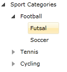

# Get Item by Path

The __RadTreeView__ API offers you the ability to get an item by path programmatically. This tutorial will show you how to do that.
	  

## Using GetItemByPath in static RadTreeView

Here is an ordinary treeview declaration: 

#### __XAML__

{{region radtreeview-how-to-get-item-by-path_0}}
	        <telerik:RadTreeView TextSearch.TextPath="Header">
	            <telerik:RadTreeViewItem Header="Sport Categories">
	                <telerik:RadTreeViewItem Header="Footbal">
	                    <telerik:RadTreeViewItem Header="Futsal" />
	                    <telerik:RadTreeViewItem Header="Soccer" />
	                </telerik:RadTreeViewItem>
	                <telerik:RadTreeViewItem Header="Tennis">
	                    <telerik:RadTreeViewItem Header="Court" />
	                    <telerik:RadTreeViewItem Header="Table" />
	                </telerik:RadTreeViewItem>
	                <telerik:RadTreeViewItem Header="Cycling">
	                    <telerik:RadTreeViewItem Header="Road" />
	                    <telerik:RadTreeViewItem Header="Mountain" />
	                </telerik:RadTreeViewItem>
	            </telerik:RadTreeViewItem>
	        </telerik:RadTreeView>
	{{endregion}}

For example, see the following situation - you want to retrieve the treeview item with __Header__ Soccer. In order to do that you need to perform the following steps:

1. Create a path, including only the treeview items' header and using some separator.

2. Set the __telerik:TextSearch.TextPath__ attached property to indicate which property to be used as a path segment.
	#### __XAML__

	{{region radtreeview-how-to-get-item-by-path_1}}
		<telerik:RadTreeView TextSearch.TextPath="Header" />
	{{endregion}}

3. Invoke the __GetItemByPath()__ method of the __RadTreeView__ class. 
	#### __C#__

	{{region radtreeview-how-to-get-item-by-path_0}}
		private void GetTreeViewItemByPath()
		{
			string path = "Sport Categories|Football|Soccer";
			RadTreeViewItem targetItem = radTreeView.GetItemByPath( path, "|" );
		}
	{{endregion}}

	#### __VB.NET__

	{{region radtreeview-how-to-get-item-by-path_1}}
		Private Sub GetTreeViewItemByPath()
			Dim path As String = "Sport Categories|Football|Soccer"
			Dim targetItem As RadTreeViewItem = radTreeView.GetItemByPath(path, "|")
		End Sub
	{{endregion}}

	The __GetItemByPath()__ method will work only __after__ the treeview has __loaded__. It will not work before that.
	
	#### __C#__
		this.radTreeView.Loaded += new RoutedEventHandler( radTreeView_Loaded );
		private void radTreeView_Loaded( object sender, RoutedEventArgs e )
		{
			// If the treeview is data bound, use the
			// GetItemByPath method here - when the treeview has already loaded.
		}

	#### __VB.NET__
		AddHandler Me.radTreeView.Loaded, AddressOf radTreeView_Loaded
		Private Sub radTreeView_Loaded(ByVal sender As Object, ByVal e As RoutedEventArgs)
			' If the treeview is data bound, use the '
			' GetItemByPath method here - when the treeview has already loaded. '
		End Sub

	>Note that, invoking the __GetItemByPath()__ method will expand the target item without animation, regardless the value of the [AnimationManager.IsAnimationEnabled]() property.

The __RadTreeView__ class supports __PathSeparator__ property, which represents the default separator. The default separator for the __RadTreeView__ is "__\\__", but it can be changed. Here you can see how the previous example will look like if you set the __PathSeparator__ property. 

#### __C#__

{{region radtreeview-how-to-get-item-by-path_2}}
	private void GetTreeViewItemByPath()
	{
	    string path = "Sport Categories|Football|Soccer";
	    radTreeView.PathSeparator = "|";
	    RadTreeViewItem targetItem = radTreeView.GetItemByPath( path );
	}
{{endregion}}

#### __VB.NET__

{{region radtreeview-how-to-get-item-by-path_3}}
	Private Sub GetTreeViewItemByPath()
	    Dim path As String = "Sport Categories|Football|Soccer"
	    radTreeView.PathSeparator = "|"
	    Dim targetItem As RadTreeViewItem = radTreeView.GetItemByPath(path)
	End Sub
{{endregion}}

>The __RadTreeView__ has __ExpandItemByPath()__ method which internally uses the __GetItemByPath()__, and in addition expands the item

## Using GetItemByPath in a Data Bound RadTreeView

You can see how to use the __GetItemByPath()__ method with a tree in a data binding scenario in the [Expand and Select Item with Load on Demand Enabled RadTreeView]() article.

# See Also
 * [Implement Drag and Drop Between TreeView and ListBox]()
 * [Templated Nodes]()