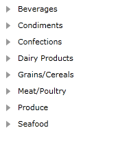
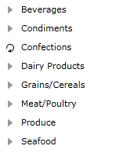
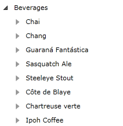

# Binding to WCF Service

The purpose of this tutorial is to show you how to populate a __RadTreeView__ with data from a __WCF Service__. 

>This tutorial will use the __Northwind__ database, which can be downloaded from [here](http://www.microsoft.com/downloads/details.aspx?FamilyID=06616212-0356-46A0-8DA2-EEBC53A68034&displaylang=en).

Here will be examined "best practice" for using __RadTreeView__ with load on demand and WCF Service. You can read more information about the load on demand behavior [[!] here](radtreeview-features-load-on-demand.html). 

* Add a new __RadTreeView__ declaration in your XAML and add an event handler for __LoadOnDemand__ event. Also set the following properties to __True__:
	* __IsLoadOnDemandEnabled__
	* __IsExpandOnSingleClickEnabled__

	#### __XAML__

	{{region radtreeview-populating-with-data-databinding-to-wcf-service_0}}
		<telerik:RadTreeView x:Name="radTreeView" Margin="8"
		   IsLoadOnDemandEnabled="True" IsExpandOnSingleClickEnabled="True"
		   LoadOnDemand="radTreeView_LoadOnDemand"/>
	{{endregion}}

	The treeview will be bound to a data source object, that has a property __Categories__. When the __LoadOnDemand__ event of __RadTreeView__ is fired, the selected category asynchronously loads its related products. 

* Create a new class named __NorthwindDataSource__. 

	#### __C#__

	{{region radtreeview-populating-with-data-databinding-to-wcf-service_1}}
		public class NorthwindDataSource
		{
		}
		{{endregion}}

	#### __VB.NET__

	{{region radtreeview-populating-with-data-databinding-to-wcf-service_2}}
		Public Class NorthwindDataSource
		End Class
		{{endregion}}

* Add a reference to your WCF Service
* In the __NorthwindDataSource__ class add a reference to an __ObservableCollection__ of __Categories.__
* In the __NorthwindDataSource__ class add a reference to your WCF Service client: 

	#### __C#__

	{{region radtreeview-populating-with-data-databinding-to-wcf-service_3}}
		public class NorthwindDataSource
		{
			private SampleWcfServiceClient serviceClient;
			public NorthwindDataSource()
			{
				serviceClient = new SampleWcfServiceClient();
				this.Categories = new ObservableCollection<Categories>();
			}
			public ObservableCollection<Categories> Categories
			{
				get;
				set;
			}
		}
		{{endregion}}

	#### __VB.NET__

	{{region radtreeview-populating-with-data-databinding-to-wcf-service_4}}
		Public Class NorthwindDataSource
			Private serviceClient As SampleWcfServiceClient
		
			Public Sub New()
				serviceClient = New SampleWcfServiceClient()
				Me.Categories = New ObservableCollection(Of Categories)()
			End Sub
		
		Private _Categories As ObservableCollection(Of Categories)
			Public Property Categories() As ObservableCollection(Of Categories)
				Get
					Return _Categories
				End Get
				Set(ByVal value As ObservableCollection(Of Categories))
					_Categories = value
				End Set
			End Property
		End Class
		{{endregion}}

* Add the following code in the constructor of the __NorthwindDataSource__. It will make the initial load of all __Categories__ from the database: 

	#### __C#__

	{{region radtreeview-populating-with-data-databinding-to-wcf-service_5}}
		this.serviceClient.LoadCategoriesCompleted += new EventHandler<LoadCategoriesCompletedEventArgs>( serviceClient_LoadCategoriesCompleted );
		this.serviceClient.LoadCategoriesAsync();
		{{endregion}}

	#### __C#__

	{{region radtreeview-populating-with-data-databinding-to-wcf-service_6}}
		foreach ( Categories c in serviceClient.LoadCategories() )
		{
			this.Categories.Add( c );
		}
		{{endregion}}
		
	#### __VB.NET__

	{{region radtreeview-populating-with-data-databinding-to-wcf-service_7}}
		AddHandler Me.serviceClient.LoadCategoriesCompleted, AddressOf serviceClient_LoadCategoriesCompleted
		Me.serviceClient.LoadCategoriesAsync()
		{{endregion}}

	#### __VB.NET__

	{{region radtreeview-populating-with-data-databinding-to-wcf-service_8}}
		For Each c As Categories In serviceClient.LoadCategories()
			Me.Categories.Add(c)
		Next
		{{endregion}}

	

	And here is the code handling the __LoadCategoriesCompleted__event: 

	#### __C#__

	{{region radtreeview-populating-with-data-databinding-to-wcf-service_9}}
		private void serviceClient_LoadCategoriesCompleted( object sender, LoadCategoriesCompletedEventArgs e )
		{
			if ( e.Error == null && e.Result != null )
			{
				foreach ( Categories c in e.Result )
				{
					this.Categories.Add( c );
				}
			}
		}
		{{endregion}}

	#### __VB.NET__

	{{region radtreeview-populating-with-data-databinding-to-wcf-service_10}}
		Private Sub serviceClient_LoadCategoriesCompleted(ByVal sender As Object, ByVal e As LoadCategoriesCompletedEventArgs)
			If e.[Error] Is Nothing AndAlso e.Result IsNot Nothing Then
				For Each c As Categories In e.Result
					Me.Categories.Add(c)
				Next
			End If
		End Sub
		{{endregion}}

	The body of the exposed __LoadCategories()__ method is shown on the code snippet below.
		
	#### __C#__
		[OperationContract]
		public List<Categories> LoadCategories()
		{
			NorthwindEntities ent = new NorthwindEntities();
			return ent.Categories.Execute( MergeOption.AppendOnly ).ToList();
		}

	#### __VB.NET__	
		<OperationContract>
		Public Function LoadCategories() As List(Of Categories)
			Dim ent As New NorthwindEntities()
			Return ent.Categories.Execute(MergeOption.AppendOnly).ToList()
		End Function

* Declare the __NorthwindDataSource__ object as a resource in your application. 

	#### __XAML__

	{{region radtreeview-populating-with-data-databinding-to-wcf-service_11}}
		<UserControl.Resources>
			<example:NorthwindDataSource x:Key="DataSource"/>
		</UserControl.Resources>
		{{endregion}}

* Declare [HierarchicalDataTemplates]() which will describe the treeview structure. 

	#### __XAML__

	{{region radtreeview-populating-with-data-databinding-to-wcf-service_12}}
		<DataTemplate x:Key="ProductTemplate">
			<TextBlock Text="{Binding ProductName}" />
		</DataTemplate>
		<telerik:HierarchicalDataTemplate x:Key="CategoryTemplate" ItemsSource="{Binding Products}"
		  ItemTemplate="{StaticResource ProductTemplate}">
			<TextBlock Text="{Binding CategoryName}" />
		</telerik:HierarchicalDataTemplate>
		{{endregion}}

	

	#### __XAML__

	{{region radtreeview-populating-with-data-databinding-to-wcf-service_13}}
		<DataTemplate x:Key="ProductTemplate">
			<TextBlock Text="{Binding ProductName}" />
		</DataTemplate>
		<HierarchicalDataTemplate x:Key="CategoryTemplate" ItemsSource="{Binding Products}"
		  ItemTemplate="{StaticResource ProductTemplate}">
			<TextBlock Text="{Binding CategoryName}" />
		</HierarchicalDataTemplate>
		{{endregion}}

	

* Update your treeview declaration - set the __ItemsSource__ and __ItemTemplate__ properties. 

	#### __XAML__

	{{region radtreeview-populating-with-data-databinding-to-wcf-service_14}}
		<telerik:RadTreeView x:Name="radTreeView" Margin="8"
			IsLoadOnDemandEnabled="True" IsExpandOnSingleClickEnabled="True"
			LoadOnDemand="radTreeView_LoadOnDemand"
			ItemTemplate="{StaticResource CategoryTemplate}"
			ItemsSource="{Binding Source={StaticResource DataSource}, Path=Categories}"/>
		{{endregion}}

	Run your demo, the result can be seen on the next picture: 
	

	If you try to expand any of the loaded categories, the default load on demand animation will be started: 
	

	The next step is to handle the load on demand event. 

* Add the following method to the __NorthwindDataSource__ class, which aims to load the products for the expanded category: 

	#### __C#__

	{{region radtreeview-populating-with-data-databinding-to-wcf-service_15}}
		public void BeginLoadingProducts( Categories category )
		{
			serviceClient.LoadProductsByCategoryIdCompleted += new EventHandler<LoadProductsByCategoryIdCompletedEventArgs>( serviceClient_LoadProductsByCategoryIdCompleted );
			serviceClient.LoadProductsByCategoryIdAsync( category.CategoryID, category );
		}
		private void serviceClient_LoadProductsByCategoryIdCompleted( object sender, LoadProductsByCategoryIdCompletedEventArgs e )
		{
			if ( e.Error == null && e.Result != null )
			{
				Categories currentCategory = e.UserState as Categories;
				foreach ( Products p in e.Result )
				{
					currentCategory.Products.Add( p );
				}
			}
		}
		{{endregion}}

	#### __C#__

	{{region radtreeview-populating-with-data-databinding-to-wcf-service_16}}
		public void LoadProducts( Categories category )
		{
			category.Products = new ObservableCollection<Products>();
			foreach ( Products p in serviceClient.LoadProductsByCategoryId( category.CategoryID ) )
			{
				category.Products.Add( p );
			}
		}
		{{endregion}}

	#### __VB.NET__

	{{region radtreeview-populating-with-data-databinding-to-wcf-service_17}}
		Public Sub BeginLoadingProducts(ByVal category As Categories)
			AddHandler serviceClient.LoadProductsByCategoryIdCompleted, AddressOf serviceClient_LoadProductsByCategoryIdCompleted
			serviceClient.LoadProductsByCategoryIdAsync(category.CategoryID, category)
		End Sub
		Private Sub serviceClient_LoadProductsByCategoryIdCompleted(ByVal sender As Object, ByVal e As LoadProductsByCategoryIdCompletedEventArgs)
			If e.[Error] Is Nothing AndAlso e.Result IsNot Nothing Then
				Dim currentCategory As Categories = TryCast(e.UserState, Categories)
				For Each p As Products In e.Result
					currentCategory.Products.Add(p)
				Next
			End If
		End Sub
		{{endregion}}

	#### __VB.NET__

	{{region radtreeview-populating-with-data-databinding-to-wcf-service_18}}
		Public Sub LoadProducts(ByVal category As Categories)
			category.Products = New ObservableCollection(Of Products)()
			For Each p As Products In serviceClient.LoadProductsByCategoryId(category.CategoryID)
				category.Products.Add(p)
			Next
		End Sub
		{{endregion}}

	The body of the exposed __LoadProductsByCategoryId()__ method is shown on the code snippet below.
		
		#### __C#__
			[OperationContract]
			public List<Products> LoadProductsByCategoryId( int categoryId )
			{
				NorthwindEntities ent = new NorthwindEntities();
				var q = from p in ent.Products
						where p.Categories.CategoryID == categoryId
						orderby p.ProductName
						select p;
				return q.ToList();
			}

		#### __VB.NET__
			<OperationContract>
			Public Function LoadProductsByCategoryId(categoryId As Integer) As List(Of Products)
				Dim ent As New NorthwindEntities()
				Dim q = From p In ent.Products Where p.Categories.CategoryID = categoryIdOrder By p.ProductNamep
				Return q.ToList()
			End Function

* Add the following code to the load on demand event handler, which you declared on step 1. 

	#### __C#__

	{{region radtreeview-populating-with-data-databinding-to-wcf-service_19}}
		private void radTreeView_LoadOnDemand( object sender, Telerik.Windows.RadRoutedEventArgs e )
		{
			RadTreeViewItem item = e.OriginalSource as RadTreeViewItem;
			Categories category = item.Item as Categories;
			if ( category != null )
			{
				( this.Resources[ "DataSource" ] as NorthwindDataSource ).BeginLoadingProducts( category );
			}
			else
			{
				item.IsLoadOnDemandEnabled = false;
			}
		}
		{{endregion}}

	#### __VB.NET__

	{{region radtreeview-populating-with-data-databinding-to-wcf-service_21}}
		Private Sub radTreeView_LoadOnDemand(ByVal sender As Object, ByVal e As Telerik.Windows.RadRoutedEventArgs)
			Dim item As RadTreeViewItem = TryCast(e.OriginalSource, RadTreeViewItem)
		
			Dim category As Categories = TryCast(item.Item, Categories)
			If category IsNot Nothing Then
				TryCast(Me.Resources("DataSource"), NorthwindDataSource).BeginLoadingProducts(category)
			Else
				item.IsLoadOnDemandEnabled = False
			End If
		End Sub
		{{endregion}}

	>When there are no items to add, and you want to prevent the __LoadOnDemand__ event to fire again, set the __IsLoadOnDemandEnabled__ property to __False__ to the __RadTreeViewItem__ that has fired the __LoadOnDemand__ event.

And here is the result: 

# See Also
 * [DataBinding - Overview]()
 * [Populating with Data - Declaratively]()
 * [Populating with Data - In Code-Behind]()
 * [Binding to XML]()
 * [Binding to Object]()
 * [Binding to ADO.NET Data Service]()