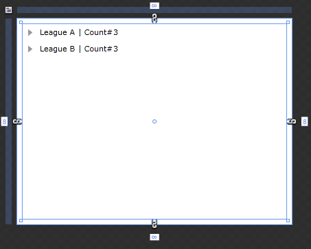
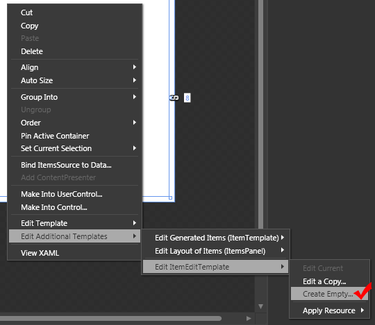
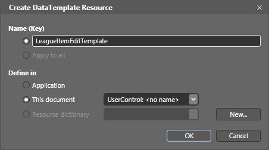
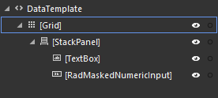
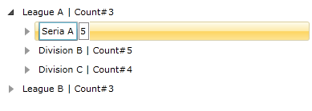

# ItemEditTemplate

## 

Telerik __RadTreeView__also supports __ItemEditTemplate__. This tutorial will walk you through the common task of creating and applying __ItemEditTemplate__.

For the purpose of this tutorial will be used the following __RadTreeView__ declaration: 

#### __XAML__

{{region radtreeview-populating-with-data-item-edit-template_0}}
	<UserControl.Resources>
	
	    <sampleData:RadTreeViewSampleData x:Key="DataSource"/>
	
	    <DataTemplate x:Key="Team">
	        <StackPanel Orientation="Horizontal">
	            <TextBlock Text="{Binding Name}"/>
	            <TextBlock Text=" | Count#"/>
	            <TextBlock Text="{Binding Count}"/>
	        </StackPanel>
	    </DataTemplate>
	
	    <telerik:HierarchicalDataTemplate x:Key="Division" ItemTemplate="{StaticResource Team}"
	       ItemsSource="{Binding Teams}">
	        <StackPanel Orientation="Horizontal">
	            <TextBlock Text="{Binding Name}" />
	            <TextBlock Text=" | Count#"/>
	            <TextBlock Text="{Binding Count}"/>
	        </StackPanel>
	    </telerik:HierarchicalDataTemplate>
	
	    <telerik:HierarchicalDataTemplate x:Key="League" ItemTemplate="{StaticResource Division}"
	       ItemsSource="{Binding Divisions}">
	        <StackPanel Orientation="Horizontal">
	            <TextBlock Text="{Binding Name}" />
	            <TextBlock Text=" | Count#"/>
	            <TextBlock Text="{Binding Count}"/>
	        </StackPanel>
	    </telerik:HierarchicalDataTemplate>
	
	</UserControl.Resources>
	
	<Grid x:Name="LayoutRoot" Background="White">
	
	    <telerik:RadTreeView x:Name="radTreeView"
	       IsEditable="True"
	       ItemsSource="{Binding Source={StaticResource DataSource}, Path=LeaguesDataSource}"
	       ItemTemplate="{StaticResource League}" />
	
	</Grid>
	{{endregion}}



#### __XAML__

{{region radtreeview-populating-with-data-item-edit-template_2}}
	<UserControl.Resources>
	
	    <sampleData:RadTreeViewSampleData x:Key="DataSource"/>
	
	    <DataTemplate x:Key="Team">
	        <StackPanel Orientation="Horizontal">
	            <TextBlock Text="{Binding Name}"/>
	            <TextBlock Text=" | Count#"/>
	            <TextBlock Text="{Binding Count}"/>
	        </StackPanel>
	    </DataTemplate>
	
	    <HierarchicalDataTemplate x:Key="Division" ItemTemplate="{StaticResource Team}"
	       ItemsSource="{Binding Teams}">
	        <StackPanel Orientation="Horizontal">
	            <TextBlock Text="{Binding Name}" />
	            <TextBlock Text=" | Count#"/>
	            <TextBlock Text="{Binding Count}"/>
	        </StackPanel>
	    </HierarchicalDataTemplate>
	
	    <HierarchicalDataTemplate x:Key="League" ItemTemplate="{StaticResource Division}"
	       ItemsSource="{Binding Divisions}">
	        <StackPanel Orientation="Horizontal">
	            <TextBlock Text="{Binding Name}" />
	            <TextBlock Text=" | Count#"/>
	            <TextBlock Text="{Binding Count}"/>
	        </StackPanel>
	    </HierarchicalDataTemplate>
	
	</UserControl.Resources>
	
	<Grid x:Name="LayoutRoot" Background="White">
	
	    <telerik:RadTreeView x:Name="radTreeView"
	       IsEditable="True"
	       ItemsSource="{Binding Source={StaticResource DataSource}, Path=LeaguesDataSource}"
	       ItemTemplate="{StaticResource League}" />
	
	</Grid>
	{{endregion}}



__ItemEditTemplate Property__

In this tutorial an __ItemEditTemplate__ will be created with Expression Blend.

* Open your application and [select]() the treeview control.

* Right-click on it or right-click in the scene explorer and choose EditAdditionalTemplates->Edit ItemEditTemplate->Create Empty. 

* Choose a name for the data template and where to be defined in:

>

Defining the template in the Application section makes it reusable from everywhere in the application.____

* Drag and drop the controls you need for the template and configure their properties. In the example are used a __TextBox__and a __RadMaskedTextBox__

* Configure the binding for the __Text__property of the __TextBox__, and for the __Value__property of the __RadMaskedTextBox__. 

* Bind the __TextBox__Text property to the __Name__property of the business object and set the binding to be __TwoWay__. 

* Do the same for the __Value__property of the __RadMaskedTextBox__.

Here is the final XAML:

#### __XAML__

{{region radtreeview-populating-with-data-item-edit-template_1}}
	<DataTemplate x:Key="LeagueItemEditTemplate">
	 <Grid>
	
	  <StackPanel Orientation="Horizontal">
	
	   <TextBox Text="{Binding Name, Mode=TwoWay}"/>
	   <telerikInput:RadMaskedTextBox MaskType="Numeric" Mask="#" Value="{Binding Count, Mode=OneWay}"/>
	
	  </StackPanel>
	
	 </Grid>
	</DataTemplate>
	................
	<telerik:RadTreeView x:Name="radTreeView"
	   IsEditable="True"
	   ItemsSource="{Binding LeaguesDataSource, Source={StaticResource DataSource}}"
	   ItemTemplate="{StaticResource League}" Margin="8" 
	   ItemEditTemplate="{StaticResource LeagueItemEditTemplate}"/>
	{{endregion}}

>

Don't forget to set the __IsEditable__property of your __RadTreeView__to __True__.

# See Also

 * [ItemEditTemplateSelector]()

 * [ItemTemplate]()

 * [DataBinding - Overview]()
