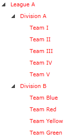

# ItemContainerStyle

The Telerik __RadTreeView__ supports __ItemContainerStyle__. The __ItemContainerStyle__ property gives you the ability to change the treeview items' header. The container created by the __RadTreeView__ for each item in the collection is of type __RadTreeViewItem__. The style defined for the __ItemContainerStyle__ property should have as __TargetType__ the __RadTreeViewItem__ class.

>The __ItemContainerStyle__ clashes with the theming. You cannot have both an __ItemContainerStyle__ and a non-application theme for the __RadTreeView__. The reason is that they both set a style. If you want to __use a different theme and ItemContainerStyle__ you need to set the theme as an application theme (which sets a __DefaultStyle__ rather than __Style__).

For the purpose of this tutorial will be used the following treeview declaration: 



#### __XAML__

{{region radtreeview-styling-and-appearance-item-container-style_0}}
	<UserControl.Resources>
	
	    <sampleData:RadTreeViewSampleData x:Key="DataSource"/>
	
	    <DataTemplate x:Key="Team">
	        <TextBlock Text="{Binding Name}" />
	    </DataTemplate>
	
	    <telerik:HierarchicalDataTemplate x:Key="Division" ItemTemplate="{StaticResource Team}"
	       ItemsSource="{Binding Teams}">
	        <TextBlock Text="{Binding Name}" />
	    </telerik:HierarchicalDataTemplate>
	
	    <telerik:HierarchicalDataTemplate x:Key="League" ItemTemplate="{StaticResource Division}"
	       ItemsSource="{Binding Divisions}">
	        <TextBlock Text="{Binding Name}" />
	    </telerik:HierarchicalDataTemplate>
	
	</UserControl.Resources>
	
	<Grid x:Name="LayoutRoot" Background="White">
	
	    <telerik:RadTreeView x:Name="radTreeView"
	       ItemsSource="{Binding Source={StaticResource DataSource}, Path=LeaguesDataSource}"
	       ItemTemplate="{StaticResource League}"/>
	
	</Grid>
	{{endregion}}




#### __XAML__

{{region radtreeview-styling-and-appearance-item-container-style_3}}
	<UserControl.Resources>
	
	    <sampleData:RadTreeViewSampleData x:Key="DataSource"/>
	
	    <DataTemplate x:Key="Team">
	        <TextBlock Text="{Binding Name}" />
	    </DataTemplate>
	
	    <HierarchicalDataTemplate x:Key="Division" ItemTemplate="{StaticResource Team}"
	       ItemsSource="{Binding Teams}">
	        <TextBlock Text="{Binding Name}" />
	    </HierarchicalDataTemplate>
	
	    <HierarchicalDataTemplate x:Key="League" ItemTemplate="{StaticResource Division}"
	       ItemsSource="{Binding Divisions}">
	        <TextBlock Text="{Binding Name}" />
	    </HierarchicalDataTemplate>
	
	</UserControl.Resources>
	
	<Grid x:Name="LayoutRoot" Background="White">
	
	    <telerik:RadTreeView x:Name="radTreeView"
	       ItemsSource="{Binding Source={StaticResource DataSource}, Path=LeaguesDataSource}"
	       ItemTemplate="{StaticResource League}"/>
	
	</Grid>
	{{endregion}}



The data source class __RadTreeViewSampleData__ assigned to the __RadTreeView__ is covered in greater details in the chapter [Binding to Object]().

>tip Defining the style in the resources of the control or in the resources of the application, makes it reusable.

__RadTreeViewItem HeaderTemplate__

#### __XAML__

{{region radtreeview-styling-and-appearance-item-container-style_1}}
	
	{{endregion}}

#### __XAML__

{{region radtreeview-styling-and-appearance-item-container-style_2}}
	<telerik:RadTreeView x:Name="radTreeView"
	   ItemsSource="{Binding Source={StaticResource DataSource}, Path=LeaguesDataSource}"
	   ItemTemplate="{StaticResource League}"
	   ItemContainerStyle="{StaticResource myItemContainerStyle}"/>
	{{endregion}}

If you have different items and/or you prefer to display items with different styles, then you should use the [ItemContainerStyleSelector]() property.

## See Also
 * [ItemContainerStyleSelector]()
 * [Styling and Appearance - Overview]()
 * [Styling the Expander]()