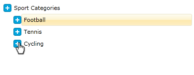
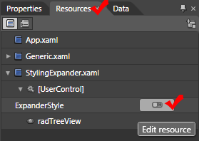
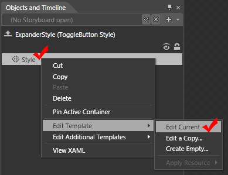
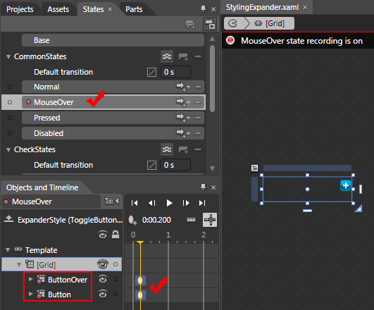
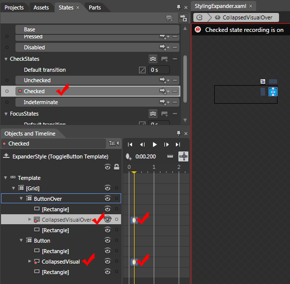
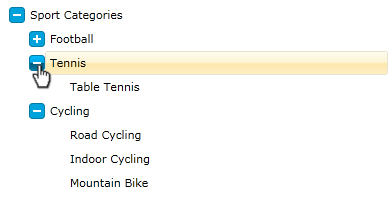

# Styling the Expander



If you need to change only the icon that is used to expand an item, you can use the __ExpanderStyle__ property of the __RadTreeView__. The icon is a __ToggleButton__, so any style that can be applied to a __ToggleButton__ can be applied to the icon too.		  

This tutorial will walk you through the common task of styling an expander.

On the snapshot below you can see how the final result will look like:

For  the purpose of the following tutorial I will use the following treeview declaration:

#### __XAML__

{{region radtreeview-styling-and-appearance-styling-expander_0}}
	<telerik:RadTreeView Margin="8" x:Name="radTreeView">
	    <telerik:RadTreeViewItem Header="Sport Categories">
	        <telerik:RadTreeViewItem Header="Football">
	            <telerik:RadTreeViewItem Header="Futsal"/>
	            <telerik:RadTreeViewItem Header="Soccer"/>
	        </telerik:RadTreeViewItem>
	        <telerik:RadTreeViewItem Header="Tennis">
	            <telerik:RadTreeViewItem Header="Table Tennis"/>
	        </telerik:RadTreeViewItem>
	        <telerik:RadTreeViewItem Header="Cycling">
	            <telerik:RadTreeViewItem Header="Road Cycling"/>
	            <telerik:RadTreeViewItem Header="Indoor Cycling"/>
	            <telerik:RadTreeViewItem Header="Mountain Bike"/>
	        </telerik:RadTreeViewItem>
	    </telerik:RadTreeViewItem>
	</telerik:RadTreeView>
	{{endregion}}

* Since the expander is a toggle button we need to create a style with __TargetType__ - __ToggleButton__.			  

	Declare a new style in your application (user control) resources and set the following common properties:

	* Set the __IsEnabled__ property to __True__;
	* Set the __IsTabStop__ property to __False__;
	* Change the cursor to be __Hand__

	#### __XAML__

	{{region radtreeview-styling-and-appearance-styling-expander_1}}
		
		{{endregion}}

* Next, we need to change the __Template__ property of the __ToggleButton__ (Expander). Add the following elements to your Template:

	#### __XAML__

	{{region radtreeview-styling-and-appearance-styling-expander_2}}
		
		{{endregion}}

* Set the __ExpanderStyle__ property of your treeview:

	#### __XAML__

	{{region radtreeview-styling-and-appearance-styling-expander_3}}
		<telerik:RadTreeView Margin="8" x:Name="radTreeView"
			ExpanderStyle="{StaticResource ExpanderStyle}">
			<telerik:RadTreeViewItem Header="Sport Categories">
				<telerik:RadTreeViewItem Header="Football">
					<telerik:RadTreeViewItem Header="Futsal"/>
					<telerik:RadTreeViewItem Header="Soccer"/>
				</telerik:RadTreeViewItem>
				<telerik:RadTreeViewItem Header="Tennis">
					<telerik:RadTreeViewItem Header="Table Tennis"/>
				</telerik:RadTreeViewItem>
				<telerik:RadTreeViewItem Header="Cycling">
					<telerik:RadTreeViewItem Header="Road Cycling"/>
					<telerik:RadTreeViewItem Header="Indoor Cycling"/>
					<telerik:RadTreeViewItem Header="Mountain Bike"/>
				</telerik:RadTreeViewItem>
			</telerik:RadTreeViewItem>
		</telerik:RadTreeView>
		{{endregion}}

* As you can see from the next figure, the expander of the treeview is changed: 

* We are one more step closer to the final result. Next we should add some visual effects. For that purpose add the following elements to your expander template: 

	#### __XAML__

	{{region radtreeview-styling-and-appearance-styling-expander_4}}
		
		{{endregion}}

	The __ButtonOver__grid will be animated when the mouse is position over the expander.

* Open your application in Expression Blend. Find the "__ExpanderStyle__" in the Resources pane and press the "Edit resource" button:
	

* Right click on the __Style__object in the __Objects and Timeline__pane and select Edit Template->Edit Current...
	

	The __ToggleButton__ template will be opened for edit.

* Using the Visual State Manager, add the following visual states:

	* __MouseOver__ - set the key time to 2 seconds and set the following properties:				  
		* Set the __Button__'s Opacity to 0
		* Set the __ButtonOver__'s Opacity to 1 (100%)

		

	* __Checked__ - set the key time to 2 seconds and set the following properties:
		* Set the __CollapseVisual__'s Opacity to 0
		* Set the __CollapseVisualOver__'s Opacity to 0

	* __Unchecked__ - set the key time to 2 seconds and set the following properties:				  
		* Set the __CollapseVisual__'s Opacity to 1 (100%)
		* Set the __CollapseVisualOver__'s Opacity to 1 (100%)					  

		

Here is the result XAML: 

#### __XAML__

{{region radtreeview-styling-and-appearance-styling-expander_5}}
	
	{{endregion}}

Here is the result: 





If you need to change only the icon that is used to expand an item, you can use the __ExpanderStyle__ property of the __RadTreeView__. The icon is a __ToggleButton__, so any style that can be applied to a ToggleButton can be applied to the icon too.
		  

This tutorial will walk you through the common task of styling an expander.

On the snapshot below you can see how the final result will look like:

For  the purpose of the following tutorial I will use the following treeview declaration: 

#### __XAML__

{{region radtreeview-styling-and-appearance-styling-expander_6}}
	<telerik:RadTreeView Margin="8" x:Name="radTreeView">
	    <telerik:RadTreeViewItem Header="Sport Categories">
	        <telerik:RadTreeViewItem Header="Football">
	            <telerik:RadTreeViewItem Header="Futsal"/>
	            <telerik:RadTreeViewItem Header="Soccer"/>
	        </telerik:RadTreeViewItem>
	        <telerik:RadTreeViewItem Header="Tennis">
	            <telerik:RadTreeViewItem Header="Table Tennis"/>
	        </telerik:RadTreeViewItem>
	        <telerik:RadTreeViewItem Header="Cycling">
	            <telerik:RadTreeViewItem Header="Road Cycling"/>
	            <telerik:RadTreeViewItem Header="Indoor Cycling"/>
	            <telerik:RadTreeViewItem Header="Mountain Bike"/>
	        </telerik:RadTreeViewItem>
	    </telerik:RadTreeViewItem>
	</telerik:RadTreeView>
	{{endregion}}

* Since the expander is a toggle button we need to create a style with __TargetType__ - __ToggleButton__.			  

	Declare a new style in your application (user control) resources and set the following common properties:
	* Set the __IsEnabled__ property to __True__;
	* Set the __IsTabStop__ property to __False__;

* Change the cursor to be __Hand__

	#### __XAML__

	{{region radtreeview-styling-and-appearance-styling-expander_7}}
		
	{{endregion}}

* Next, we need to change the __Template__ property of the __ToggleButton__ (Expander). Add the following elements to your Template:			

	#### __XAML__

	{{region radtreeview-styling-and-appearance-styling-expander_8}}
		
	{{endregion}}

* Set the __ExpanderStyle__ property of your treeview:

	#### __XAML__

	{{region radtreeview-styling-and-appearance-styling-expander_9}}
		<telerik:RadTreeView Margin="8" x:Name="radTreeView"
			ExpanderStyle="{StaticResource ExpanderStyle}">
			<telerik:RadTreeViewItem Header="Sport Categories">
				<telerik:RadTreeViewItem Header="Football">
					<telerik:RadTreeViewItem Header="Futsal"/>
					<telerik:RadTreeViewItem Header="Soccer"/>
				</telerik:RadTreeViewItem>
				<telerik:RadTreeViewItem Header="Tennis">
					<telerik:RadTreeViewItem Header="Table Tennis"/>
				</telerik:RadTreeViewItem>
				<telerik:RadTreeViewItem Header="Cycling">
					<telerik:RadTreeViewItem Header="Road Cycling"/>
					<telerik:RadTreeViewItem Header="Indoor Cycling"/>
					<telerik:RadTreeViewItem Header="Mountain Bike"/>
				</telerik:RadTreeViewItem>
			</telerik:RadTreeViewItem>
		</telerik:RadTreeView>
	{{endregion}}

	As you can see from the next figure, the expander of the treeview is changed: 
	

* We are one more step closer to the final result. Next we should add some visual effects. For that purpose add the following elements to your expander template:

	#### __XAML__

	{{region radtreeview-styling-and-appearance-styling-expander_10}}
		
	{{endregion}}

	The __ButtonOver__ grid will be animated when the mouse is position over the expander.
		  

* You should add two __Triggers__ to the ControlTemplate's Triggers Collection. The first one is activated when the mouse is over the expander, and the second one is activated when the __ToggleButton__ is checked:

	#### __XAML__

	{{region radtreeview-styling-and-appearance-styling-expander_11}}
		<ControlTemplate.Triggers>
			<Trigger Property="IsMouseOver" Value="True">
				<Trigger.EnterActions>
					<BeginStoryboard>
						<Storyboard>
						</Storyboard>
					</BeginStoryboard>
				</Trigger.EnterActions>
				<Trigger.ExitActions>
					<BeginStoryboard>
						<Storyboard>
						</Storyboard>
					</BeginStoryboard>
				</Trigger.ExitActions>
			</Trigger>
			<Trigger Property="IsChecked" Value="True">
				<Trigger.EnterActions>
					<BeginStoryboard>
						<Storyboard>
						</Storyboard>
					</BeginStoryboard>
				</Trigger.EnterActions>
				<Trigger.ExitActions>
					<BeginStoryboard>
						<Storyboard>
						</Storyboard>
					</BeginStoryboard>
				</Trigger.ExitActions>
			</Trigger>
		</ControlTemplate.Triggers>
	{{endregion}}

	When the mouse is over the expander the "ButtonOver" element must be visualized (set its Opacity property to 1), while the "Button" element must be hidden (set its Opacity property to 0). Respectively, when the mouse leaves the expander area, then the opposite operations must be performed. Here is how the "EnterActions" and "ExitActions" for the __IsMouseOver__  trigger should look like:
			  

	#### __XAML__

	{{region radtreeview-styling-and-appearance-styling-expander_12}}
		<Trigger Property="IsMouseOver" Value="True">
			<Trigger.EnterActions>
				<BeginStoryboard>
					<Storyboard>
						<DoubleAnimation Storyboard.TargetName="ButtonOver" Storyboard.TargetProperty="(UIElement.Opacity)" To="1"/>
						<DoubleAnimation Storyboard.TargetName="Button" Storyboard.TargetProperty="(UIElement.Opacity)" To="0"/>
					</Storyboard>
				</BeginStoryboard>
			</Trigger.EnterActions>
			<Trigger.ExitActions>
				<BeginStoryboard>
					<Storyboard>
						<DoubleAnimation Storyboard.TargetName="ButtonOver" Storyboard.TargetProperty="(UIElement.Opacity)" To="0"/>
						<DoubleAnimation Storyboard.TargetName="Button" Storyboard.TargetProperty="(UIElement.Opacity)" To="1"/>
					</Storyboard>
				</BeginStoryboard>
			</Trigger.ExitActions>
		</Trigger>
	{{endregion}}

	When the __ToggleButton__ is checked, then the "CollapseVisualOver" and "CollapseVisual" elements must be hidden (set their Opacity property to 0). When the ToggleButton is __checked__, then the both elements must be visualized (set their Opacity property to 1). Here is how the "EnterActions" and "ExitActions" for the __IsChecked__ trigger should look like:

	#### __XAML__

	{{region radtreeview-styling-and-appearance-styling-expander_13}}
		<Trigger Property="IsChecked" Value="True">
			<Trigger.EnterActions>
				<BeginStoryboard>
					<Storyboard>
						<DoubleAnimation Storyboard.TargetName="CollapsedVisualOver" Storyboard.TargetProperty="(UIElement.Opacity)" To="0"/>
						<DoubleAnimation Storyboard.TargetName="CollapsedVisual" Storyboard.TargetProperty="(UIElement.Opacity)" To="0"/>
					</Storyboard>
				</BeginStoryboard>
			</Trigger.EnterActions>
			<Trigger.ExitActions>
				<BeginStoryboard>
					<Storyboard>
						<DoubleAnimation Storyboard.TargetName="CollapsedVisualOver" Storyboard.TargetProperty="(UIElement.Opacity)" To="1"/>
						<DoubleAnimation Storyboard.TargetName="CollapsedVisual" Storyboard.TargetProperty="(UIElement.Opacity)" To="1"/>
					</Storyboard>
				</BeginStoryboard>
			</Trigger.ExitActions>
		</Trigger>
	{{endregion}}

And here is the complete XAML for the "ControlTemplate.Triggers" section:

#### __XAML__

{{region radtreeview-styling-and-appearance-styling-expander_14}}
	<ControlTemplate.Triggers>
	    <Trigger Property="IsMouseOver" Value="True">
	        <Trigger.EnterActions>
	            <BeginStoryboard>
	                <Storyboard>
	                    <DoubleAnimation Storyboard.TargetName="ButtonOver" Storyboard.TargetProperty="(UIElement.Opacity)" To="1"/>
	                    <DoubleAnimation Storyboard.TargetName="Button" Storyboard.TargetProperty="(UIElement.Opacity)" To="0"/>
	                </Storyboard>
	            </BeginStoryboard>
	        </Trigger.EnterActions>
	        <Trigger.ExitActions>
	            <BeginStoryboard>
	                <Storyboard>
	                    <DoubleAnimation Storyboard.TargetName="ButtonOver" Storyboard.TargetProperty="(UIElement.Opacity)" To="0"/>
	                    <DoubleAnimation Storyboard.TargetName="Button" Storyboard.TargetProperty="(UIElement.Opacity)" To="1"/>
	                </Storyboard>
	            </BeginStoryboard>
	        </Trigger.ExitActions>
	    </Trigger>
	    <Trigger Property="IsChecked" Value="True">
	        <Trigger.EnterActions>
	            <BeginStoryboard>
	                <Storyboard>
	                    <DoubleAnimation Storyboard.TargetName="CollapsedVisualOver" Storyboard.TargetProperty="(UIElement.Opacity)" To="0"/>
	                    <DoubleAnimation Storyboard.TargetName="CollapsedVisual" Storyboard.TargetProperty="(UIElement.Opacity)" To="0"/>
	                </Storyboard>
	            </BeginStoryboard>
	        </Trigger.EnterActions>
	        <Trigger.ExitActions>
	            <BeginStoryboard>
	                <Storyboard>
	                    <DoubleAnimation Storyboard.TargetName="CollapsedVisualOver" Storyboard.TargetProperty="(UIElement.Opacity)" To="1"/>
	                    <DoubleAnimation Storyboard.TargetName="CollapsedVisual" Storyboard.TargetProperty="(UIElement.Opacity)" To="1"/>
	                </Storyboard>
	            </BeginStoryboard>
	        </Trigger.ExitActions>
	    </Trigger>
	</ControlTemplate.Triggers>
{{endregion}}

> With the same success and effectiveness you could use Expression Blend for adding interactivity. Since the operations in this example are pretty simple I decided to write the triggers by hand.

Here is the result:



## See Also
 * [ItemTemplate]()