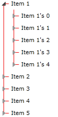
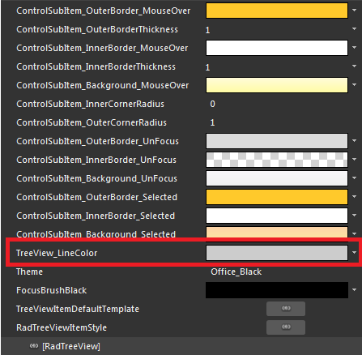

# Styling the Lines

## 

The purpose of this tutorial is to show you how to __change the color__ of the __connected lines__ between the nodes of a __RadTreeView__. The final result should look like the one on the snapshot below:

In order to style the lines, you should edit the __RadTreeViewItem__'s __Template__ and change the __TreeView_LineColor__resource. This tutorial illustrates you a step by step example on how to do that.

* Open your application in Expression Blend. 

* Add a dummy __RadTreeViewItem__ control to the artboard - from the __Assets__ pane select *Controls->All->RadTreeViewItem* and draw it somewhere on the scene. 

* Select the just drawn __RadTreeViewItem__, and from the menu choose *Object->Edit Template->Edit a Copy*. You will be prompted for the name of the style and where to be placed within your application.

After clicking OK, a style for your __RadTreeViewItem__ control will be created. Go to the *Resources* pane and see all of the resources generated for your style.

* Modify the __TreeView_LineColor__resource, which represents the __Stroke__ of the horizontal and vertical lines connecting the nodes. For example, change the color to __Red__. 

* Finally, go back to your XAML and set the __ItemContainerStyle__ property to the just created style. 

#### __XAML__

{{region radtreeview-styling-appearance-styling-line_0}}
	<telerik:RadTreeView x:Name="radTreeView" IsLineEnabled="True"
	    ItemContainerStyle="{StaticResource RadTreeViewItemStyle}"
	    ItemTemplate="{StaticResource RadTreeViewItemTemplate}"/>
	{{endregion}}

>Don't forget to delete the created dummy control.

>Note that the provided solution is valid in the cases when your __RadTreeView__ is [data bound to a business object](). If your __RadTreeView__ is populated [declaratively]() in XAML (with static data), then you should set the __Style__ property of each __RadTreeViewItem__!
