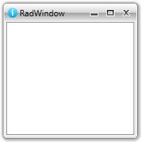

# Window Icon

__RadWindow__ allows you to display a custom icon in its top-left corner. To specify the icon you can use either the __Icon__ or the __IconTemplate__ properties.

If you have a window-specific icon, use the __Icon__ property.

>tipAs the __Icon__ property is of type object you can set it to any control that you like. If you want to have a more complex icon content that consists of more than one control, be sure to wrap them inside a layout control and pass the layout control as content.

>__RadWindow__ is declared and opened from the code behind by default. The only way to use the __RadWindow__ as a visual element in XAML is when it represents the entire UserControl. To learn more about that read [Use RadWindow as User Control]() article.

#### __C#__

{{region radwindow-features-window-icon_0}}
	RadWindow radWindow = new RadWindow();
	radWindow.Icon = new Image()
	{
	    Source = new BitmapImage(new Uri("../../Images/WindowIcon.png", UriKind.Relative ))
	};
{{endregion}}

#### __VB.NET__

{{region radwindow-features-window-icon_1}}
	Dim radWindow As New RadWindow()
	Dim image As New Image()
	image.Source = New BitmapImage(New Uri("../../Images/WindowIcon.png", UriKind.Relative))
	radWindow.Icon = image
{{endregion}}

This will be the final result:

If you want to share a common icon layout structure for the content of multiple windows, define an appropriate __DataTemplate__ and set it to the __IconTemplate__ property of the __RadWindow__.

#### __XAML__

{{region radwindow-features-window-icon_2}}
	<UserControl.Resources>
	    <DataTemplate x:Key="WindowIconTemplate">
	        <Image Source="/Images/WindowIcon.png"
	               Stretch="None" />
	    </DataTemplate>
	</UserControl.Resources>
{{endregion}}

#### __C#__

{{region radwindow-features-window-icon_3}}
	RadWindow radWindow = new RadWindow();
	radWindow.IconTemplate = this.Resources["WindowIconTemplate"] as DataTemplate;
{{endregion}}

#### __VB.NET__

{{region radwindow-features-window-icon_4}}
	Dim radWindow As New RadWindow()
	radWindow.IconTemplate = TryCast(Me.Resources("WindowIconTemplate"), DataTemplate)
{{endregion}}