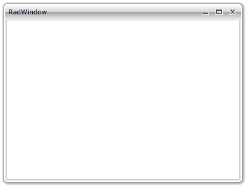

# Working with RadWindow

This topic will explain you how to work with the __RadWindow__ in details. It will make you familiar with the following:

* [Create a RadWindow](#Create_a_RadWindow)

* [Show the RadWindow](#Show_the_RadWindow)

* [Add content to the RadWindow](#Add_content_to_the_RadWindow)

* [Program the RadWindow](#Program_the_RadWindow)

* [Modify the appearance of the RadWindow](#Modify_the_appearance_of_the_RadWindow)

## Create a RadWindow

In order to use the __RadWindow__ in your application you have to add a reference to the __Telerik.Windows.Controls.Navigation__assembly in your project.

After the reference is available, you can declare a __RadWindow__. Here is an example.

#### __C#__

{{region radwindow-features-working-with-radwindow_0}}
	RadWindow radWindow = new RadWindow();
	radWindow.Width = 400;
	radWindow.Height = 300;
	{{endregion}}

#### __VB.NET__

{{region radwindow-features-working-with-radwindow_1}}
	Dim radWindow As New RadWindow()
	radWindow.Width = 400
	radWindow.Height = 300
	{{endregion}}

## Show the RadWindow

When you want to display the __RadWindow__ you have two options - to display it as a __window__ or as a __modal dialog window__.

>tipTo learn more about modal windows read [here]().

Call the __Show()__ method of the __RadWindow__ instance to open it as a __normal window__.

#### __C#__

{{region radwindow-features-working-with-radwindow_2}}
	radWindow.Show();
	{{endregion}}

#### __VB.NET__

{{region radwindow-features-working-with-radwindow_3}}
	radWindow.Show()
	{{endregion}}

Call the __ShowDialog()__ method of the __RadWindow__ instance to open it as a __modal dialog window__.

#### __C#__

{{region radwindow-features-working-with-radwindow_4}}
	radWindow.ShowDialog();
	{{endregion}}

#### __VB.NET__

{{region radwindow-features-working-with-radwindow_5}}
	radWindow.ShowDialog()
	{{endregion}}

         
      

>tipLearn more about positioning the __RadWindow__ by reading the [Positioning]() topic.

## Add content to the RadWindow

To add a content to the __RadWindow__ you can use either the __Content__ or the __ContentTemplate__ properties.

If you have a window-specific content, use the __Content__ property.

>tipAs the __Content__ property is of type object you can set it to any control you like. If you want to have a more complex content that consists of more than one control, be sure to wrap them inside a layout control and pass the layout control as content.You can also set the content of the __RadWindow__ to a __UserControl__.

>The only scenario, where you can add content to the __RadWindow__ at design-time, is when the __RadWindow__ represents an entire user control. To learn more about that read [here]().

#### __C#__

{{region radwindow-features-working-with-radwindow_6}}
	Grid grid = new Grid();
	grid.Background = new SolidColorBrush( Color.FromArgb( 255, 240, 255, 255 ) );
	radWindow.Content = grid;
	{{endregion}}

#### __VB.NET__

{{region radwindow-features-working-with-radwindow_7}}
	Dim grid As New Grid()
	grid.Background = New SolidColorBrush(Color.FromArgb(255, 240, 255, 255))
	radWindow.Content = grid
	{{endregion}}

If you want to share a common layout structure for the content of multiple windows, define an appropriate __DataTemplate__ and set it to the __ContentTemplate__ property of the __RadWindow__.

#### __XAML__

{{region radwindow-features-working-with-radwindow_8}}
	<UserControl.Resources>
	    <DataTemplate x:Key="WindowContentTemplate">
	        <Grid Background="Azure" />
	    </DataTemplate>
	</UserControl.Resources>
	{{endregion}}

#### __C#__

{{region radwindow-features-working-with-radwindow_9}}
	radWindow.ContentTemplate = this.Resources[ "WindowContentTemplate" ] as DataTemplate;
	{{endregion}}

#### __VB.NET__

{{region radwindow-features-working-with-radwindow_10}}
	radWindow.ContentTemplate = TryCast(Me.Resources("WindowContentTemplate"), DataTemplate)
	{{endregion}}

         
      

## Program the RadWindow

The __RadWindow__ exposes a few methods, that allow you to programmatically control its behavior. Here is a list of them:

* __BringToFront__ - attempts to bring the __RadWidnow__ over any other __RadWindows__ except topmost. 

* __Close__ - closes the __RadWindow__.

## Modify the appearance of the RadWindow

To modify the default appearance of the __RadWindow__ you can use the following brushes:

* __BorderBrush__ - changes the outer border of the __RadWindow__ and the outer border of its content area.

* __Background__ - changes the background of the content area.

* __ModalBackground__ - changes the color of the background behind the __RadWindow__ when it is opened as a modal dialog.

Also you can create a style and apply it to the __RadWindow__ or modify the default template of the __RadWindow__ to change its overall look. To learn more read the [Styles and Templates]() section.

# See Also

 * [Visual Structure]()

 * [Events]()

 * [Styles and Templates - Overview]()

 * [Predefined Dialogs]()

 * [RadWindowManager]()
