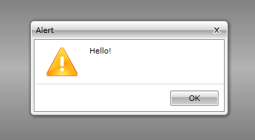
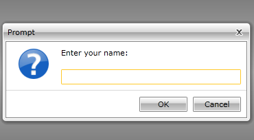

# Getting Started

This tutorial will walk you through the creation of a __RadWindow__ and will show you how to:

* [Declare a RadWindow](#Declare_a_RadWindow)

* [Show the RadWindow](#Show_the_RadWindow)

* [Add content to the RadWindow](#Add_content_to_the_RadWindow)

* [Use predefined windows](#Use_predefined_windows)

## Declare a RadWindow

>In order to use __RadWindow__control in your projects you have to add references to the following assemblies:

* __Telerik.Windows.Controls__

* __Telerik.Windows.Controls.Navigation__

* __Telerik.Windows.Data__You can find more info 
            [here](http://www.telerik.com/help/silverlight/installation-installing-controls-dependencies.html)[here](http://www.telerik.com/help/wpf/installation-installing-controls-dependencies-wpf.html).

Here is an example of declaring a __RadWindow__.

>It's not a good practice do declare your __RadWindow__as visual element in XAML. The only scenario, when it is meaningful to use the __RadWindow__ in XAML, is when it represents the entire user control. To learn more about that read [here]().

#### __C#__

{{region radwindow-getting-started_0}}
	RadWindow radWindow = new RadWindow();
	radWindow.Width = 400;
	radWindow.Height = 300;
	{{endregion}}

#### __VB.NET__

{{region radwindow-getting-started_1}}
	Dim radWindow As New RadWindow()
	radWindow.Width = 400
	radWindow.Height = 300
	{{endregion}}

## Show the RadWindow

To open the __RadWindow__ you have to call its__Show()__ method. Here is an example.

>tipIn order to make the window modal you have to call the __ShowDialog()__ method. To learn more about modal windows read [here]().

#### __C#__

{{region radwindow-getting-started_2}}
	radWindow.Show();
	{{endregion}}

#### __VB.NET__

{{region radwindow-getting-started_3}}
	radWindow.Show()
	{{endregion}}

## Add content to the RadWindow

To add content to the __RadWindow__ you have to use the __Content__ property or the __ContentTemplate__ property. Here is an example of setting the __Content__ property.

>tipAs the __Content__ property is of type object you can set it to any control that you like. If you want to have a more complex content that consists of more than one control, be sure to wrap them inside a layout control and pass the layout control as content.You can also set the content of the __RadWindow__ to a __UserControl__.

>tipYou can skip the in-line setting of the __Content__ property and define the content directly under the __RadWindow__ tag.

>The only scenario, where you can add content to the __RadWindow__ at design-time, is when the __RadWindow__ represents an entire user control. To learn more about that read [here]().

#### __C#__

{{region radwindow-getting-started_4}}
	Grid grid = new Grid();
	grid.Background = new SolidColorBrush( Color.FromArgb( 255, 240, 255, 255 ) );
	radWindow.Content = grid;
	{{endregion}}

#### __VB.NET__

{{region radwindow-getting-started_5}}
	Dim grid As New Grid()
	grid.Background = New SolidColorBrush(Color.FromArgb(255, 240, 255, 255))
	radWindow.Content = grid
	{{endregion}}

## Use predefined windows

There is a set of predefined dialog windows that can be directly used. Such windows are the __Confirm__, __Alert__ and __Prompt__ dialogs. These dialogs can be shown by calling the respective methods of the static __RadWindow__ class.

>All of the predefined windows are modal windows.

* __Alert()__ - shows an alert dialog. This method has 3 overloads. To learn more read [here]().

#### __C#__

{{region radwindow-getting-started_6}}
	RadWindow.Alert( "Hello!" );
	{{endregion}}

#### __VB.NET__

{{region radwindow-getting-started_7}}
	RadWindow.Alert( "Hello!" )
	{{endregion}}

         
      

* __Confirm()__ - shows a confirm dialog. This method has 2 overloads. To learn more read [here]().

#### __C#__

{{region radwindow-getting-started_8}}
	RadWindow.Confirm( new DialogParameters()
	{
	    Content = "Are you sure?"
	} );
	{{endregion}}

#### __VB.NET__

{{region radwindow-getting-started_9}}
	Dim parameters As New DialogParameters()
	parameters.Content = "Are you sure?"
	RadWindow.Confirm(parameters)
	{{endregion}}

         
      

* __Prompt()__ - shows a prompt dialog. This method has 3 overloads. To learn more read [here]().

#### __C#__

{{region radwindow-getting-started_10}}
	RadWindow.Prompt( new DialogParameters()
	{
	    Content = "Enter your name:"
	} );
	{{endregion}}

#### __VB.NET__

{{region radwindow-getting-started_11}}
	Dim parameters As New DialogParameters()
	parameters.Content = "Enter your name:"
	RadWindow.Confirm(parameters)
	{{endregion}}

         
      

# See Also

 * [Visual Structure]()

 * [Predefined Dialogs]()

 * [RadWindowManager]()

 * [Events]()

 * [Styles and Templates - Overview]()
