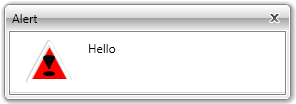

# Styling the Predefined Dialogs

This article explains how you could customize the look and feel of the predefined dialog windows. We will discuss the following topics:

* [Modifying the default Style](#modifying-the-default-style)

* [Applying IconTemplate](#applying-icontemplate)

## Modifying the Default Style

>To style the predefined dialogs of the __RadWindow__ static class, you have to call them via the overload that takes a __DialogParameters__ object as an argument. Learn more about the predefined dialogs [here]().

In this article's example we will use __RadAlert__, but the approach is the same for __RadConfirm__ and __RadPrompt__.

First, you will need to obtain the default style that targets __RadAlert__. To learn how to do this, take a look at the [Editing Control Templates]() topic. The extracted __RadAlertStyle__ will be similar to the following:

#### __[XAML] Example 1: Default RadAlertStyle__

{{region xaml-radwindow-styles-and-templates-styling-the-predefined-windows_0}}
	
{{endregion}}

>If you are not using [Implicit Styles]() to style the controls, you will need to copy all the referenced inside __RadAlertStyle__ StaticResources to your project as well (such as AlertIconTemplate).

Now you can make modifications in the template such as removing the OK button, changing the Alert icon, etc.

And finally, you have to pass the customized __RadAlertStyle__ to the predefined dialog via the __DialogParameters__ object and its __ContentStyle__ property.

#### __[C#] Example 2: Applying customized Style to RadAlert__

{{region cs-radwindow-styles-and-templates-styling-the-predefined-windows_0}}
	DialogParameters parameters = new DialogParameters();
	parameters.ContentStyle = this.Resources["RadAlertStyle"] as Style;
	parameters.Content = "Hello";
	RadWindow.Alert(parameters);
{{endregion}}

#### __[VB.NET] Example 2: Applying customized Style to RadAlert__

{{region vb-radwindow-styles-and-templates-styling-the-predefined-windows_1}}
	Dim parameters As New DialogParameters()
	parameters.ContentStyle = TryCast(Me.Resources("RadAlertStyle"), Style)
	parameters.Content = "Hello"
	RadWindow.Alert(parameters)
{{endregion}}

__Figure 1__ shows the final result.

#### __Figure 1: RadAlert with custom Style__

## Applying IconTemplate

With the Q1 2016 release of UI for WPFSilverlight the __IconTemplate__ property was introduced. By using it you are now able to easily change the icon of the predefined windows.  

Basically, a valid DataTemplate needs to be created and that Template should be passed to the predefined windows via the __DialogParameters__ and its __IconTemplate__ property:

#### __[XAML] Example 3: Defining the DataTemplate__

{{region xaml-radwindow-styles-and-templates-styling-the-predefined-windows_1}}
	<DataTemplate x:Key="IconTemplate">
	    <Image Source="telerik.png" Stretch="Fill" Width="22" Height="22"/>
	</DataTemplate>
{{endregion}}

#### __[C#] Example 4: Applying the DataTemplate to the IconTemplate property__

{{region cs-radwindow-styles-and-templates-styling-the-predefined-windows_2}}
	RadWindow.Alert(new DialogParameters()
	{
	    Content = "Hello",
	    IconTemplate = this.Resources["IconTemplate"] as DataTemplate
	});
{{endregion}}

#### __[VB.NET] Example 4: Applying the DataTemplate to the IconTemplate property__

{{region vb-radwindow-styles-and-templates-styling-the-predefined-windows_3}}
	RadWindow.Alert(New DialogParameters() With
	{
	    .Content = "Hello",
	    .IconTemplate = TryCast(Me.Resources("IconTemplate"), DataTemplate
	)})
{{endregion}}

__Figure 2__ shows the final result.

#### __Figure 2: RadAlert with set IconTemplate__

# See Also

 * [Template Structure]()

 * [Styling the RadWindow]()

 * [Change the Default Theme]()
